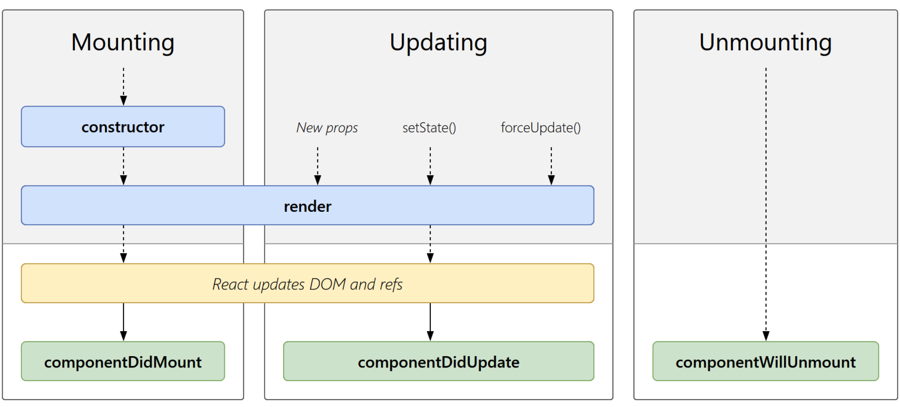

# 生命周期

- 挂载
- 更新
- 卸载


一个完整的生命周期:

挂载：
constructor： 在 React 组件挂载之前，会调用它的构造函数。
getDerivedStateFromProps(): 在调用 render 方法之前调用，并且在初始挂载及后续更新时都会被调用。
render： render（）方法是 class 组件中唯一必须实现的方法
componentDidMount: 在组件挂载后（插入 DOM 树中）立即调用。

更新：

shouldComponentUpdate 当 props 或 state 发生变化时，shouldComponentUpdate() 会在渲染执行之前被调用。
render： render（）方法是 class 组件中唯一必须实现的方法.
getSnapshotBeforeUpdate(): 在最近一次渲染输出（提交到 DOM 节点）之前调用。
componentDidUpdate: 在更新后会被立即调用。

卸载
componentWillUnmount(): 在组件卸载及销毁之前直接调用。


## shouldComponentUpdate

shouldComponentUpdate(nextProps, nextState)

這個函數的功用像是守門員，用來做確認是不是真的要 update 。這個函數要 return 一個布林值。當函數回傳 false 時，元件就不會更新，也不會繼續執行接下來的 render()以及剩下的 update 生命週期函數。預設會回傳 true。

```js
    shouldComponentUpdate(nextProps, nextState) {
        console.log('nextProps, nextState: ', nextProps, nextState);
        const {
            props,
            state
        } = this;

        function shallowCompare(a, b) {
            return a === b || Object.keys(a).every(k => a[k] === b[k])
        }
        return shallowCompare(nextProps, props) && shallowCompare(nextState, state)
    }
```

```js
class PureComponent extends Component {
  shouldC;
}
```

在這邊，this.props 和 this.state 是更新之前的，新的 props 和 state 在參數中以 nextProps 和 nextState 存在。你可以在這裡對這四者做比較

## react 接收到 props 时 会做相应的处理

1、直接使用
这种方式，父组件改变 props 后，子组件重新渲染，由于直接使用的 props，所以我们不需要做什么就可以正常显示最新的 props

```js
class Child extends Component {
  render() {
    return <div>{this.props.someThings}</div>;
  }
}
```

2、转换成自己的 state
这种方式，由于我们使用的是 state，所以每当父组件每次重新传递 props 时，我们需要重新处理下，将 props 转换成自己的 state，这里就用到了 componentWillReceiveProps。

关于你提到的不会二次渲染是这样的：每次子组件接收到新的 props，都会重新渲染一次，除非你做了处理来阻止（比如使用：shouldComponentUpdate），但是你可以在这次渲染前，根据新的 props 更新 state，更新 state 也会触发一次重新渲染，但 react 不会这么傻，所以只会渲染一次，这对应用的性能是有利的。

```js
class Child extends Component {
  constructor(props) {
    super(props);
    this.state = {
      someThings: props.someThings,
    };
  }
  componentWillReceiveProps(nextProps) {
    this.setState({ someThings: nextProps.someThings });
  }
  render() {
    return <div>{this.state.someThings}</div>;
  }
}
```

## componentWillMount 与 componentDidMount 对比

1. componentDidMount: 在组件挂载后（插入 DOM 树中）立即调用。


总结一下不建议在 constructor 和 componentWillMount 里写的原因是

1. 会阻碍组件的实例化，阻碍组件的渲染

2. 如果用 setState，在 componentWillMount 里面触发 setState 不会重新渲染

3. React16 之后采用了 Fiber 架构，只有 componentDidMount 声明周期函数是确定被执行一次的，类似 ComponentWillMount 的生命周期钩子都有可能执行多次，所以不加以在这些生命周期中做有副作用的操作，比如请求数据之类。

在生产时, componentDidMount 生命周期函数是最好的时间去请求数据, 其中最重要原因: 使用 componentDidMount 第一个好处就是这个一定是在组件初始化完成之后, 再会请求数据, 因此不会报什么警告或者错误, 我们正常请教数据完成之后一般都会 setState

顺便说一句在 es6 中, 使用 extend component 的方式里的 constructor 函数和 componentWillMount 是通用的作用, 所以你在构造函数里初始化了组件的状态就不必在 WillMount 做重复的事情了.

## 无状态组件 与 pureComponent

## componentWillReceiveProps

componentWillReceiveProps() 在生命周期的第一次 render 后不会被调用，但是会在之后的每次 render 中被调用 = 当父组件再次传送 props。

```js
componentWillReceiveProps: function(nextProps) {
    this.setState({
        likesIncreasing: nextProps.likeCount > this.props.likeCount
    });
}
```

该方法当 props 发生变化时执行，初始化 render 时不执行，在这个回调函数里面，你可以根据属性的变化，通过调用 this.setState()来更新你的组件状态，旧的属性还是可以通过 this.props 来获取, 这里调用更新状态是安全的，并不会触发额外的 render 调用。

## 更新

在父组件更新 自身状态变化 自身强制更新

• componentWillReceiveProps()
• shouldComponentUpdate()
• componentWillUpdate()
• render()
• componentDidUpdate()

当自身状态发生变化， 就是调用 setState 时， 会触发下面的函数
• shouldComponentUpdate()
• componentWilIUpdate()
• render()
• componentDidUpdate()

调用 forceUpdate 会发生强制更新，此时会触发下面的函数
• componentWillUpdate()
• render()
• componentDidUpdate()
should Component Up ate 可以用来提升性能， componentWillReceiveProps 般用来将新的
props 步到 tate

```js
// 更新 state
componentDidMount() {
        const newT me = this state.time + l;
        this.setState({
            time: newTime));
```

REACT 事件的优点:

1. e.preventDefault // 阻止默认事件
2. e.nativeEvent //原生事件对象

```jsx
{
  list map((item key)=> (
  <li onClick={th onClick . bind (key) ) >i tern. name</ li>
  )
}
```

```js
{
    list map（（ item key) => ( <
    li onClick = {
        () => this.onClick(key)
    } > item.name < /li>
))
}
```

## 通信

父子组件通信

- 初始化时的参数传递

- 实例化阶段的方法调用

### 子组件向父组件传递消息

- 回调函数

```js
class Child {
    constructor(cb) {
        //调用父组件传入的回调函数， 发送消息
        setTimeout(() => {
            cb()
        }, 2000);
    }
}
class Parent {
    constructor() {
        //初始化阶段， 传入回调函数
        this.child = new Child(function() {
            console.log(’child update’)
        })
    }
}
```

- 子组件部署消息接口

```js
//event.js

class Event {
  /** on 方法把订阅者所想要订阅的事件及相应的回调函数记录在 Event 对象的 _cbs 属性中*/
  on(event, fn) {
    if (typeof fn != "function") {
      console.error("fn must be a function");
      return;
    }
    this._cbs = this._cbs || {};
    (this._cbs[event] = this._cbs[event] || []).push(fn);
  }
  /**emit 方法接受一个事件名称参数，在 Event 对象的 _cbs 属性中取出对应的数组，并逐个执行里面的回调函数 */
  emit(event) {
    this._cbs = this._cbs || {};
    var callbacks = this._cbs[event],
      args;
    if (callbacks) {
      callbacks = callbacks.slice(0);
      args = [].slice.call(arguments, 1);
      for (var i = 0, len = callbacks.length; i < len; i++) {
        callbacks[i].apply(null, args);
      }
    }
  }
  /** off 方法接受事件名称和当初注册的回调函数作参数，在 Event 对象的 _cbs 属性中删除对应的回调函数。*/
  off(event, fn) {
    this._cbs = this._cbs || {};
    // all
    if (!arguments.length) {
      this._cbs = {};
      return;
    }
    var callbacks = this._cbs[event];
    if (!callbacks) return;
    // remove all handlers
    if (arguments.length === 1) {
      delete this._cbs[event];
      return;
    }
    // remove specific handler
    var cb;
    for (var i = 0, len = callbacks.length; i < len; i++) {
      cb = callbacks[i];
      if (cb === fn || cb.fn === fn) {
        callbacks.splice(i, 1);
        break;
      }
    }
    return;
  }
}

const myEvent = new Event();
export default myEvent;
```

```js
class Child  extends Component{
  constructor (props) {
  setTimeout(() => {this. props cb() }, 2000);
  render() {
    return <div></div>
  }
}

class Parent extends Component {
  render () {
  return <Child cb= { () => {console. log ( ’ update ’ )}}/>
  }
}

```

创建更新的方式
ReactDOM.render || hydrate
setState
forceUpdate

步骤
创建 reactRoot
创建 fiberRoot 和 RootFiber
创建更新

对一些名词的理解： currentTime

再一次渲染中产生的更新需要使用相同的时间
一次批处理的更新应该得到相同的时间
挂起任务用于记录的时候应该相同

1. 每个更新到来后，生成一个 Update 对象，放到 ReactRoot 的 updateQueue 里。
2. 中间一系列计算过期时间后更新 ReactRoot 的过期时间并将它添加到 ReactFiberScheduler 的 ScheduledRoot 链表里。
3. 判断这次更新是批量/批量，同步/异步，如果是异步任务，就执行 scheduleCallbackWithExpirationTime(root, expirationTime);进而执行 callbackID = scheduleDeferredCallback(performAsyncWork, {timeout});
4. scheduleDeferredCallback 在 Scheduler 里，会对应生成一个 callbackNode，并对这个 callbackNode 安排更新。

更新机制
什么是 Fiber 以及作用
React 实现路更新任务的调度，如何实现的

虚拟 Dom 控制在组件级，最早 Vue3 的提案其实是包含时间切片方案的，最后废弃的主要原因，是时间切片解决的的问题，Vue3 基本碰不到

1. Vue3 把虚拟 Dom 控制在组件级别，组件之间使用响应式，这就让 Vue3 的虚拟 Dom 不会过于庞大
2. Vue3 虚拟 Dom 的静态标记和自动缓存功能，让静态的节点和属性可以直接绕过 Diff 逻辑，也大大减少了虚拟 Dom 的 Diff 事件
3. 时间切片也会带来额外的系统复杂性
