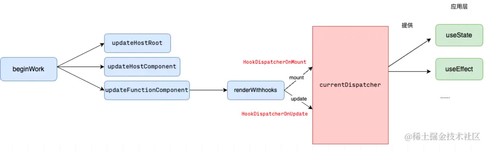
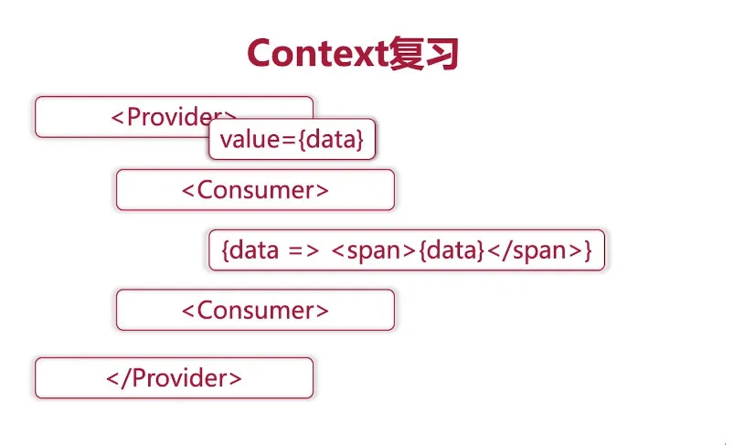
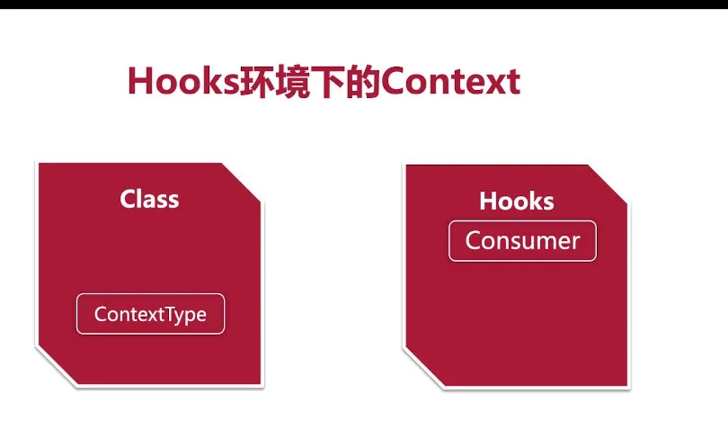
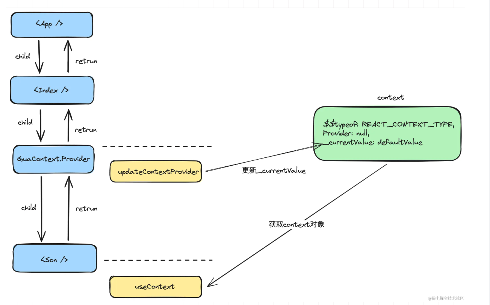
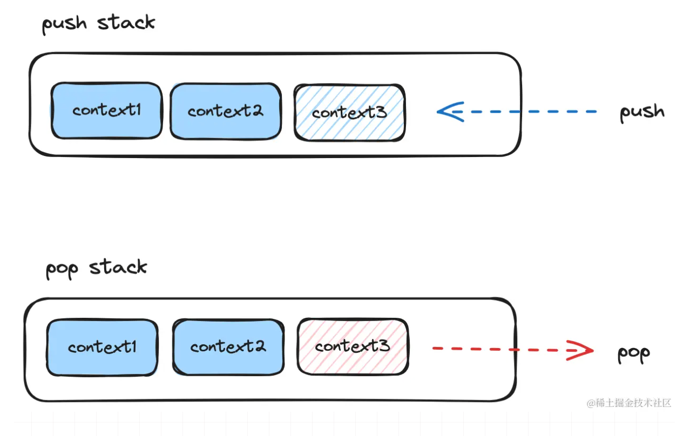

# useContext

## 概念

​useContext​ 用于在函数式组件中访问上下文（Context​）的值。

Context​ 是一种在 react 不同组件（跨层级，例如父子组件，父孙组件）之间共享，传递数据的机制。

​useContext​ 的参数是由 createContext​ 创建，或者是父级上下文 context​ 传递的，通过 Context.Provider​ 包裹的组件，才能通过 useContext​ 获取对应的值。可以理解为 useContext​ 代替之前 Context.Consumer​ 来获取 Provider​ 中保存的 value​ 值。

```js
// 内部数据共享层
export const __SECRET_INTERNALS_DO_NOT_USE_OR_YOU_WILL_BE_FIRED = {
  currentDispatcher,
};

const currentDispatcher = {
  current: null,
};
```



我们在使用 hook​ 时，react 在内部通过 ​currentDispatcher.current​ 赋予不同的函数来处理不同阶段的调用，判断 hook 是否在函数组件内部调用.

## 用法

```jsx
import React, { useState, useEffect, createContext, useContext } from "react";
import "./App.css";
import { Component } from "react";

const CountContext = createContext();

class Foo extends Component {
  render() {
    return (
      <CountContext.Consumer>
        {(count) => <h1>{count}</h1>}
      </CountContext.Consumer>
    );
  }
}

function Counter() {
  const count = useContext(CountContext);
  return <h1>{count}</h1>;
}

class Bar extends Component {
  static contextType = CountContext;
  render() {
    const count = this.context;
    return <h1>{count}</h1>;
  }
}

function App2(props) {
  const [count, setCount] = useState(0);

  return (
    <div>
      <button
        onClick={() => {
          setCount(count + 1);
        }}
      >
        Click({count})
      </button>
      <CountContext.Provider value={count}>
        <Foo />
        <Bar />
        <Counter />
      </CountContext.Provider>
    </div>
  );
}

export default App2;
```

## 原理





根据 useContext​ 这个函数的功能可见，其实它的职责只是获取 Context​ 的值，无论是在 mount​ 阶段还是 update​ 阶段。

```js
const HooksDispatcherOnMount = {
  useState: mountState,
  useEffect: mountEffect,
  // mount阶段
  useContext: readContext,
};

const HooksDispatcherOnUpdate = {
  useState: updateState,
  useEffect: updateEffect,
  // update阶段
  useContext: readContext,
};
```

相比于其他 hook 函数在不同阶段需要执行的功能不一致，useContext​ 在初始化和更新阶段的功能是一致的：获取 Context​ 中保存的值。

```js
function readContext(context) {
  // 获取当前fiber节点
  const consumer = currentlyRenderingFiber;
  if (consumer === null) {
    throw new Error("只能在函数组件中调用useContext");
  }
  // 获取value值
  const value = context._currentValue;
  return value;
}
```

currentlyRenderingFiber​ 是一个全局变量，保存当前正在处理的 fiber​ 节点，因为 Context​ 功能存在于函数组件中，所以当前处理的节点必然是一个函数组件类型 fiber

## createContext

context 与 Provider 相互引用，context 对象中保存原始值，作为函数返回值导出。而 Provider 作为一个标签节点使用，同时也可以通过\_context 属性获取到保存在 context 对象中的值。

```js
export function createContext(defaultValue) {
  const context = {
    $$typeof: REACT_CONTEXT_TYPE,
    Provider: null,
    // 初始值
    _currentValue: defaultValue,
  };
  context.Provider = {
    $$typeof: REACT_PROVIDER_TYPE,
    _context: context,
  };
  return context;
}
```

`$$typeof`​ 为节点标记。例如普通的 dom 节点标记为 REACT_ELEMENT_TYPE​。

```js
export const REACT_CONTEXT_TYPE = supportSymbol
  ? Symbol.for("react.context")
  : 0xeacc;

export const REACT_PROVIDER_TYPE = supportSymbol
  ? Symbol.for("react.provider")
  : 0xeac2;
```

在生产 fiber 阶段时，会根据`$$typeof`​ 这个节点标记为 fiber​ 节点生成不同的 tag​

```js
export const ContextProvider = 8;

export function createFiberFromElement(element) {
	const { type, key, props, ref } = element;
	// 默认为函数组件类型的tag
	let fiberTag = FunctionComponent;
	// dom类型tag 比如：div，span...
	if (typeof type === 'string') {
		fiberTag = HostComponent;
	} else if (
++		typeof type === 'object' &&
++		type.$$typeof === REACT_PROVIDER_TYPE
	) {
		// Provider类型
++		fiberTag = ContextProvider;
	} else if (typeof type !== 'function' && __DEV__) {
		console.warn('为定义的type类型', element);
	}
	const fiber = new FiberNode(fiberTag, props, key);
	fiber.type = type;
	fiber.ref = ref;
	return fiber;
}
```

## Context 的逻辑

需要实现两部分内容：

- 对 ContextProvider​ 类型 FiberNode​ 的支持
- ​Context​ 逻辑的实现

由于我们在 createContext​ 函数中已经导出了一个包含有 Provider​ 对象返回值。所以我们在使用 GuaContext.Provider​ 作为标签使用时，这个标签在编译后的已经是一个$$typeof​ 类型为 REACT_PROVIDER_TYPE​ 的 element​ 对象了，所以在生成 fiber​ 节点时这个标签的 tag​ 被标记为 ContextProvider​。

```js
export const beginWork = (wip, renderLane) => {
  switch (wip.tag) {
    case HostRoot:
    // ...
    case HostComponent:
    // ...
    case HostText:
      return null;
    case FunctionComponent:
    // ...
    case ContextProvider:
      // ContextProvider类型
      return updateContextProvider(wip);
    default:
      if (__DEV__) {
        console.warn("beginWork未实现的类型");
      }
      break;
  }
  return null;
};
```

数据保存与 context 嵌套

既然已经通过 createContext​ 函数生成了一个 Context​ 对象，那么在处理 ContextProvider​ 类型的节点时，首要任务就是将新的值更新，支持 Context.\_currentValue​ 的变化。

新的值是通过 value​ 属性传递，我们可以通过 fiber​ 节点的 pendingProps​ 属性获取新的值。



在创建 fiber​ 节点的过程中，遇到 ContextProvider​ 标记的节点代表当前是一个 Provider​ 标签，更新与当前节点对应的 Context​ 对象的值。当子孙节点使用 useContext​ 函数时传入同一个 Context​ 对象即可获取最新值。

如果整棵 fiber​ 树中之存在一个 Context​，可以直接更新 Context​ 对象，但是在实际的情况中可能会有多层嵌套：

所以我们使用栈的形式来存储值，由于整个 render​ 阶段的处理过程是先深度遍历，到达最深处节点后回溯，直到根节点。beginWork​ 由上至下，completeWork​ 由下至上。

所以在 beginWork​ 流程中入栈，completeWork​ 流程出栈，可以满足每一层的对应关系。



```js
function updateContextProvider(wip) {
  // 从element对象的type属性获取Context对象
  const providerType = wip.type;
  const context = providerType._context;
  // 获取新的值
  const newProps = wip.pendingProps;
  // 入栈
  pushProvider(context, newProps.value);

  // 处理子节点
  // ...
}
```

定义两个全局变量，prevContextValue​ 代表当前正在处理的 context​ 对象，prevContextValueStack​ 保存 context​ 对象栈

```js
let prevContextValue = null;
const prevContextValueStack = [];

export function pushProvider(context, newValue) {
  prevContextValueStack.push(prevContextValue);
  // 保存当前正在处理的context对象
  prevContextValue = context._currentValue;
  // 更新_currentValue
  context._currentValue = newValue;
}
```

​completeWork​ 回溯的过程与 beginWork​ 类似，同样也是通过 tag​ 对不同的 fiber​ 类型的节点调用不同的处理逻辑。

```js
export const completeWork = (wip: FiberNode) => {
  // 递归中的归

  const newProps = wip.pendingProps;
  const current = wip.alternate;

  switch (wip.tag) {
    case HostComponent:
    // ...
    case HostText:
    // ...
    case HostRoot:
    // ...
    case ContextProvider:
      const context = wip.type._context;
      // 出栈
      popProvider(context);
      return null;
    default:
      if (__DEV__) {
        console.warn("未处理的completeWork情况", wip);
      }
      break;
  }
};
```

由于当前 fiber​ 将要回溯到父级，所以更新为父级的值。同时 prevContextValueStack​ 栈出栈。

```js
export function popProvider(context) {
  context._currentValue = prevContextValue;
  // 出栈
  prevContextValue = prevContextValueStack.pop();
}
```
