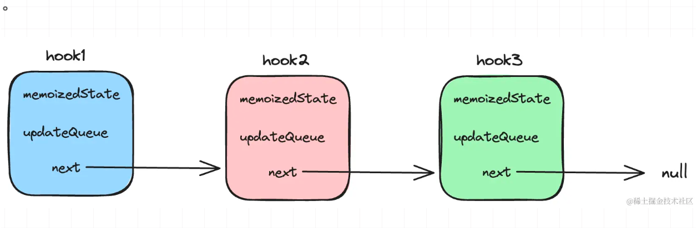

# 总结

## 为什么要引入 hook

1. 在组件之间复用状态逻辑很难
2. 复杂组件变得难以理解
3. 难以理解的 class

- 1 状态管理: 在函数组件中引入 useState，无需类组件也能管理状态。
- 2 副作用处理：通过 useEffect 统一处理生命周期逻辑，避免类组件中复杂的生命周期方法。
- 3 解决逻辑复用难的问题。
- 4 放弃面向对象编程，拥抱函数式编程。

## 目前常见的 hooks

```jsx
useState: setState
useReducer: setState
useRef: ref
useImperativeMethods: ref
useContext: context
useCallback: 可以对setState的优化
useMemo: useCallback的变形
useLayoutEffect: 类似componentDidMount/Update, componentWillUnmount
useEffect: 类似于setState(state, cb)中的cb，总是在整个更新周期的最后才执行
```


```jsx
function App(){
  useEffect(()=>{
    //componentDiMount
    return ()=>{
       //componentWillUnMount
    }
  },[])
}
  let renderCounter = useRef(0);
  renderCounter.current ++;

  useEffect(())=>{
    if(renderCount> 1){
       //componentDidUpdate
    }
  }


```

# 类实例成员变量如何映射到 hooks

```jsx
class App extend Component(){
  const it = 0
}


function App(){
  const it = useRef(0)
}

```

# hooks 中如何获取历史 props 和 state

```jsx
function Counter() {
  const [count, setCount] = useState(0);

  const prevCountRef = useRef();

  useEffect(() => {
    preCountRef.current = count;
  });

  const prevCount = prevCountRef.current;

  return (
    <h1>
      Now: {count}, before: {prevCount}
    </h1>
  );
}
```

调用 State Hook 的更新函数并传入当前的 state 时，React 将跳过子组件的渲染及 effect 的执行。（React 使用 Object.is 比较算法 来比较 state。）

用副作用来同步 count 的值

# 如何强制更新一个 hook 组件

```jsx
function forceUpdate() {
  setUpdater((updater) => updater + 1);
}
```

useEffect 对于函数依赖，尝试将该函数放置在 effect 内，或者使用 useCallback 包裹；useEffect/useCallback/useMemo，对于 state 或者其他属性的依赖，根据 eslint 的提示填入 deps；如果不直接使用 state，只是想修改 state，用 setState 的函数入参方式（setState(c => c + 1)）代替；如果修改 state 的过程依赖了其他属性，尝试将 state 和属性聚合，改写成 useReducer 的形式。当这些方法都不奏效，使用 ref，但是依然要谨慎操作。

赋予函数组件类组件的能力

useReducer 跟 useState 差不多

useEffect 和 useLayoutEffect

memo 提供了类似 class ComponentShouldUpdate 的功能

ref 不能挂载 function Component 上面 一般来说我们都是用在 class 实例上

\*/
const ReactCurrentOwner = {
/\*\*

- @internal
- @type {ReactComponent}
  \*/
  current: (null: null | Fiber),
  currentDispatcher: (null: null | Dispatcher),
  };

export default ReactCurrentOwner;

我们在 ReactHooks.js 里面可以看到

```js
export function useState<S>(initialState: (() => S) | S) {
  const dispatcher = resolveDispatcher();
  return dispatcher.useState(initialState);
}
```

再看一下 resloveDispatcher
它来自 ReactCurrentOwner

```js
const ReactCurrentOwner = {
  /**
   * @internal
   * @type {ReactComponent}
   */
  current: (null: null | Fiber),
  currentDispatcher: (null: null | Dispatcher),
};
```

在 ReactFiberHooks 中 我们可以看到

```JS
export function useState<S>(
  initialState: (() => S) | S,
): [S, Dispatch<BasicStateAction<S>>] {
  return useReducer(
    basicStateReducer,
    // useReducer has a special case to support lazy useState initializers
    (initialState: any),
  );
}
```

而它们的实现又是从 reactBeginWork.js 先 prepareToReadContext 接着 prepareToUseHooks 中间执行 Component 最后执行 finishHooks

从打的断点可以知道
firstWorkInProgressHook = workInProgressHook

redux 作者 Dan 加入到 React 推行了 Hook

```js
if(reducer === basicStateReducer){
  if(typeof initalState === 'function'){
    initialState = initialState();
  }
} else if{
  initialState = reducer(initialState, initialAction)
}

```

我们每个 fiber 对应每个组件，hook 代表更细粒度的 fiber,

## Hooks Capture props 属性

```js
Class Component:

class ProfilePage extends React.Component {
  showMessage = () => {
    alert("Followed " + this.props.user);
  };

  handleClick = () => {
    setTimeout(this.showMessage, 3000);
  };

  render() {
    return <button onClick={this.handleClick}>Follow</button>;
  }
}
Function Component:

function ProfilePage(props) {
  const showMessage = () => {
    alert("Followed " + props.user);
  };

  const handleClick = () => {
    setTimeout(showMessage, 3000);
  };

  return <button onClick={handleClick}>Follow</button>;
}

```

```js
function MessageThread() {
  const latestMessage = useRef("");

  const showMessage = () => {
    alert("You said: " + latestMessage.current);
  };

  const handleSendClick = () => {
    setTimeout(showMessage, 3000);
  };

  const handleMessageChange = (e) => {
    latestMessage.current = e.target.value;
  };
}
```

只要将赋值与取值的对象变成 useRef，而不是 useState，就可以躲过 capture value 特性，在 3 秒后得到最新的值

## 替代 shouldComponentUpdate 得方案

```js
const Button = React.memo((props) => {
  // your component
});
```

或者

```js
function Parent({ a, b }) {
  // Only re-rendered if `a` changes:
  const child1 = useMemo(() => <Child1 a={a} />, [a]);
  // Only re-rendered if `b` changes:
  const child2 = useMemo(() => <Child2 b={b} />, [b]);
  return (
    <>
      {child1}
      {child2}
    </>
  );
}
```

## 怎么替代 componentDidUpdate

由于 useEffect 每次 Render 都会执行，因此需要模拟一个 useUpdate 函数：

```js
const mounting = useRef(true);
useEffect(() => {
  if (mounting.current) {
    // 初次进入得时候不执行
    mounting.current = false;
  } else {
    fn();
  }
});
```

## 怎么替代 forceUpdate

React 官方文档提供了一种方案：

```js
const [ignored, forceUpdate] = useReducer((x) => x + 1, 0);

function handleClick() {
  forceUpdate();
}
```

每次执行 dispatch 时,只要 state 变化就会触发组件更新

```js
const useUpdate = () => useState(0)[1];
```

state 拆分过多

```js
function FunctionComponent() {
  const [state, setState] = useState({
    left: 0,
    top: 0,
    width: 100,
    height: 100,
  });
}
```

只是更新的时候，不再会自动 merge，而需要使用 ...state 语法：

```js
setState((state) => ({ ...state, left: e.pageX, top: e.pageY }));
```

## 获取上一个 props

```js
function usePrevious(value) {
  const ref = useRef();
  useEffect(() => {
    ref.current = value;
  });
  return ref.current;
}

const [count, setCount] = useState(0);
const prevCount = usePrevious(count);

setTimeout(() => {
  setCount((count) => count + 1);
});

return (
  <h1>
    Now: {count}, before: {prevCount}
  </h1>
);
```

## 性能注意事项

useState 函数的参数虽然是初始值,但由于整个函数都是 render, 因此每次初始化都会被调用,如果初始值计算非常消耗实践,建议使用函数传入,这样只会执行一次

```js
function FunctionComponent(props) {
  const [rows, setRows] = useState(() => createRows(props.count));
}
```

写 react hooks 的一些思考, “有状态的组件没有渲染，有渲染的组件没有状态”：

利用 useState 创建 Redux

```js
// 这就是 Redux
function useReducer(reducer, initialState) {
  const [state, setState] = useState(initialState);

  function dispatch(action) {
    const nextState = reducer(state, action);
    setState(nextState);
  }

  return [state, dispatch];
}
```

## hook

​hook​ 可以看做是函数组件和与其对应的 fiber​ 节点进行沟通和的操作的纽带。在 react​ 中处于不同阶段的 fiber​ 节点会被赋予不同的处理函数执行 hook​：

- 初始化阶段 -----> HookDispatcherOnMount​

- 更新阶段 -----> HookDispatcherOnUpdate

```js
const HookDispatcherOnMount = {
  useState: mountState,
  useEffect: mountEffect,
  useTransition: mountTransition,
};

const HookDispatcherOnUpdate = {
  useState: updateState,
  useEffect: updateEffect,
  useTransition: updateTransition,
};
```

## 如何确定 fiber 对应的 hook 上下文？

在我们执行 hook 相关的逻辑时，讲当前 fiber 节点信息保存在一个全局变量中。

```js
// 当前正在render的fiber
let currentlyRenderingFiber = null;
```

```js
export function renderWithHooks(wip: FiberNode) {
  // 赋值操作
  currentlyRenderingFiber = wip;
  // 重置
  wip.memoizedState = null;
  const current = wip.alternate;

  if (current !== null) {
    // update
    // hooks更新阶段
  } else {
    // mount
    // hooks初始化阶段
  }

  const Component = wip.type;
  const props = wip.pendingProps;
  const children = Component(props);

  // 重置操作
  // 处理完当前fiber节点后清空currentlyRenderingFiber
  currentlyRenderingFiber = null;

  return children;
}
```

## hook 是如何存在的？保存在什么地方？

在 react 中，hook 是保存在 fiber 节点上的，每个 fiber 节点都有一个 memoizedState 属性，用来保存当前 fiber 节点对应的 hook 上下文。

fiber​ 节点中保存着非常多的属性，有作为构造 fiber​ 链表，用于保存位置信息的属性，有作为保存更新队列的属性等等。

而对于函数组件类型的 fiber​ 节点，memoizedState​ 属性保存 hooks​ 信息。hook​ 在初始化时，会创建一个对象，保存此 hook​ 所产生的计算值，更新队列，hook​ 链表。

```js
const hook = {
	// hooks计算产生的值 （初始化/更新）
	memoizedState: "";
	// 对此hook的更新行为
	updateQueue: "";
	// hooks链表指针
	next: null;
}
```

## 多个 hook 如何处理？

在某个函数组件中存在多个 hook​，此时每个 hook​ 的信息该如何保存呢？这就是上文中 hook​ 对象中 next​ 属性的作用，它是一个链表指针。在 hook​ 对象中，next​ 属性指向下一个 hook​。



换句话说，如果在一个函数组件中存在多个 hook，那么在该 fiber 节点的 memoizedState 属性中保存着一个 hook 链表，每个 hook 对象中的 next 属性指向下一个 hook。

函数组件对应 fiber​ 用 memoizedState​ 保存 hook​ 信息，每一个 hook​ 执行都会产生一个 hook​ 对象，hook​ 对象中，保存着当前 hook​ 的信息，不同 hook​ 保存的形式不同。每一个 hook​ 通过 next​ 链表建立起关系。
