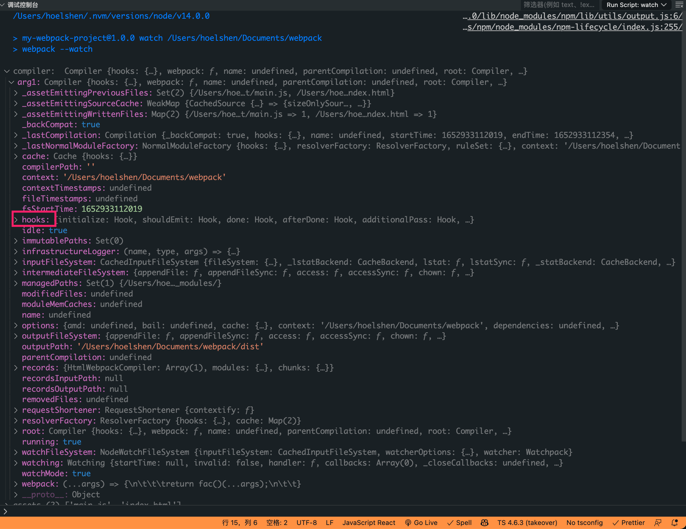

# 编写一个自己的webpack插件plugin

要想写好插件就要知道Webpack中的几个比较核心的概念compiler、compilation、tapable

Webpack 通过 Plugin 机制让其更加灵活，以适应各种应用场景。 在 Webpack 运行的生命周期中会广播出许多事件，Plugin 可以监听这些事件，在合适的时机通过 Webpack 提供的 API 改变输出结果。

1.实现一个webpack的基本包含以下几步：
1.一个JavaScript函数或者类
2.在函数原型（prototype）中定义一个注入compiler对象的apply方法。
3.apply函数中通过compiler插入指定的事件钩子，在钩子回调中拿到compilation对象，并对compilation对象进行操作。
4.使用compilation操纵修改webapack内部实例数据。
5.异步插件，数据处理完后使用callback回调

大白话：
Webpack在启动时会实例化插件对象，在初始化compiler对象之后会调用插件实例的apply方法，传入compiler对象，插件实例在apply方法中会注册感兴趣的钩子，Webpack在执行过程中会根据构建阶段回调相应的钩子。

```js
class WebpackCleanPlugin {
  // 构造函数
  constructor(options) {
    console.log("WebpackCleanPlugin", options);
  }
  // 应用函数
  apply(compiler) {
    console.log(compiler);
    // 绑定钩子事件
    compiler.hooks.done.tap(pluginName, compilation => {
      console.log(compilation);
    });
  }
}

```

* webpack启动后，在读取配置的过程中会先执行new WebpackCleanupPlugin()初始化一个webpackCleanPlugin获得实例
* 在初始化complier对象后，在调用webpackCleanPlugin.apply(compiler)给插件实例传入compiler对象
* 插件实例获取到compiler对象后，就可以通过compiler.plugin(事件名称，回调函数)监听到webpack广播出来的事件
* 并且可以通过compiler对象去操作webpack

## Compiler、Compilation

* Compiler 对象包含了 Webpack 环境所有的的配置信息，包含 **options，hook，loaders，plugins** 这些信息，这个对象在 **Webpack** 启动时候被实例化，它是全局唯一的，可以简单地把它理解为 **Webpack** 实例；Compiler中包含的东西如下所示：

* Compilation 对象包含了当前的模块资源、编译生成资源、变化的文件等。当 **Webpack** 以开发模式运行时，每当检测到一个文件变化，一次新的 **Compilation** 将被创建。**Compilation** 对象也提供了很多事件回调供插件做扩展。通过 **Compilation** 也能读取到 **Compiler** 对象。
**
Compiler 和 Compilation 的区别在于：

**Compiler 代表了整个 Webpack 从启动到关闭的生命周期，而 Compilation 只是代表了一次新的编译。**

```js
const recursiveReadSync = require("recursive-readdir-sync");
const minimatch = require("minimatch");
const path = require("path");
const fs = require("fs");
const union = require("lodash.union");

// 匹配文件
function getFiles(fromPath, exclude = []) {
  const files = recursiveReadSync(fromPath).filter((file) =>
    exclude.every(
      (excluded) =>
        !minimatch(path.relative(fromPath, file), path.join(excluded), {
          dot: true,
        })
    )
  );
  // console.log(files);
  return files;
}

class WebpackCleanPlugin {
  constructor(options = {}) {
    // 配置文件
    this.options = options;
  }
  apply(compiler) {
    // 获取output路径
    const outputPath = compiler.options.output.path;
    console.log("compiler: ", compiler);
    const pluginName = WebpackCleanPlugin.name;
    // 绑定钩子事件
    compiler.hooks.done.tap(pluginName, (stats) => {
      // 获取编译完成 文件名
      const assets = stats.toJson().assets.map((asset) => asset.name);
      console.log("assets", assets);
      // 多数组合并并且去重
      const exclude = union(this.options.exclude, assets);
      console.log("exclude", exclude);
      // 获取未匹配文件
      const files = getFiles(outputPath, exclude);
      console.log("files", files);
      // 删除未匹配文件
      files.forEach(fs.unlinkSync);
    });
  }
}
module.exports = WebpackCleanPlugin;

```

* 获取output路径，也就是dist路径
* 绑定钩子事件 compiler.hooks.done
* 编译文件，与源文件做对比，判断是否需要删除匹配文件

## Tapable

Tapable是webpack的一个核心工具，webpack 中许多对象扩展自Tapable类。Tapable类暴露了tap、tapAsync和tapPromise方法，可以根据钩子的同步、异步方式来选择一个函数注入逻辑

* tap 同步钩子
* tapAsync 异步钩子，通过callback回调告诉Webpack异步执行完毕
* tapPromise 异步钩子，返回一个Promise告诉Webpack异步执行完毕

## 构建流程

1.校验配置文件
2.生成Compiler对象
3.初始化默认插件
4.run/watch：如果运行在watch模式则执行watch方法，否则执行run方法
5.compilation：创建Compilation对象回调compilation相关钩子
6.emit：文件内容准备完成，准备生成文件，这是最后一次修改最终文件的机会
7.afterEmit：文件已经写入磁盘完成
8.done：完成编译
常见钩子
Webpack会根据执行流程来回调对应的钩子，下面我们来看看都有哪些常见钩子，这些钩子支持的tap操作是什么。

钩子
说明
参数
类型

afterPlugins
启动一次新的编译
compiler
同步

compile
创建compilation对象之前
compilationParams
同步

compilation
compilation对象创建完成
compilation
同步

emit
资源生成完成，输出之前
compilation
异步

afterEmit
资源输出到目录完成
compilation
异步

done
完成编译
stats
同步
