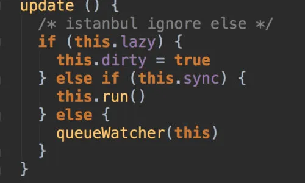
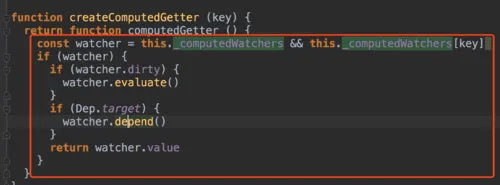

# 调用的是 watch

```js
Vue.prototype.$watch = function (
  expOrFn: string | Function,
  cb: any,
  options?: Object
): Function {
  const vm: Component = this;
  if (isPlainObject(cb)) {
    return createWatcher(vm, expOrFn, cb, options);
  }
  options = options || {};
  options.user = true;
  const watcher = new Watcher(vm, expOrFn, cb, options);
  if (options.immediate) {
    try {
      cb.call(vm, watcher.value);
    } catch (error) {
      handleError(
        error,
        vm,
        `callback for immediate watcher "${watcher.expression}"`
      );
    }
  }
  return function unwatchFn() {
    watcher.teardown();
  };
};
```

如果配置了 immediate 为 true 的话会在函数进来的时候立即执行一遍

由于我们把代码写在了最下面

```js
watch:{
  useless(newVal){
    console.log('useless', newVal);
  },
  name: {
    immediate: true,
    handler(newVal){
      console.log('name: ', newVal)
    }
  },
  nested:{
    deep: true,
    sync: true,
    handler(newVal){
      console.log('nested: ', newVal.a.b)
    }
  }
}
```

如果进行 sync 的话就不会放到下一个 nexttick

断点调试的话
会进行 getter 收集依赖 接着订阅 dep.depend()

watch 分 string 或者 对象 handler

```js
function initWatch(vm: Component, watch: Object) {
  for (const key in watch) {
    const handler = watch[key];
    if (Array.isArray(handler)) {
      for (let i = 0; i < handler.length; i++) {
        createWatcher(vm, key, handler[i]);
      }
    } else {
      createWatcher(vm, key, handler);
    }
  }
}

function createWatcher(
  vm: Component,
  expOrFn: string | Function,
  handler: any,
  options?: Object
) {
  if (isPlainObject(handler)) {
    options = handler;
    handler = handler.handler;
  }
  if (typeof handler === "string") {
    handler = vm[handler];
  }
  return vm.$watch(expOrFn, handler, options);
}
```

收集依赖 就是让我们变更的时候能够触发回调执行

如果在 flushing 过程中又往队列里添加，那么它就会插入倒这个队列中，还是在遍历这个 queue 的过程中执行更新， 不会放到 nexttick 中

```js
export function queueWatcher(watcher: Watcher) {
  const id = watcher.id;
  if (has[id] == null) {
    has[id] = true;
    if (!flushing) {
      queue.push(watcher);
    } else {
      // if already flushing, splice the watcher based on its id
      // if already past its id, it will be run next immediately.
      let i = queue.length - 1;
      while (i > index && queue[i].id > watcher.id) {
        i--;
      }
      queue.splice(i + 1, 0, watcher);
    }
    // queue the flush
    if (!waiting) {
      waiting = true;

      if (process.env.NODE_ENV !== "production" && !config.async) {
        flushSchedulerQueue();
        return;
      }
      nextTick(flushSchedulerQueue);
    }
  }
}
```

清理操作，把自身从 vm.\_watch 中移出，然后遍历它收集的依赖，删除对它的订阅

```js
  teardown () {
    if (this.active) {
      // remove self from vm's watcher list
      // this is a somewhat expensive operation so we skip it
      // if the vm is being destroyed.
      if (!this.vm._isBeingDestroyed) {
        remove(this.vm._watchers, this)
      }
      let i = this.deps.length
      while (i--) {
        this.deps[i].removeSub(this)
      }
      this.active = false
    }
  }
```

computed(lazy) watcher 给计算属性用的，render watcher 是监听组件重新渲染用的，user watcher 是给用户自定义监听器用的。

deep 决定是否 watch 内部深层属性的变化，immediate 表示 watcher 创建后是否立刻执行回调函数，sync 表示这个 watcher 观测到变化是不是同步（当前 tick）执行，这仨主要是给 user watcher 用的。

因为先 initState 在$mounted 前面，所以初始化的 computerWatcher 和 userWatcher 的 id 都比渲染 watcher 的 id 小，异步执行 flushSchedulerQueue 过程中它们做了一个 id 的排序，所以渲染 watcher 的 getter 是最后才执行的。

如果模板有多个 data 发生变化，那么只有第一个数据发生变化的时候，把渲染 watcher push 到异步执行队列 queue 中，模板的其他数据发生变化都不会把渲染 watcher push 进去，所以最后只执行一次渲染 watcher。

关于 watcher 的一些理解

vnode.elm 是组件的 root vnode 保存的 DOM 引用，相当于组件对应的 DOM。

Vue 的数据更新都是组件级别的，因为可以基于它的依赖跟踪，把要观测变化的响应式数据的依赖都收集到组件 render watcher 中，所以组件的某个数据变了就会触发组件的 re render，是组件粒度的更新。

Virtual DOM 更大的意义是跨平台，它对 DOM 的更新算法是相对高效，但并不一定是最优的，你可以理解为提供了一个还不错的性能。它也不是什么精准更新，而是根据 diff 算法的结果，选择一个更新的策略

新旧虚拟 Dom diff 比对，对 vnode.elm 做出修改。vnode.elm 是真实 dom。它是边比修改，边更新 Dom

计算属性的本质是 computed watcher
侦听属性的本质是 userwatcher， 他支持 deep sync immediate



```js
//计算属性
```


也仅仅是把 this.dirty 设置为 false 并不会触发计算属性的重新计算也不会让页面重新渲染。所以我们需要把计算属性中的依赖收集到当前渲染 watcher 中。这样一旦计算属性的依赖发生变化就会触发 render watcher 的 update 就会触发重新渲染在重新渲染的过程中会再次访问到计算属性的 getter。然后又回到最初。
