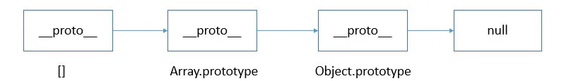
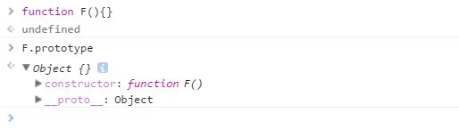
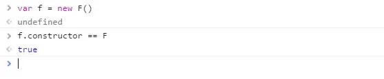

# instanceOf

```js
function myInstanceOf(left, right) {
  let left = left.__proto__; // 取左表达式的__proto__值
  let right = right.prototype; // 取右表达式的 prototype 值

  while (true) {
    if (left === null) return false;
    if (right === left) return true;

    left = left.__proto__;
  }
}
```

其实 instanceof 主要的实现原理就是只要右边变量的 prototype 在左边变量的原型链上即可。因此，instanceof 在查找的过程中会遍历左边变量的原型链，直到找到右边变量的 prototype，如果查找失败，则会返回 false，告诉我们左边变量并非是右边变量的实例。

接着 我们 看一下 下面的例子

```JS
[] instanceof Array; // true
{} instanceof Object;// true
newDate() instanceof Date;// true

function Person(){};
newPerson() instanceof Person;

[] instanceof Object; // true
newDate() instanceof Object;// true
newPerson instanceof Object;// true
```

虽然 instanceof 能够判断出 [ ] 是 Array 的实例，但它认为 [ ] 也是 Object 的实例，为什么呢？

我们来分析一下 [ ]、Array、Object 三者之间的关系：

从 instanceof 能够判断出 [ ].**proto** 指向 Array.prototype，而 Array.prototype.**proto** 又指向了 Object.prototype，最终 Object.prototype.**proto** 指向了 null，标志着原型链的结束。因此，[]、Array、Object 就在内部形成了一条原型链



[] 的 **proto** 直接指向 Array.prototype，间接指向 Object.prototype，所以按照 instanceof 的判断规则，[] 就是 Object 的实例。依次类推，类似的 new Date()、new Person() 也会形成一条对应的原型链 。因此，instanceof 只能用来判断两个对象是否属于实例关系， 而不能判断一个对象实例具体属于哪种类型。

Array.isArray() 本质上检测的是对象的 [[Class]] 值，[[Class]] 是对象的一个内部属性，里面包含了对象的类型信息，其格式为 [object Xxx] ，Xxx 就是对应的具体类型 。对于数组而言，[[Class]] 的值就是 [object Array] 。

3、constructor
当一个函数 F 被定义时，JS 引擎会为 F 添加 prototype 原型，然后再在 prototype 上添加一个 constructor 属性，并让其指向 F 的引用。如下所示：



当执行 var f = new F() 时，F 被当成了构造函数，f 是 F 的实例对象，此时 F 原型上的 constructor 传递到了 f 上，因此 f.constructor == F



F 利用原型对象上的 constructor 引用了自身，当 F 作为构造函数来创建对象时，原型上的 constructor 就被遗传到了新创建的对象上， 从原型链角度讲，构造函数 F 就是新对象的类型。

4、toString
toString() 是 Object 的原型方法，调用该方法，默认返回当前对象的 [[Class]] 。这是一个内部属性，其格式为 [object Xxx] ，其中 Xxx 就是对象的类型。

对于 Object 对象，直接调用 toString() 就能返回 [object Object] 。而对于其他对象，则需要通过 call / apply 来调用才能返回正确的类型信息。

Object.prototype.toString.call('') ; // [object String]
Object.prototype.toString.call(1) ; // [object Number]
Object.prototype.toString.call(true) ; // [object Boolean]
Object.prototype.toString.call(Symbol()); //[object Symbol]
Object.prototype.toString.call(undefined) ; // [object Undefined]
Object.prototype.toString.call(null) ; // [object Null]
Object.prototype.toString.call(newFunction()) ; // [object Function]
Object.prototype.toString.call(newDate()) ; // [object Date]
Object.prototype.toString.call([]) ; // [object Array]
Object.prototype.toString.call(newRegExp()) ; // [object RegExp]
Object.prototype.toString.call(newError()) ; // [object Error]
Object.prototype.toString.call(document) ; // [object HTMLDocument]
Object.prototype.toString.call(window) ; //[object global] window 是全局对象 global 的引用

## hasOwnProperty

hasOwnProperty() 方法会返回一个布尔值，指示对象自身属性中是否具有指定的属性（也就是，是否有指定的键）。

```js
o = new Object();
o.hasOwnProperty("prop"); // 返回 false
o.prop = "exists";
o.hasOwnProperty("prop"); // 返回 true
delete o.prop;
o.hasOwnProperty("prop"); // 返回 false
```
