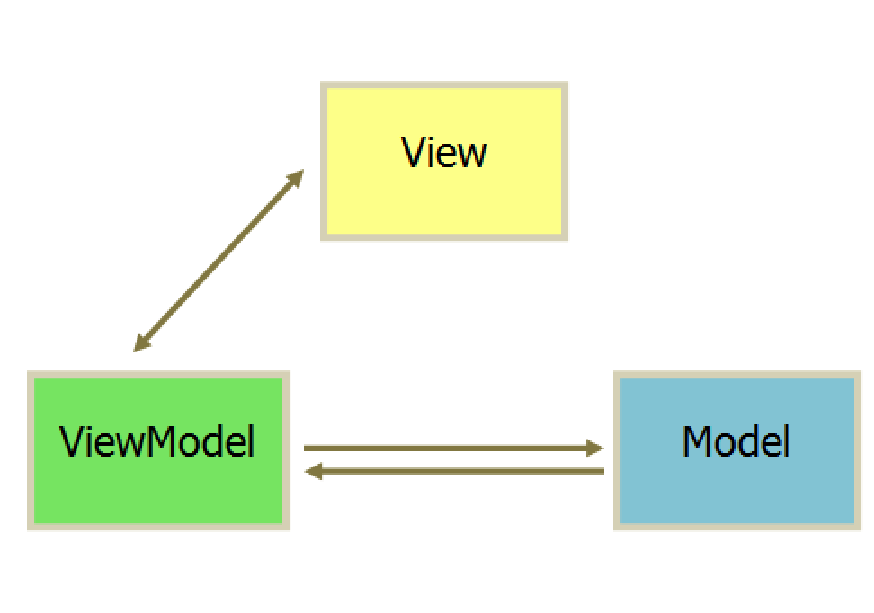

MVC与MVVM设计模式理解

MVC设计模式（View和Model之间不能直接通信）
MVC是一种架构模式，M表示Model，V表示视图View，C表示控制器Controller：

* Model负责存储、定义、操作数据、从网络中获取数据（Struts中Service和Form）；
* View用来展示给用户，并且和用户进行交互；
* Controller是Model和View的协调者，Controller把Model中的数据拿过来给View使用。Controller可以直接与Model和View进行通信，而View不能与Controller直接通信。，当有数据更新时，Model也要与Controller进行通信，这个时候就要用Notification和KVO，这个方式就像发广播一样，Model发信号，Controller设置接收监听信号，当有数据更新是就发信号给Controller，Model和View不能直接通信，这样违背MVC设计原则。View与Controller通信需要利用代理协议的方式，Controller可以直接根据Model决定View的展示。View如果接受响应事件则通过delegate，target-action，block等方式告诉Controller的状态变化。Controller进行业务的处理，然后再控制View的展示。
* 那这样Model和View就是相互独立的。View只负责页面的展示，Model只是数据的存储，那么也就达到了解耦和重用的目的。
实例解析
UML图：大家熟悉MVC的调用流程逻辑


MVVM是一种设计思想，M表示Model，V表示视图View，VM表示数据与模型（区别MVC中，C是用于跳转至哪个页面，而VM只是将数据进行转换或者封装）：
VM：首先要理解binding，可以参考WPF中的Binding，一个控件与后台数据模型（VM）进行绑定，后台数据模型也可以与M进行交互。VM就是将V->M或M-V的数据进行转换或者封装
　　1.当前台View发生变化时，View与VM进行了绑定，VM又与M进行交互，从而使M得到了改变。
　　2.当M变化时，以C#为例，M中的DO实现了INotifyChanged，当检测到变化时，M通知VM，VM与V进行了绑定，然后实现M->V。


