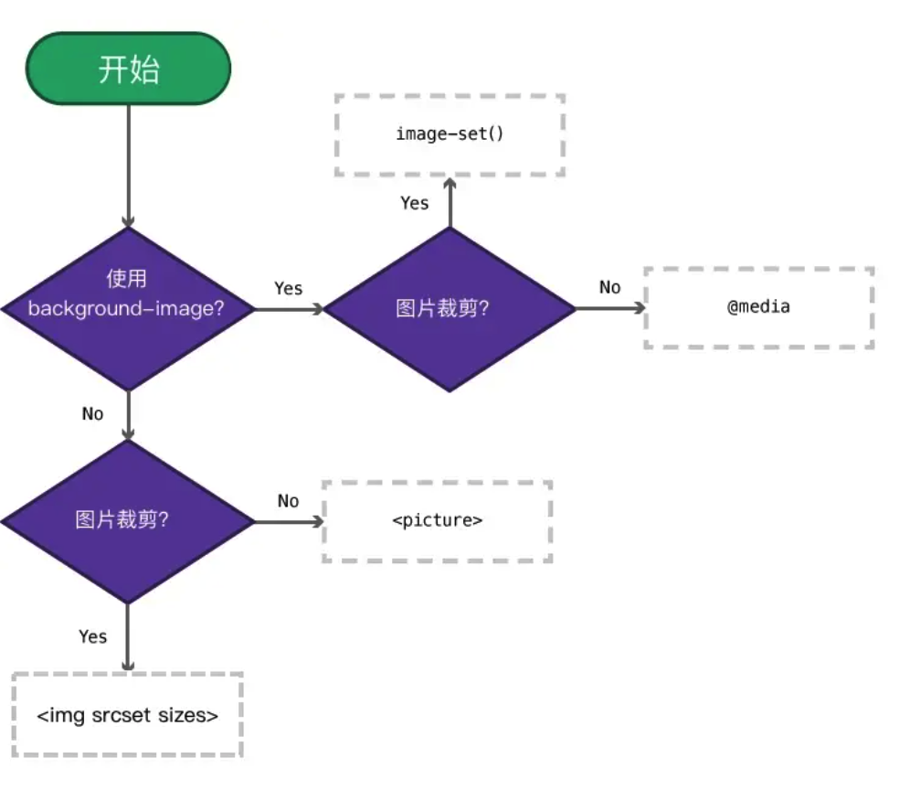
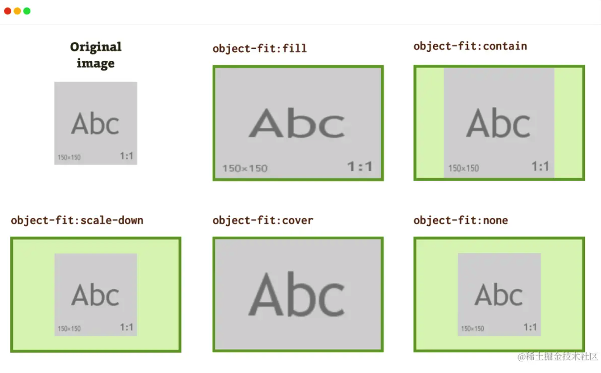
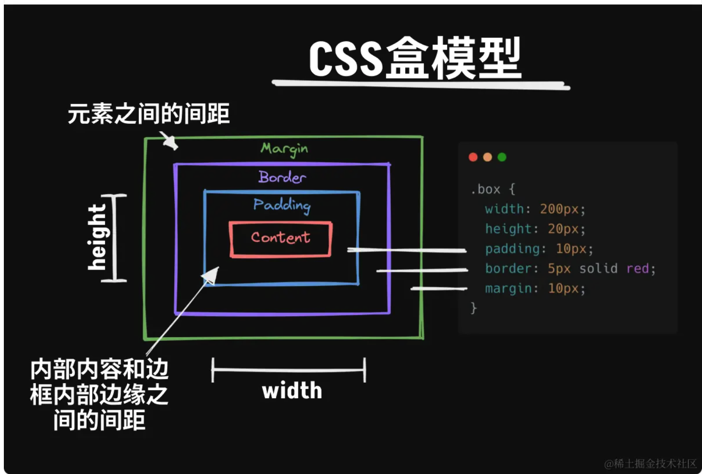
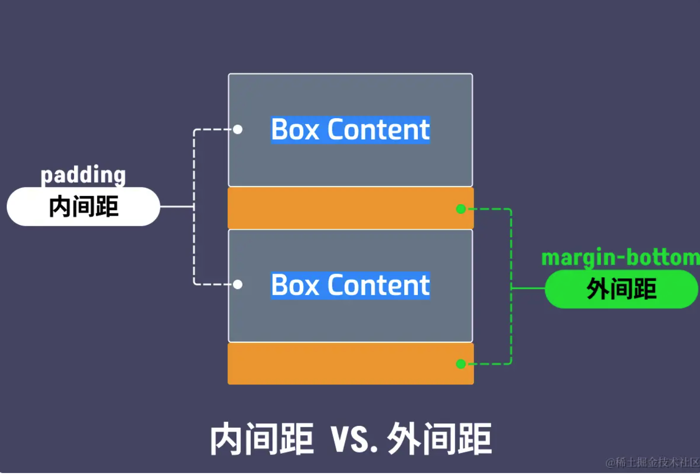
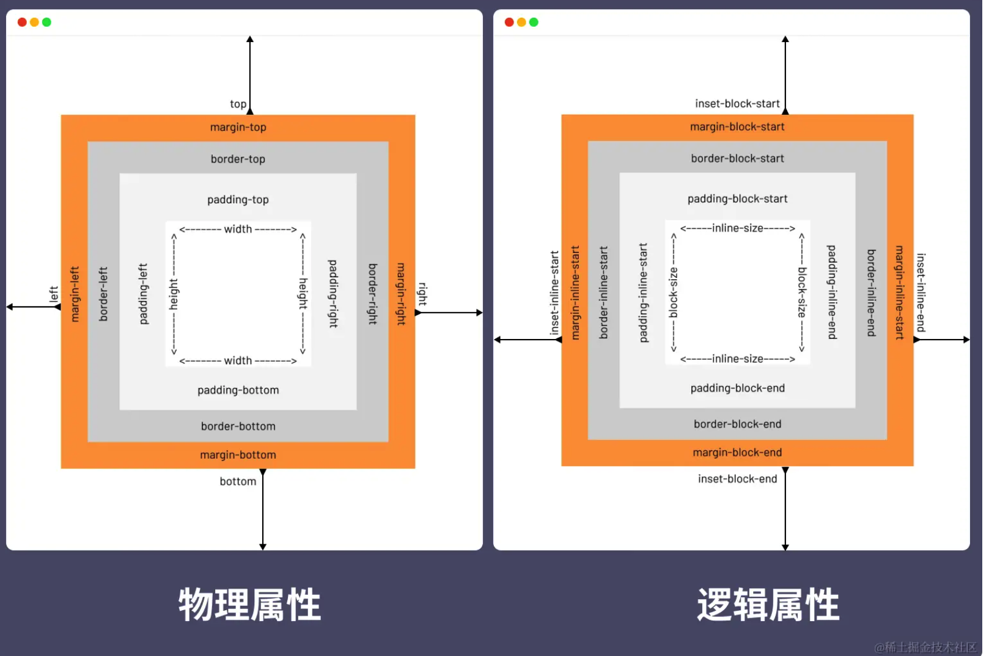
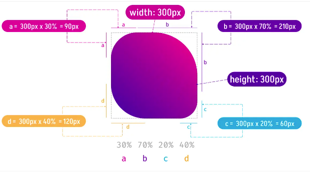
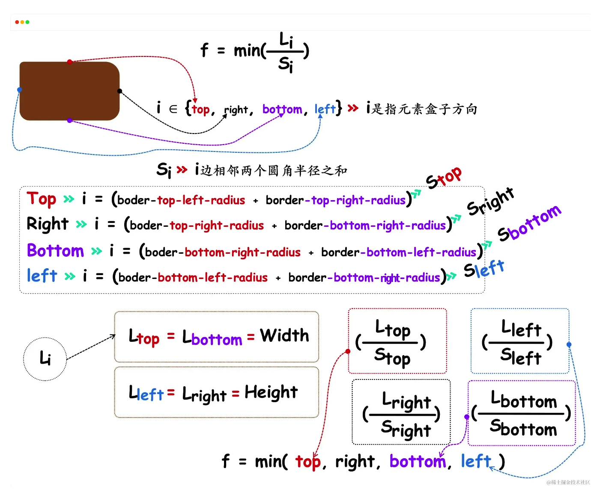

display
第二列是 display 属性未来的使用语法，也被称为双值语法

```CSS
.container {
    display: grid;

    /* 等同于 */
    display: block grid; /* 两个词之间有一个空格 */
}

.container {
    display: inline-grid;

    /* 等同于 */
    display: inline grid; /* 两个词之间有一个空格 */
}
```


在使用 css flex box 构建布局时， 应该尽量在 flexbox 容器上设置 flex-wrap： wrap 来避免意外布局的行为。

```CSS
    /* 不具防御性的 CSS */

.flex-container {
display: flex; /_ 或 inline-flex _/
}

/_ 具有防御性的 CSS _/
.flex-container {
display: flex; /_ 或 inline-flex _/
flex-wrap: wrap;
}


```

有一点需要注意是，flex-wrap: wrap (或 flex-wrap: wrap-reverse)只有在 Flex 容器没有足够空间容纳 Flex 项目时（即，同一 Flex 行所有 Flex 项目最小内容宽度总和大于 Flex 容器宽度），才会让 Flex 项目换行（或列） 。

理想情况三分布局

```CSS

.card {
    display: flex;
    flex-wrap: wrap;
    gap: 1rem;
}

.card img {
    flex-shrink: 0; /* 防止图片因容器空间不足被挤压 */
}

.card .content {
    flex: 1 1 0%; /* 自动匹配 Flex 容器的剩余空间 */
    min-width: 0;
}

.card h4 {
    white-space: nowrap;
    overflow: hidden;
    text-overflow: ellipsis;
}

.card p {
    overflow:hidden;
    text-overflow:ellipsis;
    display:-webkit-box;
    -webkit-line-clamp:2;
    -webkit-box-orient:vertical;
}

.card button {
    margin-block: auto; /* 垂直居中 */
    margin-inline-start: auto; /* 居右对齐 */
}

```

RAM 布局技术指的是在定义网格时，使用了 repeat()、auto-fit、auto-fill、minmax()、max-content、min-content、fit-content()、fr 等新的 CSS 单位和函数。

通过 auto-fit 或 auto-fill 关键字来指定网格轨道数量

元素盒子中只有字符串内容，那么其最小尺寸会受到 CSS 的 font-family （字体）、font-size （字号）、font-weight （粗细权重）等相关属性值的影响。

最小尺寸和最小内容之间的关系

元素上设置 min-_ 相关属性可以起到一定的条件作用。当它和 width 、height 属性同时出现时，在某些环境之下，min-_ 相关属性权重要更大。比如，元素同时设置了 width 和 min-width 属性，当 width 属性的值小于 min-width 的值时，浏览器将会选择 min-width 属性的值作为元素的宽度值：

```js
if (width < min - width) {
  // 元素的宽度值将取 min-width 属性的值
} else {
  // 元素的宽度值将取 width 属性的值
}
```

最小尺寸是属性，最小内容尺寸是一个尺寸值

如果使用 CSS Flexbox 或 CSS Grid 来构建布局，我们就需要改变元素的 display 属性的值：

CSS Flexbox 布局：flex 或 inline-flex；
CSS Grid 布局：grid 或 inline-grid。


- auto-fill ：当使用 minmax() 函数时，auto-fill 在不改变网格项目宽度的情况下保留可用空间；
- auto-fit ：当使用 minmax() 函数时，auto-fit 关键词将扩展网格项目来填充可用空间。

简单地说，auto-fit 将扩展网格项目以填补可用空间，而 auto-fill 不会扩展网格项目。相反，auto-fill 将保留可用的空间，而不改变网格项目的宽度 。

### z-index

在正常文档流中，元素默认都是静态定位元素，并不会创建层叠上下文。这个时候你在元素上为 z-index 指定了一个特定的值，它也不会起任何的作用。最常见的方法就是给元素的 position 属性设置一个非 static 的值。

不过如果元素是一个 flex 项目或 Grid 项目，那么它会创建一个层叠上下文，即使它的 position 属性值是 static 。

z-index 还可以指定为负值。

创建层叠上下文


** css 中的层叠上下文中元素的 z-index 总是相对于父元素在其自身层叠上下文中的当前顺序来计算的。**

《html》根元素本身就是一个层叠上下文，没有任何元素还可以比它更低

还可以通过给元素添加其他的属性值，来创建一个新的层叠上下文，比如：

- Flex 项目或 Grid 项目，且 z-index 的值不是默认值 auto；
- opacity 的值小于 1；
- mix-blend-mode 的值不是 normal；
- transform 、filter 、backdrop-filter 、perspective 、clip-path 和 mask 属性的值不是 none；
- isolation 的值为 isolate；
- will-change 值设定了任一属性，而该属性在非初始值（non-initial）值；
- contain 的值为 layout 、paint 或包含它们其中之一的合成值，比如 contain: strict 、contain: content。

特别声明：上面所列创建层叠上下文的方法中，如果 position 的值是 relative 或 absolute 时，需要显式设置 z-index 的值才会创建一个层叠上下文，但 position 的值是 fixed 或 sticky 时，不需要显式设置 z-index 的值也同样会创建一个层叠上下文 。

最好用的还是 isolation 属性，它创建一个层叠上下文。

反观其他创建方式，你会发它们都是通过一些其他修改来隐式创建的，而 isolation 则是显性创建：

- 不需要规定 z-index 的值；
- 可以作用到 static 元素；
- 不会影响到子元素。

⚠️： 层叠等级需要在相同的层叠上下文中比较才有意义，不同层叠上下文中比较层叠等级是没有意义的。

##   响应式图片

- 使用  和它的 sizes 及 srcset 属性，加载不同尺寸的图片，并且可以针对用户的使用环境，指定图片呈现时的尺寸；
- 使用 <picture> ，在 <source> 标签元素上使用 srcset、sizes、media、type 加载不同图片，并且可以针对用户的使用环境，加载不同图片；
- 使用 image-set() 函数，可以像  和 <picture> ，在 CSS 中使用不同图片。



图片的挤压、变形 主要原因是，设置图片尺寸时和原始尺寸比例不相匹配。

CSS 中为 img 提供了 object-fit 和 object-position 两个属性，可以帮助 Web 开发者更好处理图片的适配：



对于背景图片，也有一个相似的属性： background-size

如果图片的尺寸不一致， 也会造成布局的偏移

在 CSS 中，我们可以给图片指定一个 aspect-ratio 值，避免源图片因尺寸比例不一致，造成布局的偏移：

```CSS
.card img {
    display: block;
    max-width: 100%;
    aspect-ratio: 4 / 3;
    border-radius: 20px 20px 0 0;
    object-fit: cover;
    objeft-position: center;
}

```

需要注意的是，CSS 的 aspect-ratio 需要和 width （inline-size），或 height （block-size），或 min-width （min-inline-size），或 min-height （min-block-size），或 max-height （max-block-size）中的一个属性结合在一起使用。如果同时和元素的宽高一起使用的话，那么 aspect-ratio 将不会起任何作用。

但是很多时候，web 开发者并不知道图片的容器 figure 尺寸。 这时候我们可以通过 max-width:100% 来实现

```CSS
img {
    display: block;
    max-width: 100%;
    height: auto;
}

```

在这个基础上添加 object-fit: cover; 可以在维持原图片比例下，填满整个容器

```CSS
img {
    display: block;
    max-width: 100%;
    height: auto;
    object-fit: cover;
}

```

还有一种情况是： 当容器的大小远大于图片的大小时，图片也会变得模糊（图像失真）

其实，CSS 中提供了一个新的属性 image-rendering ，该属性可以指定图片在缩放状态下的渲染算法。简单地说，image-rendering 的作用是在图像缩放时，提供不一样的渲染方式，让图片的展示形态更为多样化，或者说是尽可能减少图片的失真带来的信息损耗。

小结：

- aspect-ratio ：控制图片或图片容器的宽高比，避免产生布局的偏移和抖动；
- object-fit ：控制图片填充容器的方式，避免图片的扭曲与变形；
- image-rendering ：控制图片在缩放状态下的渲染算法。

## 给文本添加阴影

```CSS
text-shadow: 0 2px 3px rgba(0, 0, 0, 0.3);

```

文本高亮

```CSS
background-color: rgb(0 0 0);
```

使用伪元素::before 或 ::after 让加载失败的图片在浏览器呈现上变得更美观

```CSS
img {
    /* Same as first example */
    min-height: 50px;
}

img::before,
img::after {
    position: absolute;
    width: 100%;
    left: 0;

}

img::before {
    content: " ";
    top: -10px;
    height: calc(100% + 10px);
    background-color: rgb(230, 230, 230);
    border: 2px dotted rgb(200, 200, 200);
    border-radius: 5px;
}

img::after {
    content: "\f127" " Broken Image of " attr(alt);
    font-size: 16px;
    font-style: normal;
    font-family: FontAwesome;
    color: rgb(100, 100, 100);
    top: 5px;
    text-align: center;
}

```

## css 渐变

渐变一般指的是从一种颜色平滑地过渡到另一种颜色，而且用户代理（比如浏览器）将其渲染为图像，这个图像可以是背景图像（background-image）、边框图像（border-image）和遮罩图像（mask-image）等，即 CSS 中可以接受图像的任何属性。

- 线性渐变 ：linear-gradient() 和 repeating-linear-gradient()；
- 径向渐变 ：radial-gradient() 和 repeating-radial-gradient()；
- 锥形渐变 ：conic-gradient() 和 repeating-conic-gradient()。

## css 如何改善滚动体验

滚动容器视觉视窗（可见区域）与它的内距盒子框（<padding-box>）边缘重合，被称为滚动视窗 。

滚动容器给 web 带来最直观的变化就是容器出现滚动条

先来看滚动条的类型，它分为经典型滚动条和覆盖型滚动条


上图左侧是覆盖式滚动条 ，在 iOS 或 Mac 系统上很常见，它被放置在内容之上。它们默认不显示，只在用户滚动的时候显示。为了保持滚动条下面的内容可见，它们都是半透明的，但这完全由用户代理（浏览器）来决定。在与它们互动时，其外观（包括大小）会有所不同。

右侧的是经典型滚动条 ，在 Windows 系统上很常见，它总是放置在一沟槽中（也称“滚动沟槽”），位于边框盒子（<border-box> ）内边缘和内距盒子（<padding-box>）外边缘之间。当出现时占用空间，通常是不透明的，会从相邻的内容中拿走一些空间（改变盒模型大小）。

采用经典型滚动条，滚动条的出现会引起布局变化，产生重排和重绘，对于渲染性能来说是昂贵的。这是因为，滚动条的存在可能影响盒子尺寸的情况，所以 UA 必须从假设不需要滚动条开始，如果发现需要滚动条，则重新计算盒子尺寸。

改善用户体验的滚动新特性

为滚动条保留空间

可以使用 css 的 scrollbar-gutter 属性来为滚动条保留空间，，避免页面布局的变化。

scrollbar-gutter 属性可接受的值有 auto 、 stable 和 both-edges ，而且该属性需要和 overflow 属性结合在一起使用。scrollbar-gutter 同一个值与 overflow 属性不同值时，滚动条保留的空间也是有所差异的。

auto ：当 overflow 为 scroll 或 auto 且有内容溢出时，经典型的滚动条会通过创建滚动沟槽来占用盒子（滚动容器）空间。

stable ：当 overflow 为 hidden、scroll 或 auto 时，经典型滚动条会出现滚动沟槽（不管内容是否溢出容器）。

stable both-edges ：它是 stable 的一个扩展值。可以通过 both-edges 实现对称性，即滚动容器两边都有滚动沟槽等同的空间。

也就是说，在滚动容器上指 scrollbar-gutter 的值为 stable，那么滚动容器的两边都会有滚动沟槽等同的空间，即使内容没有溢出容器。

```css
/* 为滚动条保留空间 */
.scroll-container {
  overflow: auto;
  scrollbar-gutter: stable;
}
```


不过，使用 scrollbar-gutter 有两个注意事项：

- 像 overflow 属性一样，根元素（<html>）上设置的 scrollbar-gutter 会被应用到视窗中；
- 与 overflow 属性不同的是，浏览器不会从 HTML 的 <body> 元素中传播 scrollbar-gutter。

也就是说，如果你能预测容器是一个滚动容器，它有可能会出现滚动条，那么应该在滚动容器上设置 scrollbar-gutter 为 stable ：

```css
.scroll--container {
  scrollbar-gutter: stable;
}
```


在必要时显示滚动条

虽然说 scrollbar-gutter 可以给滚动条保留预定的空间，避免页面的回流，但我们还是应该尽可能地在必要时显示滚动条 。

因此，在内容比较长的情况下，更推荐将 overflow 的值设置为 auto。如果你将 overflow 显式设置为 scroll 时，不管容器内容长短，滚动条都会像下图这样展示出来：


阻止滚动穿透下拉刷新

## 自定义滚动条 -- 美化你的滚动条


这是滚动条最简单的组成部分:

滚动轨道（Scrollbar Track） ：滚动轨道是滚动条的底部；
滚动滑块（Scrollbar Thumb） ：滚动滑块是用户点击或拖动滚动的对象。

::-webkit-scrollbar ：整个滚动条；
::-webkit-scrollbar-button ：滚动条上的按钮（上下箭头）；
::-webkit-scrollbar-thumb ：滚动条上的滚动滑块；
::-webkit-scrollbar-track ：滚动条轨道；
::-webkit-scrollbar-track-piece ：滚动条没有滑块的轨道部分；
::-webkit-scrollbar-corner ：垂直滚动条和水平滚动条交汇的部分，通常是浏览器窗口的右下角；
::-webkit-resize ：出现在某些元素底角的可拖动调整大小的滑块。


阻止滚动穿透下拉刷新

带有滚动的模态框是滚动穿透的典型案例之一，模态框内容溢出时会出现滚动条

旧版本解决方案

```css
.bg-scrolling-element-when-modal-active {
  touch-action: none;
  -webkit-overflow-scrolling: none;
  overflow: hidden;
  overscroll-behavior: none;
}
```

既模态框弹出时，给 body 添加下面这段 css 代码

```css
.modal--content {
  overflow-y: auto;
  overscroll-behavior-y: contain;
}
```

overscroll-behavior 属性和 overflow 相似，可以分别在 x 轴（overscroll-behavior-x）和 y 轴方向（overscroll-behavior-y）阻止滚动穿透。该属性提供了三个可选值，auto 、contain 和 none ，其中 auto 是其初始值，允许滚动穿透。

要是你给滚动容器指定 overscroll-behavior 属性的值为 contain ，默认的滚动边界行为不变（“滚动触底”或者刷新），但是可以阻止滚动穿透。比如，模态框滚动到底部时，位于其底下的 body 不会有滚动行为：

如果要移除滚动至顶部或者底部的默认滚动特效，需要在 html 或 body 元素上设置 overscorll-behavior 属性的值为 none。这也是禁用原生下拉刷新最有效的方案，而且它对于我们定制一个下拉刷新是非常有利的。否则就会出现两个下拉刷新的效果（一个是原生的，一个是定制的）。

::-webkit-scrollbar

```CSS
.scrollbar--horizontal::-webkit-scrollbar {
    height: 20px;
}
.scrollbar--vertical::-webkit-scrollbar {
    width: 20px;
}

```

定义滚动轨道的样式

::-webkit-scrollbar-track

定义滚动滑块的样式

::-webkit-scrollbar-thumb

7. 如何灵活设置元素之间的距离

css 中间距主要分为两种类型，一种是外间距，另一种是内间距。

- 外间距，主要是用于设置元素盒子外部之间的间距，一般盒子元素主要通过 CSS 的 margin 属性来设置，在 CSS Flexbox 和 Grid 布局中，还可以通过 CSS 的 gap 属性来设置。

- 内间距，主要是用于设置元素盒子框边缘和其内容之间的间距，主要通过 CSS 的 padding 属性来设置。



看一段示例 css

```css
.box {
  padding: 10vh;
  margin-bottom: 10vh;
}
```



除此之外，内距 padding 和 外距 margin 还有两个最大的差异

- padding 不可以设置负值，而 margin 却可以
- padding 没有叠加的概念，而 margin 却有

小结：

margin 和 gap 都可以用来设置元素与元素之间的外间距，一般情况下，Flexbox 和 Grid 布局中常用 gap 属性来设置项目之间的间距，但有一个前提条件，那就是所有项目之间的间距相等；
padding 用来设置容器边缘与其内容之间的间距；
在 Flexbox 和 Grid 布局中，还可以使用对齐方式来设置项目之间的间距，但很容易因项目增加或减少造成 Web 布局上的不美观，因此应该尽可能避免使用对齐方式来控制项目之间的间距；
在某些特殊的布局场景，还可以使用 CSS 的定位来设置元素之间的间距。

8. position：sticky 失效与修复

position 的基础知识：

- position 属性的值有 static 、relative 、absolute 、fixed 和 sticky ；

定位元素 ：计算后位置 position 属性为 relative 、absolute 、fixed 或 sticky 的一个元素；
相对定位元素 ：计算后位置 position 属性为 relative 的元素；
绝对定位元素 ：计算后位置 position 属性为 absolute 或 fixed 的元素；
粘性定位元素 ：计算后位置 position 属性为 sticky 的元素。



- top 、right 、bottom 和 left 属于 CSS 的物理属性；
- inset-block-start 、inset-inline-end 、inset-block-end 和 inset-inline-start 属于 CSS 的逻辑属性。其中 inset-block-start 和 inset-block-end 还可以简写为 inset-block ；inset-inline-start 和 inset-inline-end 可以简写为 inset-inline。

虽然 inset 看上去和 inset-\* 等逻辑属性很相似，但 CSS 的 inset 并没有定义块轴和内联轴方向的偏移量，相反，它定义的是物理方向的偏移量。换句话说，inset 是一个物理属性，它不会考虑元素的写入模式、方向和文本方向 。它其实就是 top 、right 、bottom 和 left 等属性的一个简写属性，而且使用方式和 padding 、margin 、border 等简写属性一样，遵循 CSS TRBL 原则：

static 是 position 的默认属性

如果你想重置一个定位元素的话，就需要将 position 显式设置为 static ：

```css
.static {
  position: static;
}
```

简单地说，相对定位它会与页面上其他元素重叠，但不会影响其他元素在文档流中的位置。另外，相对定位是相对于元素自身进行偏移 。

绝对定位的元素可以设置外边距（margin），且不会与其他 margin 合并。如果绝对定位元素显式设置了宽高（width 和 height），那么 margin: auto 配合 inset:0 可以实现水平垂直居中的效果：

```css
.container {
  position: relative;
}

.box {
  position: absolute;
  inset: 0;
  margin: auto;
  width: 20cqw;
  aspect-ratio: 4 / 3;
}
```

当你定义了带有 position: sticky 的元素时，将自动定义其父元素为粘附容器！这一点需要记住，非常重要！粘附容器是粘附项目的范围，粘附项目不能脱离其对应粘附容器的范围。

我们在使用 position: sticky 时，如果碰到下面这几种情形，那么 sticky 将会失效：

粘性定位元素（即显式设置 position: sticky 元素）的父元素（只要是它的祖先元素）显式设置了 overflow 属性的值为 hidden 、scroll 或 auto；
粘性定位元素没有指定一个阈值；
粘附容器（即粘性定位元素的父元素）的高度（height）或其高度的计算值和粘性定位元素高度一样。

最小尺寸

font-size（字号） font-family（字体）、font-weight（粗细权重）

最小内容尺寸是一个值，浏览器最终可以根据最小内容计算出来个真实的值（像素值），即 min-content 的计算值。它可以运用于 CSS 中描述元素盒子大小的属性上，比如 width 、min-width 、max-width 等

min-\* 属性除了可以显式指定具体的长度值（<length-percentage> 值）之外，也可以是一些关键词值，比如 auto 、min-content 、max-content 、fit-content 等

- 最小尺寸一般指的是 min-\* 相关属性；
- 最小内容尺寸一般指的是内容中的最小值，即 min-content 关键词的计算值。

元素盒子的最小尺寸不会小于该盒最小内容的尺寸，即 min-content。

注意点： CSS Flexbox 或 CSS Grid 布局中，Flex 项目或 Grid 项目的最小尺寸不会小于其最小内容尺寸 。

## 你不知道的 border-radius

如果你只想给元素框某一个顶点设置圆角，那么就可以使用 border-top-left-radius 、border-top-right-radius 、border-bottom-right-radius 或 border-bottom-left-radius 四个属性中的一个。

border-radius 百分值相对于谁计算?

border-radius 值可以是：

固定值 ：带有固定单位的长度值（<length>），比如 px 单位值；
相对值 ：带有相对单位的长度值，比如百分比值（%）、视窗单位值（vw 、vh 等）、容器查询单位（cqw 、cqh 等）、rem 和 em 等；
函数值 ：calc() 、min() 、max() 和 clamp() 等函数表达式值。

相比而言，% 的取值是最为复杂的。特别是对于初学者而言，可能不太了解 border-radius 值为 % 时，它是相对于谁做计算。

border-radius 使用 % 值时，它的相对值是需要分开来计算的，其中 x 轴的 % 值相对于元素的 width 值计算；y 轴的 % 值相对于元素的 height 值计算，比如

示例：css

```css
.element {
  width: 300px;
  height: 300px;
  border-radius: 30% 70% 20% 40%;
}
```

```css
x = width = 300px
y = height = 300px

a: 左上角（border-top-left-radius）
    ⇒ border-top-left-radius: 30%
    ⇒ a(x) = a(y) = 300px × 30% = 90px

b: 右上角（border-top-right-radius）
    ⇒ border-top-right-radius: 70%
    ⇒ b(x) = b(y) = 300px × 70% = 210px

c: 右下角（border-bottom-right-radius）
    ⇒ border-bottom-right-radius: 20%
    ⇒ c(x) = c(y) = 300px × 20% = 60px

d: 左下角（border-bottom-left-radius）
    ⇒ border-bottom-left-radius: 40%
    ⇒ d(x) = d(y) = 300px × 40% = 120px

```



胶囊 ui

```css
.pill {
  border-radius: 999vmax;
}
```



这个公式的目的是防止 border-radius （圆角半径）重叠

计算出 .pill 元素每条边的长度与与它接触的半径之和的比率”：

## web 中的阴影

常见的主要有 text-shadow（文本阴影）、box-shadow（盒子阴影）和 filter 的 drop-shadow()（不规则阴影）。

阴影的分类：

1. 外阴影
2. 内阴影

- text-shadow ：专门为文本创建阴影；
- box-shadow ：可以创建符合元素边界框的阴影（矩形框阴影）；
- drop-shadow() ：它不是 CSS 的属性，是一个 CSS 函数，只是 filter 属性中的一个值。它和 box-shadow 的不同之处在于，它遵循任何元素（包括伪元素）的渲染形状（可以是任何规则形状）。

## web 中的边框

border 除了可以用来设置元素的边框风格之外，它还会影响元素尺寸（每个元素都是一个独立的盒子）大小。

CSS 的 border-width 和 padding 都会影响一个盒子的尺寸大小。

content-box ：是 box-sizing 的默认值。元素盒子的 width 和 height 指的是它内容本身的宽和高，不会包括元素盒子的边框宽度（border-width）、内距（padding）和外距（margin）。注意，边框、内距和外距都在这个元素盒子的外部，向外扩展。
border-box ：元素盒子的 width 和 height 包括了内容本身的宽和高，同时也包括了元素盒子的边框宽度（border-width）和内距（padding），但它不包括元素盒子的外距（margin）。注意，边框和内距都在这个元素盒子的内部，向内收缩。

box-sizing 属性的值有两个：
外边框：需要将 box-sizing 属性的值设置为 content-box；
内边框：需要将 box-sizing 属性的值设置为 border-box。

## css 渐变

---

---

主项目： neko
组件的实现 公共组件的封装 业务组件的完成 组织架构

子项目： blink heart stage

blink 是一个可以在 web 和移动应用程序添加可视代码编辑器的库。 blink 编辑器使用互锁的图形块来表示变量、逻辑表达式、循环等代码概念。它允许用户应用编程原则，而不必担心语法或命令行上发生错误


在使用过程中，用户通过从点击 toolbox 上分类的方式来展开 flyout，通过从 flyout 中拖出的方式来创建积木到 workspace，通过拖拽的方式来摆放或连接不同的积木，通过下拉选择或在输入框中修改数值的方式来修改积木上的数值，通过右键菜单或拖动到删除区域的方式来删除积木，通过撤销重做按钮来对刚才的操作进行撤销和重做。这一系列积木相关的交互流程，都由 Blink 提供支持。

Blink 不做什么

● 记录数据。Blink 只会知道当前 workspace 上所存在的积木；业务中多角色或屏幕的切换操作对于 Blink 本体来说，实际上只是清空和加载的过程。业务方需要自行决定如何保存每个角色或屏幕的数据。

● 运行积木。任何运行问题出门右转找 Heart，包括积木报错的时机和内容（报错气泡的样式目前由业务方自定义，不在 Blink 内部实现，以后也许会提供公共接口）。

● 为每个业务做不同的功能细节。作为公共组件，不应该存在业务向的定制功能，反之，我们更倾向于推动各个业务间相似功能的统一化。

● 实现有业务特色的组件外观，如 nemo 的长按菜单。交互组件的外观颜色等与业务本身的风格强相关，难以复用。Blink 提供该类组件的逻辑是：推动不同业务中相似组件的排布逻辑（如层级关系、排列方式等）的统一化，并提供对应的类名，允许业务方通过自行改写 css 来实现自身所需要的具体外观。

安装
项目地址：https://gitlab.codemao.cn/crc/creation/platform/blink
从 master 上拉取代码
该项目是个 npm 包，用于工具项目使用，本地开发需进行如下配置
git clone ssh://git@gitlab.codemao.cn:crc/creation/platform/blink.git
cd blink && npm ci
yarn link
yarn watch
在主项目（如 kitten）根目录执行 yarn link @crc/blink

stage 是一款基于 pixi 扩展的 codemao 专用渲染引擎库

heart 负责将积木编译为代码，并让代码运行起来

Heart 的目标
Blink 一类积木编辑器提供了将积木转换为任何我们定义的代码的能力，为什么我们不直接运行这些代码，而需要有 Heart 呢？
● 我们的产品能够编辑多个角色，所有角色的代码需要并发运行。
● 我们需要保证写出来的死循环等代码不会让浏览器崩溃
● 我们需要为每一个被错误使用的积木提供有效的错误信息
● 我们必须确保代码是安全的
● 我们需要提供友好的开发体验
● 提供存取解释器状态的能力，以在多人游戏中获取更好的体验

Heart 做什么
● 提供积木编译方式
● 提供积木运行状态
● 提供部分基础积木的功能以及定义

Heart 不做什么
● 提供某个业务所需要的积木定义（提供部分基础积木定义）
● 与网络有任何关联
● 处理积木编辑相关事务
● 处理用户界面交互
● 生成 Toolbox

```js

```
