display
第二列是 display 属性未来的使用语法，也被称为双值语法

```CSS
.container {
    display: grid;

    /* 等同于 */
    display: block grid; /* 两个词之间有一个空格 */
}

.container {
    display: inline-grid;

    /* 等同于 */
    display: inline grid; /* 两个词之间有一个空格 */
}
```

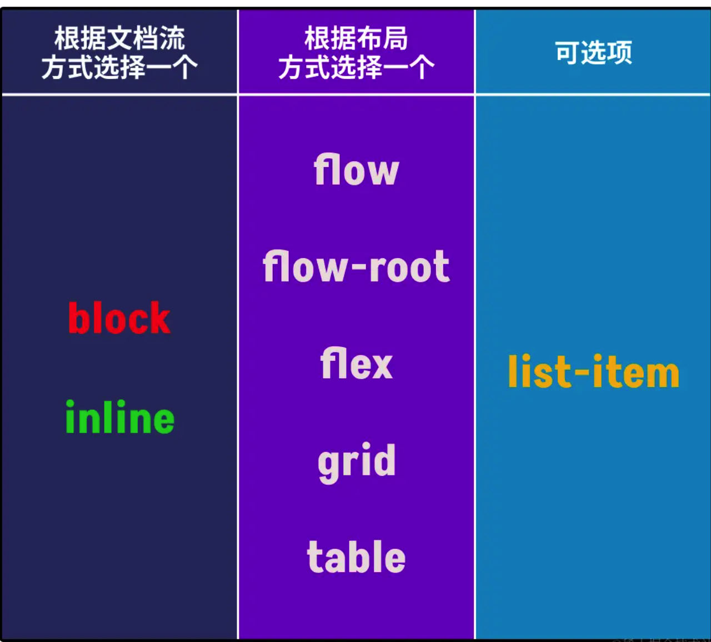

在使用 css flex box 构建布局时， 应该尽量在 flexbox 容器上设置 flex-wrap： wrap 来避免意外布局的行为。

```CSS
    /* 不具防御性的 CSS */

.flex-container {
display: flex; /_ 或 inline-flex _/
}

/_ 具有防御性的 CSS _/
.flex-container {
display: flex; /_ 或 inline-flex _/
flex-wrap: wrap;
}


```

有一点需要注意是，flex-wrap: wrap (或 flex-wrap: wrap-reverse)只有在 Flex 容器没有足够空间容纳 Flex 项目时（即，同一 Flex 行所有 Flex 项目最小内容宽度总和大于 Flex 容器宽度），才会让 Flex 项目换行（或列） 。

理想情况三分布局

```CSS

.card {
    display: flex;
    flex-wrap: wrap;
    gap: 1rem;
}

.card img {
    flex-shrink: 0; /* 防止图片因容器空间不足被挤压 */
}

.card .content {
    flex: 1 1 0%; /* 自动匹配 Flex 容器的剩余空间 */
    min-width: 0;
}

.card h4 {
    white-space: nowrap;
    overflow: hidden;
    text-overflow: ellipsis;
}

.card p {
    overflow:hidden;
    text-overflow:ellipsis;
    display:-webkit-box;
    -webkit-line-clamp:2;
    -webkit-box-orient:vertical;
}

.card button {
    margin-block: auto; /* 垂直居中 */
    margin-inline-start: auto; /* 居右对齐 */
}

```

RAM 布局技术指的是在定义网格时，使用了 repeat()、auto-fit、auto-fill、minmax()、max-content、min-content、fit-content()、fr 等新的 CSS 单位和函数。

通过 auto-fit 或 auto-fill 关键字来指定网格轨道数量

元素盒子中只有字符串内容，那么其最小尺寸会受到 CSS 的 font-family （字体）、font-size （字号）、font-weight （粗细权重）等相关属性值的影响。

最小尺寸和最小内容之间的关系

元素上设置 min-_ 相关属性可以起到一定的条件作用。当它和 width 、height 属性同时出现时，在某些环境之下，min-_ 相关属性权重要更大。比如，元素同时设置了 width 和 min-width 属性，当 width 属性的值小于 min-width 的值时，浏览器将会选择 min-width 属性的值作为元素的宽度值：

```js
if (width < min - width) {
  // 元素的宽度值将取 min-width 属性的值
} else {
  // 元素的宽度值将取 width 属性的值
}
```

最小尺寸是属性，最小内容尺寸是一个尺寸值

如果使用 CSS Flexbox 或 CSS Grid 来构建布局，我们就需要改变元素的 display 属性的值：

CSS Flexbox 布局：flex 或 inline-flex；
CSS Grid 布局：grid 或 inline-grid。

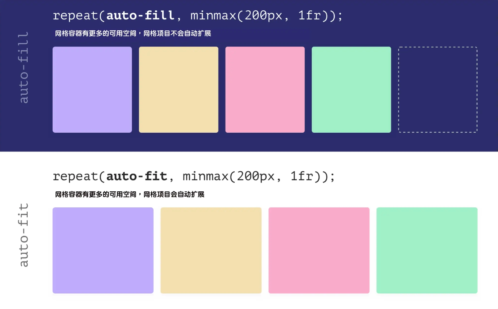

- auto-fill ：当使用 minmax() 函数时，auto-fill 在不改变网格项目宽度的情况下保留可用空间；
- auto-fit ：当使用 minmax() 函数时，auto-fit 关键词将扩展网格项目来填充可用空间。

简单地说，auto-fit 将扩展网格项目以填补可用空间，而 auto-fill 不会扩展网格项目。相反，auto-fill 将保留可用的空间，而不改变网格项目的宽度 。

### z-index

在正常文档流中，元素默认都是静态定位元素，并不会创建层叠上下文。这个时候你在元素上为 z-index 指定了一个特定的值，它也不会起任何的作用。最常见的方法就是给元素的 position 属性设置一个非 static 的值。

不过如果元素是一个 flex 项目或 Grid 项目，那么它会创建一个层叠上下文，即使它的 position 属性值是 static 。

z-index 还可以指定为负值。

创建层叠上下文

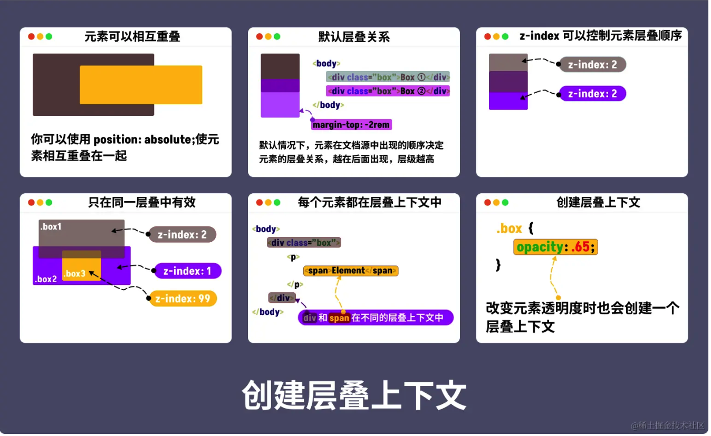

** css 中的层叠上下文中元素的 z-index 总是相对于父元素在其自身层叠上下文中的当前顺序来计算的。**

《html》根元素本身就是一个层叠上下文，没有任何元素还可以比它更低

还可以通过给元素添加其他的属性值，来创建一个新的层叠上下文，比如：

- Flex 项目或 Grid 项目，且 z-index 的值不是默认值 auto；
- opacity 的值小于 1；
- mix-blend-mode 的值不是 normal；
- transform 、filter 、backdrop-filter 、perspective 、clip-path 和 mask 属性的值不是 none；
- isolation 的值为 isolate；
- will-change 值设定了任一属性，而该属性在非初始值（non-initial）值；
- contain 的值为 layout 、paint 或包含它们其中之一的合成值，比如 contain: strict 、contain: content。

特别声明：上面所列创建层叠上下文的方法中，如果 position 的值是 relative 或 absolute 时，需要显式设置 z-index 的值才会创建一个层叠上下文，但 position 的值是 fixed 或 sticky 时，不需要显式设置 z-index 的值也同样会创建一个层叠上下文 。

最好用的还是 isolation 属性，它创建一个层叠上下文。

反观其他创建方式，你会发它们都是通过一些其他修改来隐式创建的，而 isolation 则是显性创建：

- 不需要规定 z-index 的值；
- 可以作用到 static 元素；
- 不会影响到子元素。

⚠️： 层叠等级需要在相同的层叠上下文中比较才有意义，不同层叠上下文中比较层叠等级是没有意义的。

## css 如何改善滚动体验

滚动容器视觉视窗（可见区域）与它的内距盒子框（<padding-box>）边缘重合，被称为滚动视窗 。

滚动容器给 web 带来最直观的变化就是容器出现滚动条

先来看滚动条的类型，它分为经典型滚动条和覆盖型滚动条

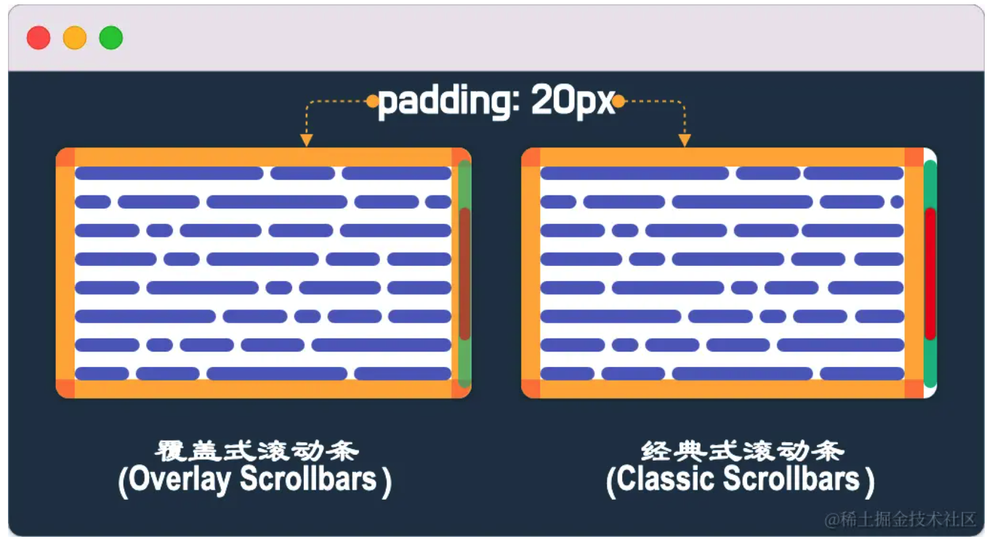

上图左侧是覆盖式滚动条 ，在 iOS 或 Mac 系统上很常见，它被放置在内容之上。它们默认不显示，只在用户滚动的时候显示。为了保持滚动条下面的内容可见，它们都是半透明的，但这完全由用户代理（浏览器）来决定。在与它们互动时，其外观（包括大小）会有所不同。

右侧的是经典型滚动条 ，在 Windows 系统上很常见，它总是放置在一沟槽中（也称“滚动沟槽”），位于边框盒子（<border-box> ）内边缘和内距盒子（<padding-box>）外边缘之间。当出现时占用空间，通常是不透明的，会从相邻的内容中拿走一些空间（改变盒模型大小）。

采用经典型滚动条，滚动条的出现会引起布局变化，产生重排和重绘，对于渲染性能来说是昂贵的。这是因为，滚动条的存在可能影响盒子尺寸的情况，所以 UA 必须从假设不需要滚动条开始，如果发现需要滚动条，则重新计算盒子尺寸。

改善用户体验的滚动新特性

为滚动条保留空间

可以使用 css 的 scrollbar-gutter 属性来为滚动条保留空间，，避免页面布局的变化。

scrollbar-gutter 属性可接受的值有 auto 、 stable 和 both-edges ，而且该属性需要和 overflow 属性结合在一起使用。scrollbar-gutter 同一个值与 overflow 属性不同值时，滚动条保留的空间也是有所差异的。

auto ：当 overflow 为 scroll 或 auto 且有内容溢出时，经典型的滚动条会通过创建滚动沟槽来占用盒子（滚动容器）空间。

stable ：当 overflow 为 hidden、scroll 或 auto 时，经典型滚动条会出现滚动沟槽（不管内容是否溢出容器）。

stable both-edges ：它是 stable 的一个扩展值。可以通过 both-edges 实现对称性，即滚动容器两边都有滚动沟槽等同的空间。

也就是说，在滚动容器上指 scrollbar-gutter 的值为 stable，那么滚动容器的两边都会有滚动沟槽等同的空间，即使内容没有溢出容器。

```css
/* 为滚动条保留空间 */
.scroll-container {
  overflow: auto;
  scrollbar-gutter: stable;
}
```

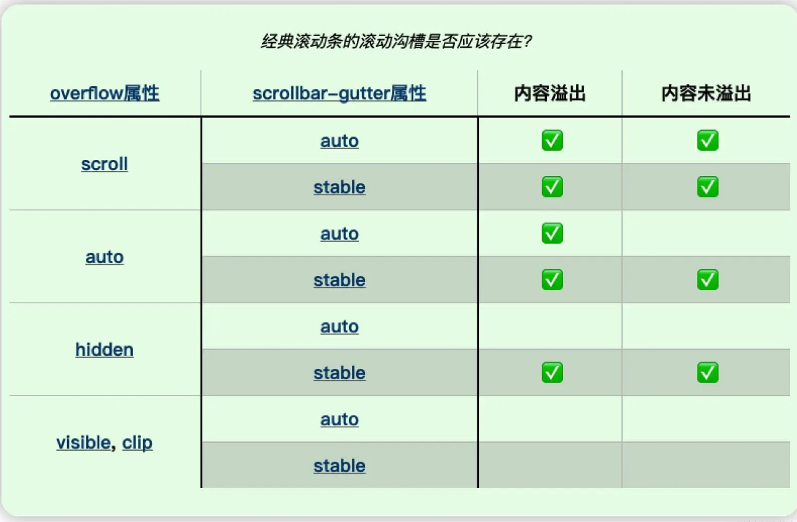

不过，使用 scrollbar-gutter 有两个注意事项：

- 像 overflow 属性一样，根元素（<html>）上设置的 scrollbar-gutter 会被应用到视窗中；
- 与 overflow 属性不同的是，浏览器不会从 HTML 的 <body> 元素中传播 scrollbar-gutter。

也就是说，如果你能预测容器是一个滚动容器，它有可能会出现滚动条，那么应该在滚动容器上设置 scrollbar-gutter 为 stable ：

```css
.scroll--container {
  scrollbar-gutter: stable;
}
```

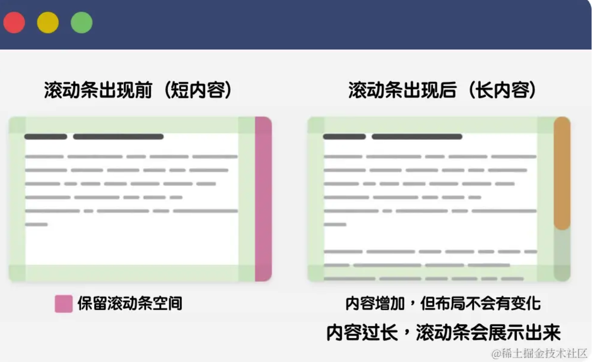

在必要时显示滚动条

虽然说 scrollbar-gutter 可以给滚动条保留预定的空间，避免页面的回流，但我们还是应该尽可能地在必要时显示滚动条 。

因此，在内容比较长的情况下，更推荐将 overflow 的值设置为 auto。如果你将 overflow 显式设置为 scroll 时，不管容器内容长短，滚动条都会像下图这样展示出来：

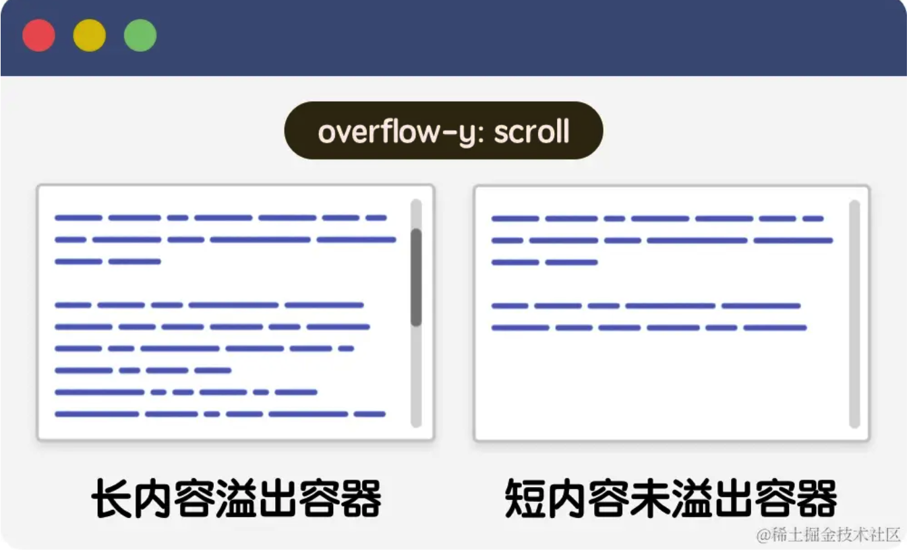

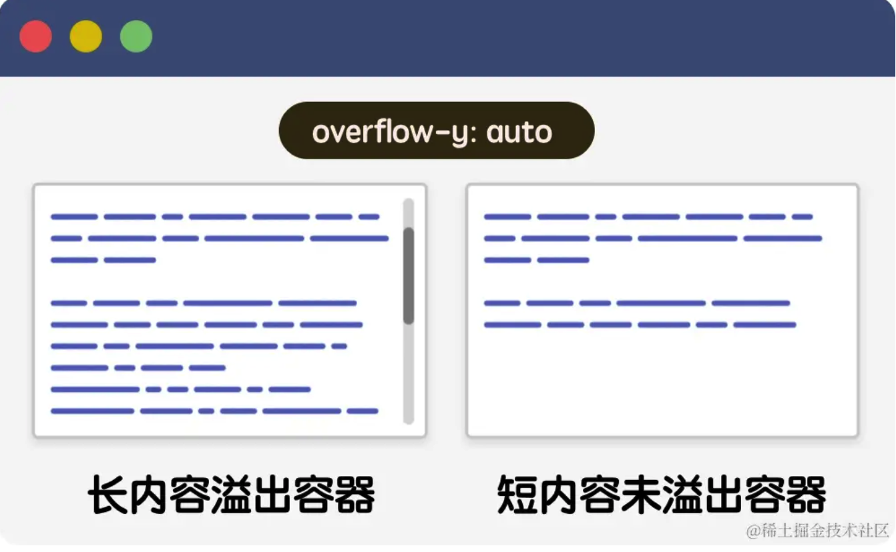

阻止滚动穿透下拉刷新

## 自定义滚动条 -- 美化你的滚动条

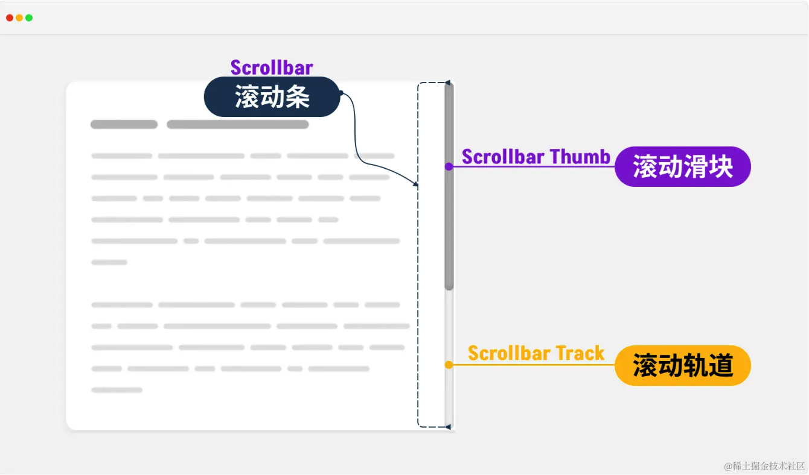

这是滚动条最简单的组成部分:

滚动轨道（Scrollbar Track） ：滚动轨道是滚动条的底部；
滚动滑块（Scrollbar Thumb） ：滚动滑块是用户点击或拖动滚动的对象。

::-webkit-scrollbar ：整个滚动条；
::-webkit-scrollbar-button ：滚动条上的按钮（上下箭头）；
::-webkit-scrollbar-thumb ：滚动条上的滚动滑块；
::-webkit-scrollbar-track ：滚动条轨道；
::-webkit-scrollbar-track-piece ：滚动条没有滑块的轨道部分；
::-webkit-scrollbar-corner ：垂直滚动条和水平滚动条交汇的部分，通常是浏览器窗口的右下角；
::-webkit-resize ：出现在某些元素底角的可拖动调整大小的滑块。

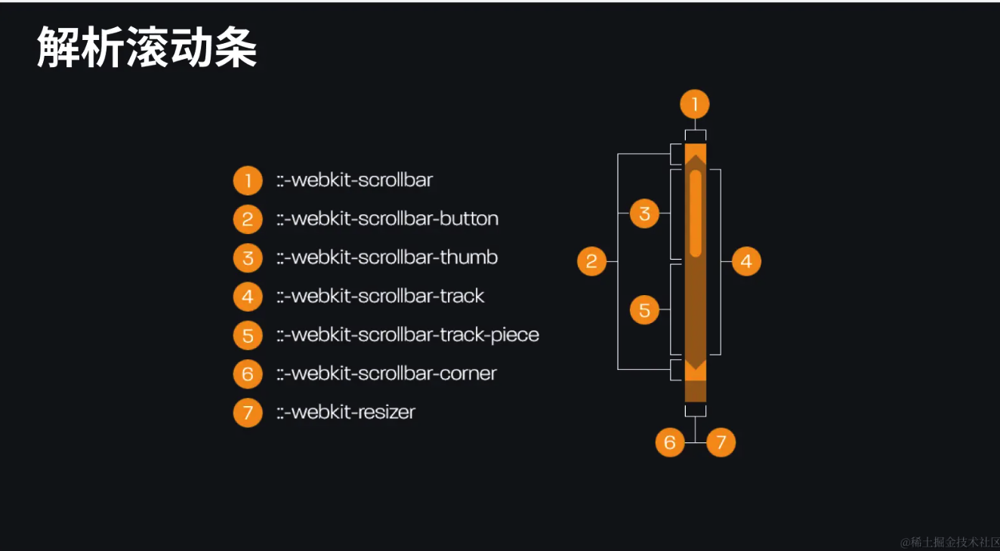

阻止滚动穿透下拉刷新

带有滚动的模态框是滚动穿透的典型案例之一，模态框内容溢出时会出现滚动条

旧版本解决方案

```css
.bg-scrolling-element-when-modal-active {
  touch-action: none;
  -webkit-overflow-scrolling: none;
  overflow: hidden;
  overscroll-behavior: none;
}
```

既模态框弹出时，给 body 添加下面这段 css 代码

```css
.modal--content {
  overflow-y: auto;
  overscroll-behavior-y: contain;
}
```

overscroll-behavior 属性和 overflow 相似，可以分别在 x 轴（overscroll-behavior-x）和 y 轴方向（overscroll-behavior-y）阻止滚动穿透。该属性提供了三个可选值，auto 、contain 和 none ，其中 auto 是其初始值，允许滚动穿透。

要是你给滚动容器指定 overscroll-behavior 属性的值为 contain ，默认的滚动边界行为不变（“滚动触底”或者刷新），但是可以阻止滚动穿透。比如，模态框滚动到底部时，位于其底下的 body 不会有滚动行为：

如果要移除滚动至顶部或者底部的默认滚动特效，需要在 html 或 body 元素上设置 overscorll-behavior 属性的值为 none。这也是禁用原生下拉刷新最有效的方案，而且它对于我们定制一个下拉刷新是非常有利的。否则就会出现两个下拉刷新的效果（一个是原生的，一个是定制的）。

---

---

主项目： neko
组件的实现 公共组件的封装 业务组件的完成 组织架构

子项目： blink heart stage

blink 是一个可以在 web 和移动应用程序添加可视代码编辑器的库。 blink 编辑器使用互锁的图形块来表示变量、逻辑表达式、循环等代码概念。它允许用户应用编程原则，而不必担心语法或命令行上发生错误

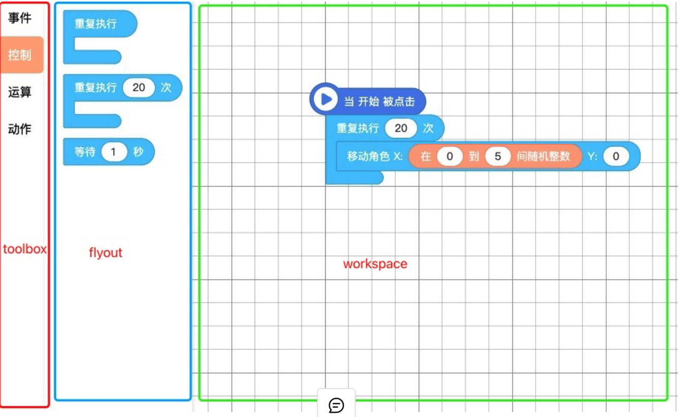

在使用过程中，用户通过从点击 toolbox 上分类的方式来展开 flyout，通过从 flyout 中拖出的方式来创建积木到 workspace，通过拖拽的方式来摆放或连接不同的积木，通过下拉选择或在输入框中修改数值的方式来修改积木上的数值，通过右键菜单或拖动到删除区域的方式来删除积木，通过撤销重做按钮来对刚才的操作进行撤销和重做。这一系列积木相关的交互流程，都由 Blink 提供支持。

Blink 不做什么

● 记录数据。Blink 只会知道当前 workspace 上所存在的积木；业务中多角色或屏幕的切换操作对于 Blink 本体来说，实际上只是清空和加载的过程。业务方需要自行决定如何保存每个角色或屏幕的数据。

● 运行积木。任何运行问题出门右转找 Heart，包括积木报错的时机和内容（报错气泡的样式目前由业务方自定义，不在 Blink 内部实现，以后也许会提供公共接口）。

● 为每个业务做不同的功能细节。作为公共组件，不应该存在业务向的定制功能，反之，我们更倾向于推动各个业务间相似功能的统一化。

● 实现有业务特色的组件外观，如 nemo 的长按菜单。交互组件的外观颜色等与业务本身的风格强相关，难以复用。Blink 提供该类组件的逻辑是：推动不同业务中相似组件的排布逻辑（如层级关系、排列方式等）的统一化，并提供对应的类名，允许业务方通过自行改写 css 来实现自身所需要的具体外观。

安装
项目地址：https://gitlab.codemao.cn/crc/creation/platform/blink
从 master 上拉取代码
该项目是个 npm 包，用于工具项目使用，本地开发需进行如下配置
git clone ssh://git@gitlab.codemao.cn:crc/creation/platform/blink.git
cd blink && npm ci
yarn link
yarn watch
在主项目（如 kitten）根目录执行 yarn link @crc/blink

stage 是一款基于 pixi 扩展的 codemao 专用渲染引擎库

heart 负责将积木编译为代码，并让代码运行起来

Heart 的目标
Blink 一类积木编辑器提供了将积木转换为任何我们定义的代码的能力，为什么我们不直接运行这些代码，而需要有 Heart 呢？
● 我们的产品能够编辑多个角色，所有角色的代码需要并发运行。
● 我们需要保证写出来的死循环等代码不会让浏览器崩溃
● 我们需要为每一个被错误使用的积木提供有效的错误信息
● 我们必须确保代码是安全的
● 我们需要提供友好的开发体验
● 提供存取解释器状态的能力，以在多人游戏中获取更好的体验

Heart 做什么
● 提供积木编译方式
● 提供积木运行状态
● 提供部分基础积木的功能以及定义

Heart 不做什么
● 提供某个业务所需要的积木定义（提供部分基础积木定义）
● 与网络有任何关联
● 处理积木编辑相关事务
● 处理用户界面交互
● 生成 Toolbox

```js

```
