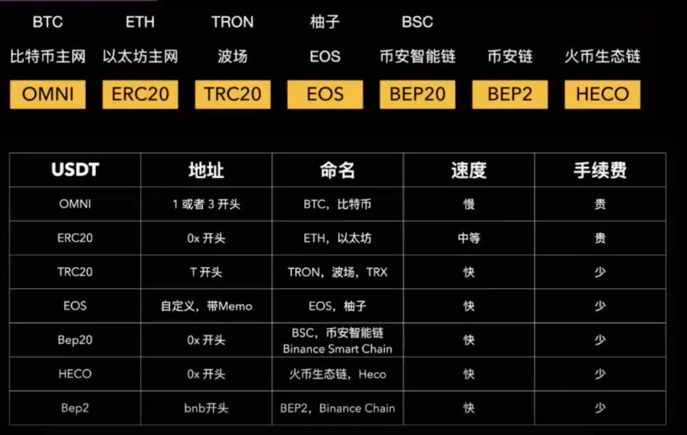
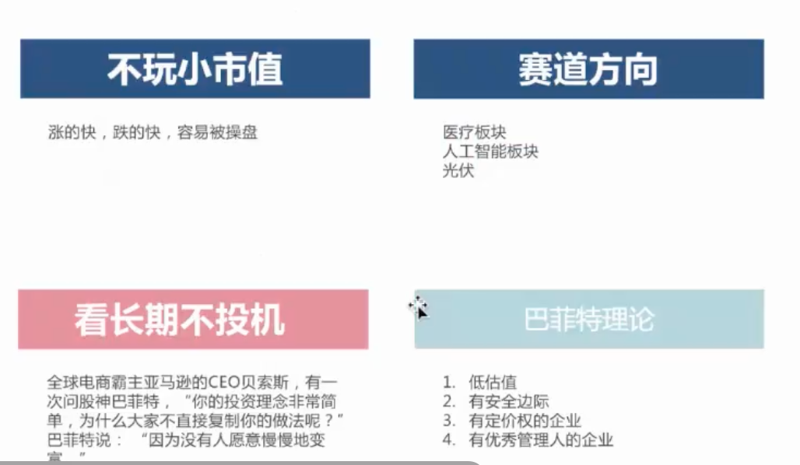
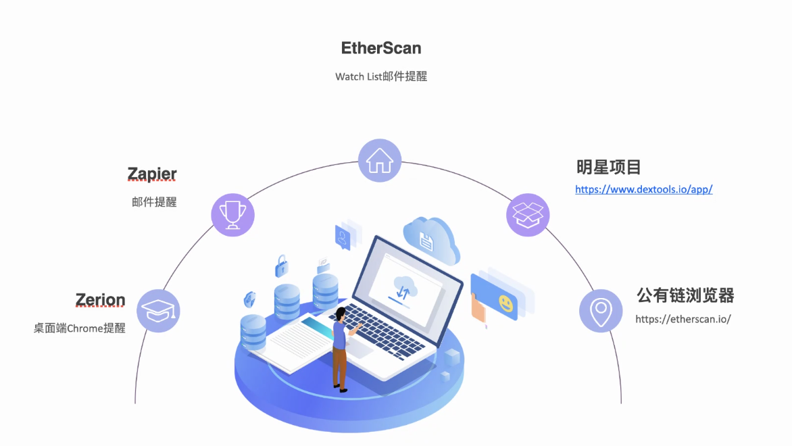
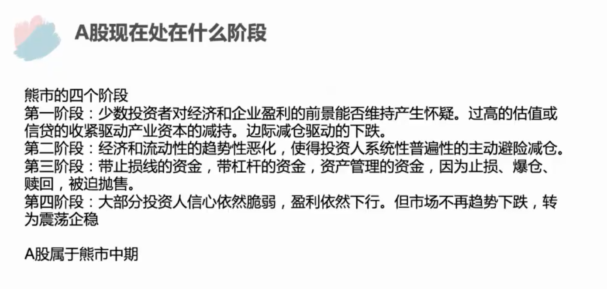
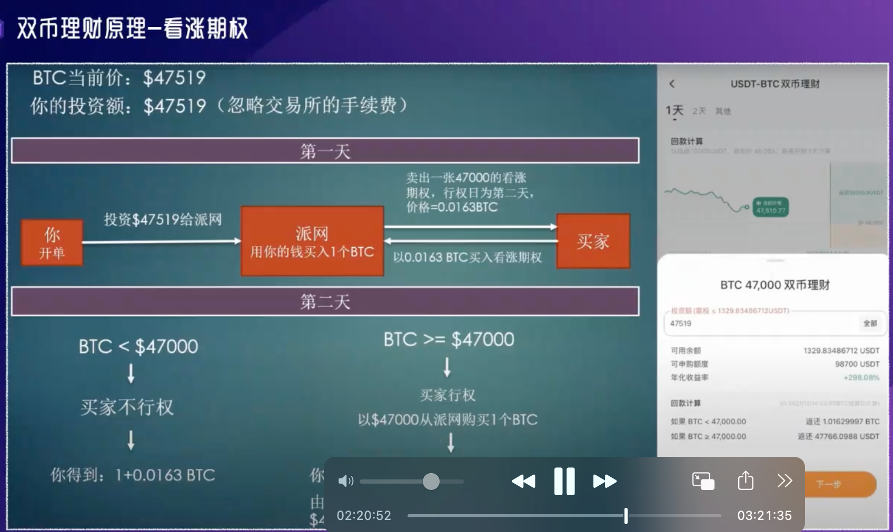
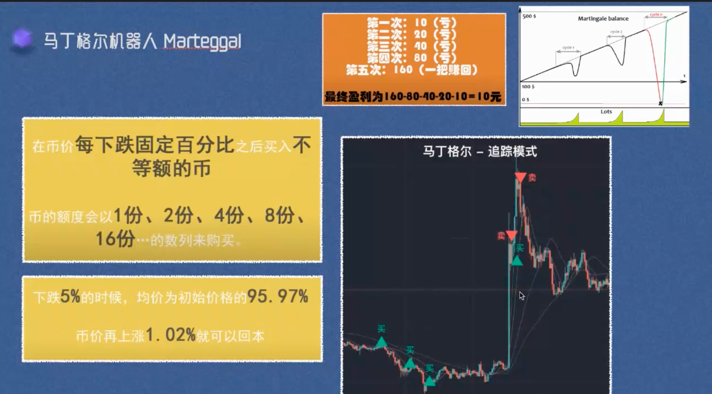
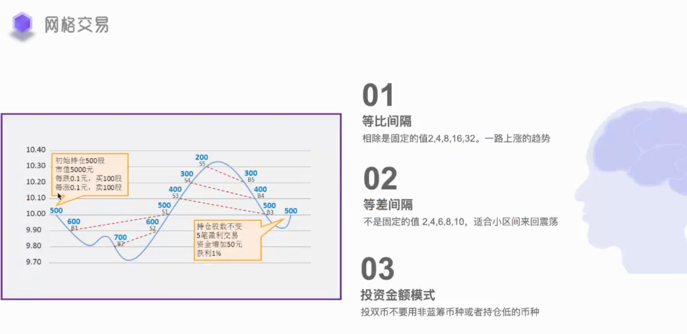

# 基础知识

流动性挖矿： DEfi去中心化金融的一种

马丁格尔5.3% 期现套利 5.78% 币安 月5%

转账需要知道 对方的钱包地址和运用到的链
ERC20 最安全的链

交易所 cex dex DEFI

派网, 芝麻, bybit

现阶段----注册制

严进严出

A股现在处在什么阶段
第一阶段
第二阶段
第三阶段
第四阶段 大部分投资

拿出1w放到币安宝

1. 10% + 5%理财
2. 双币理财 600%
3. 流动性挖矿 6.8%-35% 稳  币种 无常损失
4. 期现套利  6.5%
5. 对冲+ 马丁格尔
6. 网格交易
7. 对冲搬砖
