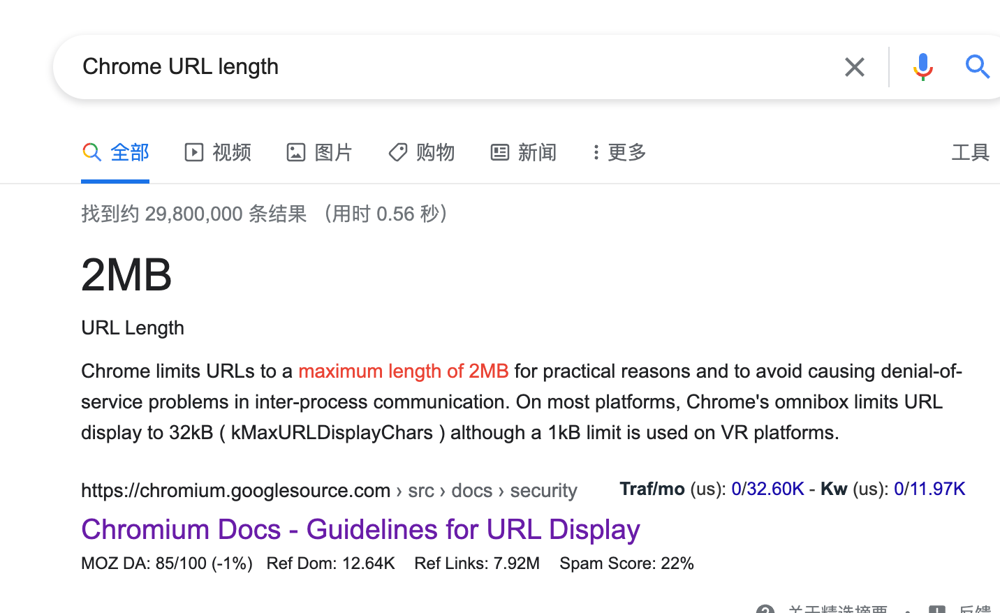

1. 遇到的最大问题就是TypeScript

*. typescript在for in循环中的不能推断键值类型?
  for ... in 包括原型链、需要属性是可枚举的，这都是运行时才能确定的，TS 静态分析不出来，或者说分析的话成本太高。

```TS
interface MyProps {
    a: string;
    b: string
}

const obj:MyProps = {
    a: '1',
    b: '2'
}

for (let i in obj) {
    console.log(obj[i as keyof MyProps])
}
```

* 数组的类型解析

```TS
type ObjectToStringType = {
    [key in keyof IShippingLabelTemplateFormData]: IShippingLabelTemplateFormData[key];
};
```

* 迭代器的类型解析

```TS
type ObjectFromEntrySet<E extends [keyof any, any]> = {
	[K in E[0]]: Extract<E, [K, any]>[1];
};

```

* 组件 Props JSX.Element”分配给类型“FC<{}>”。 参数“__0”和“props” 的类型不兼容。
把Props里面的东西挪到FC里面加泛型

```TS
const BuildTableRequlate:React.FC<xxx> = () => {
	const content = ()=> (<div>一段文本</div>)
	return content;
}

```

2. 时间解析

javascript--url参数转Object

```js
/**
 * @description url参数转Object
 */
let query = function () {
    let url = window.decodeURI(window.location.href)
    if (!url.split('?')[1]) {
        return {}
    }
    let str = JSON.stringify(
        url.split('?')[1]
        .split('&')
        .map(item => item.split('='))
    ).replace('[', '')
    .replace(/(.*)\]/, '$1')
    .replace(/\"\,\"/g, '":"')
    .replace(/\]\,\[/g, ',')
    .replace('[', '{')
    .replace(']', '}')
    return JSON.parse(str)
}
```

3.ObjectToString
需求背景是对象转成String 传递参数URL

```js
    const objectToString = (obj: IShippingLabelTemplateFormData) => {
        let str = '';
        Object.keys(obj).forEach(function (key) {
            str = `${str}${key}=${
                obj[key as keyof IShippingLabelTemplateFormData]
            }&`;
        });
        str = str.substring(0, str.length - 1);
        return str;
    };

```

4.不同浏览器对于URL的字符串长度（超出多少就会截取）




<https://www.geeksforgeeks.org/maximum-length-of-a-url-in-different-browsers/>

<https://chromium.googlesource.com/chromium/src/+/main/docs/security/url_display_guidelines/url_display_guidelines.md#url-length>

URL Length
In general, the web platform does not have limits on the length of URLs (although 2^31 is a common limit). Chrome limits URLs to a maximum length of 2MB for practical reasons and to avoid causing denial-of-service problems in inter-process communication.

On most platforms, Chrome’s omnibox limits URL display to 32kB (kMaxURLDisplayChars) although a 1kB limit is used on VR platforms.

Ensure that the client behaves reasonably if the length of the URL exceeds any limits:

Origin information appears at the start of the URL, so truncating the end is typically harmless.

Rendering a URL as an empty string in edge cases is not ideal, but truncating poorly (or crashing unexpectedly and insecurely) could be worse.

Attackers may use long URLs to abuse other parts of the system. DNS syntax limits fully-qualified hostnames to 253 characters and each label in the hostname to 63 characters, but Chromium's GURL class does not enforce this limit.

5. 处理url 进行 encodeURI decodeURI

```js
const encodeGetParams = p => 
  Object.entries(p).map(kv => kv.map(encodeURIComponent).join("=")).join("&");

const params = {
  user: "María Rodríguez",
  awesome: true,
  awesomeness: 64,
  "ZOMG+&=*(": "*^%*GMOZ"
};

console.log("https://example.com/endpoint?" + encodeGetParams(params))
```

6. 涉及到eslint的一些问题

* ESLint: for..in loops iterate over the entire prototype chain, which is virtually never what you want. Use Object.{keys,values,entries}, and iterate over the resulting array. (no-restricted-syntax

```js
for (const key in currentValues) {
    if (Object.prototype.hasOwnProperty.call(currentValues, key)) {
        yield put(setCurrentValue(key, currentValues[key]));
    }
}
```

* avoid no-param-reassign when setting a property on a DOM object
在 DOM 对象上设置属性时避免 no-param-reassign

7.yup的类型校验
react-hook-form表单会把空字符串转成NaN
数字非必填的时候，要先用transform转成null
在用nullable转换出来

```js

trackingNumber: yup
    .number().transform((value) => (isNaN(value) ? null :  value)).nullable(),
shipWeight: yup
    .number().transform((value) => (isNaN(value) ? null : value)).nullable()
    .positive(),
```

10.emotion的样式书写规则

className进行包裹

div 是有className这个属性的

10. 遇到没有d.ts文件的，只能自己写文件

11.网络搜集过来的命名规范
一、命名规则说明

所有的命名最好都用小写。

使用英文命名。

给每一个表格和表单加上一个唯一的、结构标记id。

给每个图片加上alt标签，优点在于图片发生错误时，alt可以体现给用户。

二、相对网页外层重要部分css样式命名

wrap——用于最外层

header——用于头部

main——用于主题内容（中部）

main-left——左侧布局

main-right——右侧布局

nav——网页菜单导航条

content——用于网页中部主体

footer——用于底部

css命名其他说明

DIV+CSS命名小结：无论是使用“.”选择符号开头命名，还是使用“#”选择符号开头都无所谓，但我们最好遵循——主要的，重要的，特殊的，最外层的盒子用“#”选择符号开头命名，其他都用“.”选择符号开头命名，同时要考虑命名的css选择器在html中尽量不要重复使用调用。

三、类class的书写规范示例

字体大小，直接使用"font+字体大小"作为名称，如：

.font16px{ font-size：16px } ；

.font18px{ font-size：18px } ；

标题栏样式，使用"类别+功能"的方式命名，如：

.barnews{ } ;

.barproduct{ } ;

省略0后边的单位，如：

margin: 0 ;

padding: 0 ;

四、标签属性命名规范

id：—— 连接符命名法“hello-world”

class：—— 连接符命名法“hello-world”

name：—— 骆驼式命名法“helloWorld”

五、注意事项

h1~h6：文章标题、内容区块标题，根据重要性由大到小区分，h1一个页面只出现一次。

文本框不使用size属性定义宽度，而使用css的width属性。

添加maxlength属性限制输入字符的长度。

把id留给后台开发和JS使用，除此之外页面的page id(如首页的外层需要一个ID id=”page_index”)，页面结构（header main footer）允许用id命名之外，其他禁止id使用在样式表CSS命名中，一律使用class命名。

为了节省字节数以及文件大小，尽量使用属性的简写方式。

如果颜色使用16进制色值，当6个数字两两相等时，使用缩写方式编写，比如：#996600缩写为#960

六、图片命名

背景图片：bg001，bg002……

一般图片：img001，img002……

特定图片：如icon，logo按照具体情况命名。

按钮图片：btn-submit，btn-cancel……

-----------------------------------------------

网页设计命名规范

1. Container

“container“ 就是将页面中的所有元素包在一起的部分，这部分还可以命名为:“wrapper“, “wrap“, “page“.

2. Header

“header” 是网站页面的头部区域，一般来讲，它包含网站的logo和一些其他元素。这部分还可以命名为:“page-header” (或 pageHeader).

3. Navbar

“navbar“等同于横向的导航栏，是最典型的网页元素。这部分还可以命名为:“nav”, “navigation”, “nav-wrapper”.

4. Menu

“Menu”区域包含一般的链接和菜单，这部分还可以命名为: “subNav “, “links“，“sidebar-main”.

5. Main

“Main”是网站的主要区域，如果是博客的话它将包含的日志。这部分还可以命名为: “content“, “main-content” (或“mainContent”)。

6. Sidebar

“Sidebar” 部分可以包含网站的次要内容，比如最近更新内容列表、关于网站的介绍或广告元素等…这部分还可以命名为: “subNav “, “side-panel“, “secondary-content“.

7. Footer

“Footer”包含网站的一些附加信息，这部分还可以命名为: “copyright“.

需要注意的几点

1.尽量考虑为元素命名其本身的作用或”用意”，达到语义化。不要使用表面形式的命名.

如:red/left/big等。

2.组合命名规则:

[元素类型]-[元素作用/内容]

如:搜索按钮: btn-search

登录表单:form-login

新闻列表:list-news

3.涉及到交互行为的元素命名:

凡涉及交互行为的元素通常会有正常、悬停、点击和已浏览等不同样式，命名可参考以下规则:

鼠标悬停:：hover 点击：click 已浏览：visited

如:搜索按钮: btn-search、btn-search-hover、btn-search-visited

常用命名汇总

站头部: head/header(头部) top（顶部）

导航：nav 导航具体区分：topnav(顶部导航)、mainnav(主导航)、mininav(迷你导航)、textnav(导航文本)、subnav(子导航/二级导航)

旗帜、广告和商标：logo（旗帜）、brand(商标)、banner(标语)

搜索：sreach(搜索)、sreachbox(搜索框)、sreachbtn(搜索按钮)、sreachinput（搜索输入框）

注册和登录：login(登录)、regsiter(注册)、userbox(用户名/通行证的文本框)、password(密码)

布局、分栏和框：layout(布局)、bigdiv(大div)、leftdiv(左分栏)、rightdiv(右分栏)、leftfloat(左浮动)、rightfloat(右浮动)、mainbox()、subpage(子页面/二级页面)

页脚/底部：foot/footer(页脚/底部)、copyright(版权信息)、sitemap(网站地图)

其他：content(内容)、skin(皮肤)、title(标题)、from(表单)、pic(图片)、news(新闻)、shop(购物区)、list(列表/清单)、newslist(新闻列表)、 downloadlist(下载列表)、piclist(图片列表)、dropmenv(下拉菜单)、cor/corner(圆角)、homepage(首页)、crumb(当前位置导航)

分类命名

id的命名:

(1)页面结构

容器: container 页头：header 内容：content/container

页面主体：main 页尾：footer 导航：nav

侧栏：sidebar 栏目：column 页面外围控制整体布局宽度：wrapper

左右中：left right center

(2)导航

导航：nav 主导航：mainbav 子导航：subnav

顶导航：topnav 边导航：sidebar 左导航：leftsidebar

右导航：rightsidebar 菜单：menu 子菜单：submenu

标题: title 摘要: summary

(3)功能

标志：logo 广告：banner 登陆：login 登录条：loginbar

注册：regsiter 搜索：search 功能区：shop

标题：title 加入：joinus 状态：status 按钮：btn

滚动：scroll 标签页：tab 文章列表：list 提示信息：msg

当前的: current 小技巧：tips 图标: icon 注释：note

指南：guild　服务：service 热点：hot 新闻：news

下载：download 投票：vote 合作伙伴：partner

友情链接：link 版权：copyright

class的命名:

(1)颜色:使用颜色的名称或者16进制代码,如

.red { color: red; }

.f60 { color: #f60; }

.ff8600 { color: #ff8600; }

(2)字体大小,直接使用’font+字体大小’作为名称,如

.font12px { font-size: 12px; }

.font9pt {font-size: 9pt; }

(3)对齐样式,使用对齐目标的英文名称,如

.left { float:left; }

.bottom { float:bottom; }

(4)标题栏样式,使用’类别+功能’的方式命名,如

.barnews { }

.barproduct { }

注意事项:

1.一律小写;

2.尽量用英文;

3.不加中杠和下划线;

4.尽量不缩写，除非一看就明白的单词.

主要的 master.css 模块 module.css 基本共用 base.css

布局，版面 layout.css 主题 themes.css 专栏 columns.css

文字 font.css 表单 forms.css 补丁 mend.css 打印 print.css

统计 count.css

以上结构就可以组合使用，例如：左列标题lefttitle；底部导航footernav 规范不是说要所有人照一个样子来命名css，我们可以根据自己的需要定制命名规则，只要记住命名的规则，就可以根据网站本身的特点来创造具有自己风格的命名方式。

一、目前网页设计者用得较多的是基于软件开中变量的命名方式的命名方法。如对于一组用于定义字体样式的class，我们可以使用f即foot的头字母为前缀进行命名，如：

f-blue:表示蓝色字体样式

f-blod:表示粗体字体样式

对于网页中如新闻频道的一些新闻的现实样式，可以用n作为前缀进行样式设计，如：

n-title:新闻标题

n-list:新闻列表

CSS文件及样式命名

1、CSS文件命名规范

全局样式：global.css；

框架布局：layout.css；

字体样式：font.css；

链接样式：link.css；

打印样式：print.css；

2、CSS样式命名规范

本人建议：用字母、_号工、-号、数字组成，必须以字母开头，不能为纯数字。为了开发后样式名管理方便，大家请用有意义的单词或缩写组合来命名，让同事一看就明白这样式大概是哪一块的，这样就节省了查找样式的时间，例如：

头部样式用header，头部左边，可以用header_left或header_l,还有如果是列结构的可以这样——box _1of3 (三列中的第一列)，box_2of3 (三列中的第二列)、box_3of3 (三列中的第三列)，其它的我就不一一举例了，大家按以上规律去命名就好。

下面列出一些常用的命名单词方便大家使用：（以后大家工作过程中慢慢把自己积累的单词都共享出来，那大家的命就会更加统一了，就不会有一义多词的情况了。）
