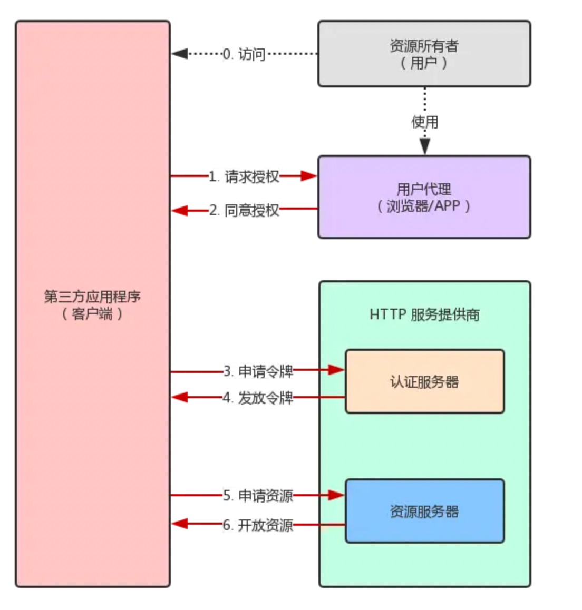
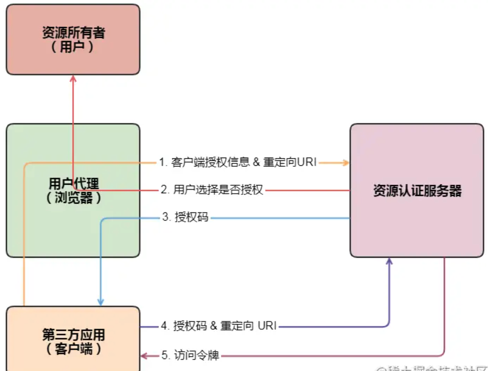
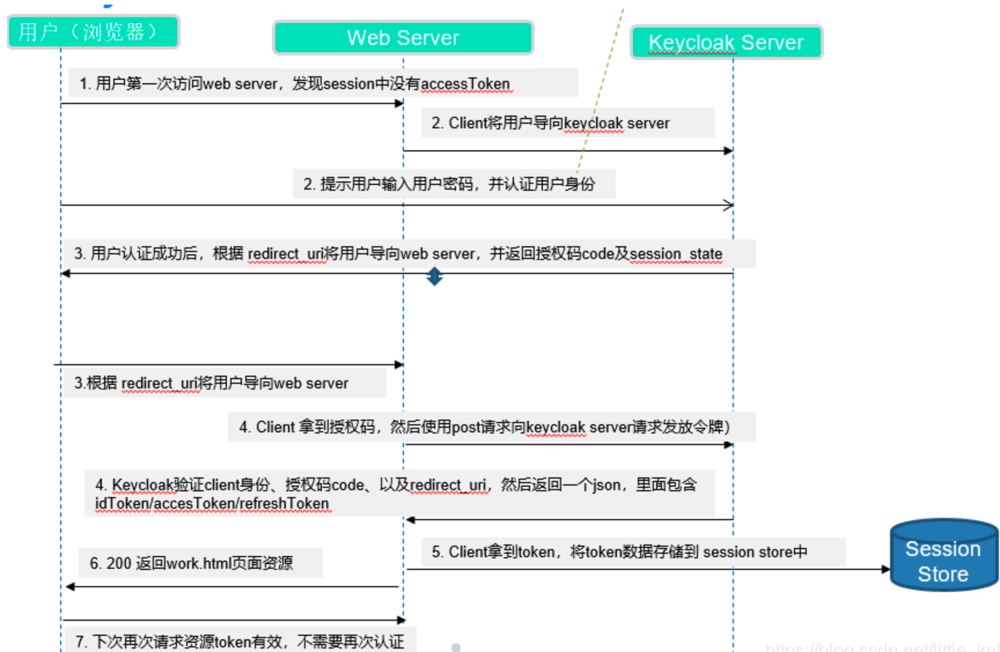

# 接入keycloak详解

## oAuth2.0

## 授权认证过程



1. 用户访问第三方应用程序（简称：客户端）以后，客户端要求用户给予授权。
2. 用户同意给予客户端授权。
3. 客户端使用第 2 步获得的授权，向认证服务器申请令牌。
4. 认证服务器对客户端进行认证以后，确认无误，同意发放令牌。
5. 客户端使用令牌，向资源服务器申请获取资源。
6. 资源服务器确认令牌无误，同意向客户端开放资源。

## 实现ajax请求session过期后提示用户已过期

## 四种授权模式

1.授权码模式

授权码（authorization code）方式，指的是第三方应用先申请一个授权码，然后再用该码获取令牌。

2.简化模式

有些 Web 应用是纯前端应用，没有后端。这时就不能用上面的方式了，必须将令牌储存在前端。RFC 6749 就规定了第二种方式，允许直接向前端颁发令牌。这种方式没有授权码这个中间步骤，所以称为（授权码）"隐藏式"（implicit）。
3.密码模式

如果你高度信任某个应用，RFC 6749 也允许用户把用户名和密码，直接告诉该应用。该应用就使用你的密码，申请令牌，这种方式称为"密码式"（password）。

4.客户端模式

最后一种方式是凭证式（client credentials），适用于没有前端的命令行应用，即在命令行下请求令牌。

## 授权码模式流程

授权码模式（authorization code）是功能最完整、流程最严密安全的授权模式。它的特点就是通过客户端的 后台服务器，与"服务提供商"的认证服务器进行互动。

注意这种方式适用于那些有后端的 Web 应用。授权码通过前端传送，令牌则是储存在后端，而且所有与资源服务器的通信都在后端完成。这样的前后端分离，可以避免令牌泄漏。



```JS
router.all('*', async (ctx, next) => {
    if (_checkSkippedUrl(ctx.originalUrl)) {
      await next()
    } else {
      const { request } = ctx
      if (_isAjaxRequest(ctx) && (!request.kauth || !request.kauth.grant)) {
        ctx.status = 401
      } else {
        return keycloakProtect(ctx, next)
      }
    }
  }
```

## 授权码模式详解

1、用户访问客户端，客户端将用户导向认证服务器。
2、用户选择是否给予客户端授权。
3、假设用户给予授权，认证服务器将用户导向客户端事先指定的"重定向URI"（redirection URI），同时附上一个授权码。
4、客户端收到授权码，附上早先的"重定向URI"，向认证服务器申请令牌。这一步是在客户端的 后台服务器 上完成的，对用户不可见。
5、认证服务器核对了授权码和重定向URI，确认无误后，向客户端发送访问令牌（access token）和更新令牌（refresh token）。

## 授权码模式流程的五个步骤

参数说明
第 1 步骤中，客户端申请认证的URI，包含以下参数：

response_type：表示授权类型，必选项，此处的值固定为"code"
client_id：表示客户端的ID，必选项
redirect_uri：表示重定向URI，可选项
scope：表示申请的权限范围，可选项
state：表示客户端的当前状态，可以指定任意值，认证服务器会原封不动地返回这个值。
示例
A 网站提供一个链接，用户点击后就会跳转到 B 网站，授权用户数据给 A 网站使用。下面就是 A 网站跳转 B 网站的一个示意链接：
<https://b.com/oauth/authorize>?
  response_type=code&
  client_id=CLIENT_ID&
  redirect_uri=CALLBACK_URL&
  scope=read

作者：木鲸鱼
链接：<https://juejin.cn/post/6844903833882066958>
来源：稀土掘金
著作权归作者所有。商业转载请联系作者获得授权，非商业转载请注明出处。
第 2 步骤中，用户跳转后，B 网站会要求用户登录，然后询问是否同意给予 A 网站授权。

第 3 步骤中，服务器回应客户端的URI，包含以下参数：

code：表示授权码，必选项。该码的有效期应该很短，通常设为10分钟，客户端只能使用该码一次，否则会被授权服务器拒绝。该码与客户端ID和重定向URI，是一一对应关系。
state：如果客户端的请求中包含这个参数，认证服务器的回应也必须一模一样包含这个参数

示例
在第 2 步骤用户表示同意之后，这时 B 网站就会跳回redirect_uri参数指定的网址。跳转时，会传回一个授权码，就像下面这样。
<https://a.com/callback?code=AUTHORIZATION_CODE>
复制代码上面 URL 中，code参数就是授权码。

第 4 步骤中，客户端向认证服务器申请令牌的HTTP请求，包含以下参数：

grant_type：表示使用的授权模式，必选项，此处的值固定为"authorization_code"。
code：表示上一步获得的授权码，必选项。
redirect_uri：表示重定向URI，必选项，且必须与A步骤中的该参数值保持一致。
client_id：表示客户端ID，必选项。

```JS
//JavaScript
```

示例
在第 3 步骤中，A 网站拿到授权码以后，就可以在后端，向 B 网站请求令牌。

```JS
https://b.com/oauth/token?
 client_id=CLIENT_ID&
 client_secret=CLIENT_SECRET&
 grant_type=authorization_code&
 code=AUTHORIZATION_CODE&
 redirect_uri=CALLBACK_URL
```

上面 URL 中：
client_id参数和client_secret参数用来让 B 确认 A 的身份（client_secret参数是保密的，因此只能在后端发请求）；
grant_type参数的值是AUTHORIZATION_CODE，表示采用的授权方式是授权码；
code参数是上一步拿到的授权码；
redirect_uri参数是令牌颁发后的回调网址。

第 5 步骤中，认证服务器发送的HTTP回复，包含以下参数：

access_token：表示访问令牌，必选项。
token_type：表示令牌类型，该值大小写不敏感，必选项，可以是bearer类型或mac类型。
expires_in：表示过期时间，单位为秒。如果省略该参数，必须其他方式设置过期时间。
refresh_token：表示更新令牌，用来获取下一次的访问令牌，可选项。
scope：表示权限范围，如果与客户端申请的范围一致，此项可省略。

示例
第 4 步骤中，B 网站收到请求以后，就会颁发令牌。具体做法是向redirect_uri指定的网址，发送一段 JSON 数据：

```JS
HTTP/1.1 200 OK
Content-Type: application/json;charset=UTF-8
Cache-Control: no-store
Pragma: no-cache

{    
    "access_token":"ACCESS_TOKEN",
    "token_type":"bearer",
    "expires_in":2592000,
    "refresh_token":"REFRESH_TOKEN",
    "scope":"read",
    "uid":100101,
    "info":{...}
}
```

上面 JSON 数据中，access_token字段就是令牌，A 网站在后端拿到了。注意：HTTP头信息中明确指定不得缓存。



在第2步，web server将用户导向keycloak server的重定向连接：
<http://localhost:8080/auth/realms/myRealm/protocol/openid-connect/auth?client_id=nodejs&state=10abdacb-5e85-4f48-8bf7-b8aedb378567&redirect_uri=http%3A%2F%2Flocalhost%3A3001%2Fwork.html%3Fauth_callback%3D1&scope=openid&response_type=code>
可以看到使用的就是OAuth2授权码模式：response_type=code

在第3步中keycloak-server将用户导向回web-server的重定向连接:
<http://localhost:3001/work.html?auth_callback=1&state=10abdacb-5e85-4f48-8bf7-b8aedb378567&session_state=3f47f74a-ef0c-4245-b87e-22acae8b08e9&code=281cd9c6-187e-423f-84ee-9419aa4dab7d.3f47f74a-ef0c-4245-b87e-22acae8b08e9.aa9ee788-cbb7-4370-9ed2-6de8b2b510b7>

返回了三个token：accessToken、refreshToken、idToken
accessToken 用于每次访问资源服务器时验证用户权限，refreshToken用于在accessToken过期以后可以通过它重新想keycloak-server申请一个新的accessToken，而不需求重新登录。idToken用于识别用户身份，这个OpenID-Connect协议新加入的一个token。

[参考文献]
[](https://github.com/keycloak)
[](https://www.keycloak.org/docs/latest/securing_apps/index.html#_javascript_adapter)
