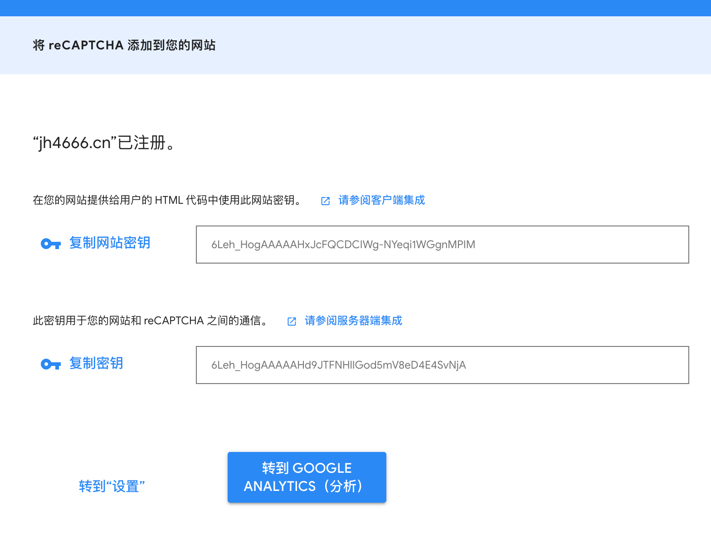
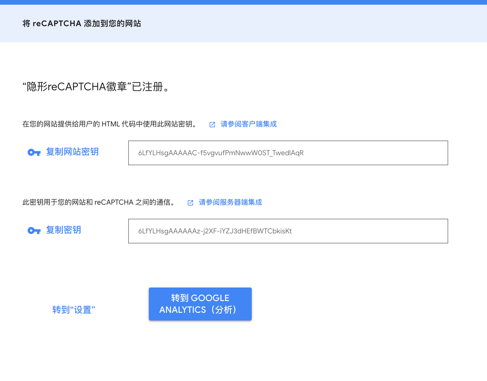
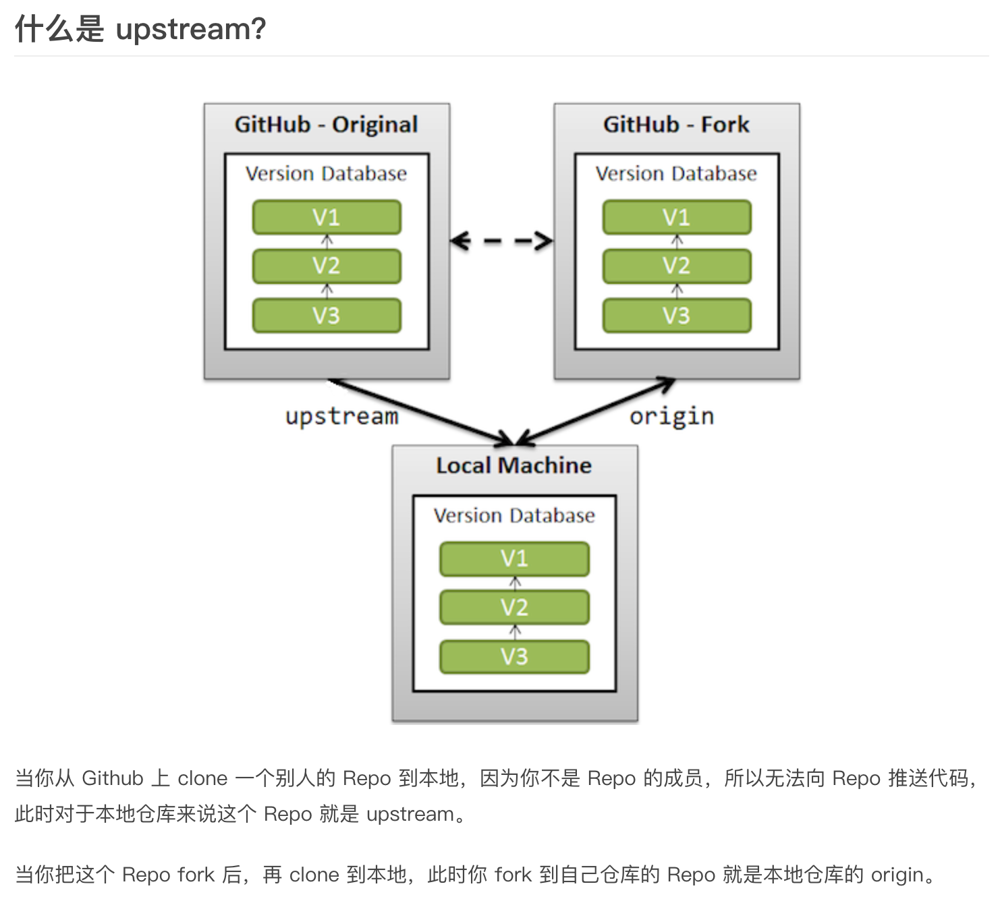

网站密钥：6Leh_HogAAAAAHxJcFQCDCIWg-NYeqi1WGgnMPIM

密钥：6Leh_HogAAAAAHd9JTFNHlIGod5mV8eD4E4SvNjA


隐形徽章

网站密钥： 6LfYLHsgAAAAAC-f5vgvufPmNwwW0ST_TwedlAqR

密钥： 6LfYLHsgAAAAAAz-j2XF-iYZJ3dHEfBWTCbkisKt

redux-thunk vs redux-saga

## git upstream 的意思

所以我们可以通过设置 upstream 来获取远程 Repo 的最新代码。



按我理解，upstream的意思是同步local的分支，跟谁同步呢--------跟远程origin ，注意这个跟你自己fork的那份没关系，fork出来的那份只在最开始的时候发挥了下作用

## git commit --amend 命令用来修复最近一次commit. 可以让你合并你缓存区的修改和上一次commit, 而不是提交一个新的快照. 还可以用来编辑上一次的commit描述

合并缓存区的修改和最近的一次commit, 然后用生成的新的commit替换掉老的. 如果缓存区没有内容, 那么利用amend可以修改上一次commit的描述.

开发过程中很容易忘记stage某个文件或填写了不够准确的commit描述. --amend就是用来fix这些错误的.

不要对一个公共的commit使用amend
amend后生成的commit是一个全新的commit, 之前的老的commit会从项目历史中被删除. 如果你amend了一个被其他开发者使用的commit, 会严重影响其他开发者.

```bash
下面的例子我们添加一个文件, 然后单独把它commit到HEAD里面, 然后发现这次commit少包括了一个文件. 然后我们使用--amend解决这个问题.

# Edit hello.py and main.py
git add hello.py
git commit
 
# Realize you forgot to add the changes from main.py
git add main.py
git commit --amend --no-edit
编辑器的默认描述会是上一次commit的描述, --no-edit能让我们修复commit,而且不要修改commit描述.
```

## 回撤commit信息

git reset --soft HEAD^

HEAD^的意思是上一个版本，也可以写成HEAD~1

如果你进行了2次commit，想都撤回，可以使用HEAD~2

## git clean

用法：git clean命令用来从你的工作目录中删除所有没有tracked过的文件.

git clean经常和git reset --hard一起结合使用. 记住reset只影响被track过的文件, 所以需要clean来删除没有track过的文件. 结合使用这两个命令能让你的工作目录完全回到一个指定的<commit>的状态.

```bash

git clean -n ----------是一次clean的演习, 告诉你哪些文件会被删除. 记住他不会真正的删除文件, 只是一个提醒.

git clean -f ------------删除当前目录下所有没有track过的文件. 他不会删除.gitignore文件里面指定的文件夹和文件, 不管这些文件有没有被track过.
```

git reset --hard和git clean -f是一对好基友. 结合使用他们能让你的工作目录完全回退到最近一次commit的时候.

git clean对于刚编译过的项目也非常有用. 如, 他能轻易删除掉编译后生成的.o和.exe等文件.  这个在打包要发布一个release的时候非常有用.

## 通过tag merge进去

此时，QA们测完了你的 feature，给了你 thumbup (测试通过) 的 tag，模拟一下这个tag：
git ck -
git tag thumbup-feature
然后，你就可以用这个 tag merge 了：
git checkout master
git pull origin master # 拉取远程 master 合并到本地 master
git merge thumbup-feature --no-ff # --no-ff 是为了避免 fast-forward

## gitmoji 的学习

## 写一份合理的commit信息

	
## TIPS
	Note: reCAPTCHA also works with ['strict-dynamic'](https://w3c.github.io/webappsec-csp/#strict-dynamic-usage) on browsers that support it.

Alternatively, please add the following values to the directives:

-   **script-src** https://www.google.com/recaptcha/, https://www.gstatic.com/recaptcha/
-   **frame-src** https://www.google.com/recaptcha/, https://recaptcha.google.com/recaptcha/
	
	注意事项：
	https://developers.google.com/recaptcha/docs/faq