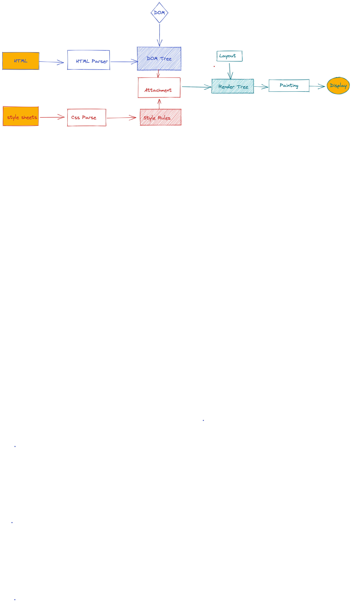

## css 会堵塞渲染吗

**css 并不会阻塞 DOM 树的解析，但是 css 加载会阻塞 DOM 树渲染。**

### 原因

因为你加载 css 的时候，可能会修改下面 DOM 节点的样式，如果 css 加载不阻塞 DOM 树渲染的话，那么当 css 加载完之后，DOM 树可能又得重新重绘或者回流了，这就造成了一些没有必要的损耗。所以我干脆就先把 DOM 树的结构先解析完，把可以做的工作做完，然后等你 css 加载完之后，在根据最终的样式来渲染 DOM 树，这种做法性能方面确实会比较好一点。



## 总结

1. css 加载不会堵塞 DOM 的解析
2. css 加载会堵塞 DOM 的渲染
3. js 可能会操作之前的 DOM 节点和 Css 样式，因此浏览器会维持 html 中 css 和 js 的顺序。因此，样式表会在后面的 js 执行前先加载执行完毕。所以 css 会阻塞后面 js 的执行。

对于浏览器来说，页面加载主要有两个事件，一个是 DOMContentLoaded，另一个是 onLoad。而 onLoad 没什么好说的，就是等待页面的所有资源都加载完成才会触发，这些资源包括 css、js、图片视频等。

而 DOMContentLoaded，顾名思义，就是当页面的内容解析完成后，则触发该事件。那么，正如我们上面讨论过的，css 会阻塞 Dom 渲染和 js 执行，而 js 会阻塞 Dom 解析。那么我们可以做出这样的假设

###

css 加载会阻塞后面的 js

第一部分 自我介绍完 聊了下文本 协同合作的方案
第二部分 输入一串 url 到渲染页面所涉及到的知识点 https 和加密方案 css 会堵塞 dom 吗

## 重排 重绘 区别

[重排和重绘](../../杂文/重绘和重排.md)

第三部分 编程题 this 的指向和变量提升

第四部分 vue 和 react 有什么不同 讲讲 fiber 讲讲为什么改成 fiber

第五部分编程题 输出一个等待 3 秒 总共 4 次的函数

```js
function wait(timer) {
  return new Promise((resolve) =>
    setTimeout(() => {
      resolve();
    }, timer)
  );
}

async function waitProcess(timer, repeat) {
  // 一次 3 秒
  for (let i = 1; i <= repeat; i++) {
    console.log(`等待第 ${i} 次`);
    await wait(timer);
  }
}
waitProcess(2000, 4);
```
