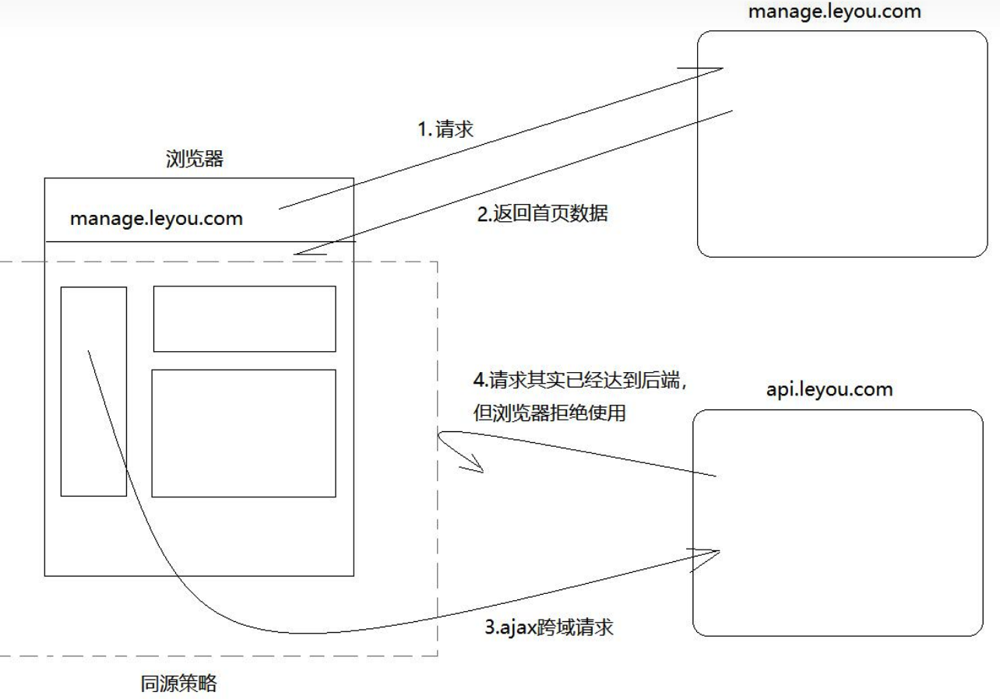

## 闭包

 在js高程里面的定义是： 指有权访问另一个函数作用域中的变量的函数。然后我自己的理解闭包其实只是一个绑定了执行环境的函数,能够在函数声明过程中，将环境信息与所属函数绑定在一起的数据结构。它是基于函数声明的文本位置的，因此也被称为围绕函数定义的静态作用域或词法作用域。

## 解决问题的能力， 更多的是接受新事物，能够学习 归纳 总结

## hook的原理

## 同源跨域的通信方式

  同源策略引起的跨域问题（自己反思点）
    同源策略是浏览器的行为，是为了保护本地数据不被JavaScript代码获取回来的数据污染，因此拦截的是客户端发出的请求回来的数据接收，即请求发送了，服务器响应了，但是无法被浏览器接收。需要注意的是，很多人以为同源策略是浏览器不让请求发出去、或者后端拒绝返回数据。实际情况是，请求正常发出，后端接口正常响应，只不过数据到了浏览器后被丢弃了。



同源策略限制内容有：

Cookie、LocalStorage、IndexedDB 等存储性内容
DOM节点
AJAX跨域请求的数据

同源跨域通信

1. Hash
2. postMessage
3. JSONP
4. WebSocket
5. CORS

### CORS是为了解决AJAX跨域的问题

整个CORS通信过程，都是浏览器自动完成，不需要用户参与。对于开发者来说，CORS通信与同源的AJAX通信没有差别，代码完全一样。浏览器一旦发现AJAX请求跨源，就会自动添加一些附加的头信息，有时还会多出一次附加的请求，但用户不会有感觉。
CORS背后的基本思想就是使用自定义的HTTP头部让浏览器与服务器进行沟通，从而决定请求或响应是应该成功，还是应该失败。

服务器端对于CORS的支持，主要就是通过设置 Access-Control-Allow-Origin 来进行的。如果浏览器检测到相应的设置，就可以允许Ajax进行跨域的访问。

比如一个简单的使用GET或者POST发送的请求，它没有自定义头部，而主体内容是text/plain。在发送该请求时，需要给它附加一个额外的Origin头部，其中包含请求页面的源信息（协议、域名和端口），以便服务器根据这个头部信息来决定是否给予响应。下面是Origin头部的一个示例。

Origin: <http://www.nczonline.net>
如果服务器认为这个请求可以接受，就在Access-Control-Allow-Origin头部中回发相同的源信息（如果是公共资源，可以回发'*'）。例如：

Access-Control-Allow-Origin: <http://www.nczonline.net>
如果没有这个头部，或者有这个头部但源信息不匹配，浏览器就会驳回请求。正常情况下，浏览器会处理请求。注意，请求进而响应都不包含cookie信息。

JSONP是通过动态<script>元素来使用的，使用时可以为src属性指定一个跨域URL。
这里的<scriot>元素与元素类似，都有能力不受限制的从其他域加载资源。因为JSONP是有效的JS代码，所以在请求完成后，即在JSONP响应加载到页面中以后，就会立即执行。来看一个例子。

CORS和JSONP对比

JSONP只能实现GET请求，而CORS支持所有类型的HTTP请求。
使用CORS，开发者可以使用普通的XMLHttpRequest发起请求和获得数据，比起JSONP有更好的错误处理。
JSONP主要被老的浏览器支持，它们往往不支持CORS，而绝大多数现代浏览器都已经支持了CORS

## new string 和 直接string一样吗


## 讲一讲vue3中的proxy

## 讲一讲fiber

Fiber 思路是不减少渲染工作量，把渲染工作拆分成小任务思路是不减少渲染工作量。渲染过程中，留出时间来处理用户响应，让用户感觉起来变快了。这样会带来额外的问题，不得不加载额外的代码，用于处理复杂的运行时调度工作

## 箭头函数和普通函数的区别

```javascript
var id = 'GLOBAL';
var obj = {
  id: 'OBJ',
  a: function(){
    console.log(this.id);
  },
  b: () => {
    console.log(this.id);
  }
};

obj.a();    // 'OBJ'
obj.b();    // 'GLOBAL'

```

对象obj的方法a使用普通函数定义的，普通函数作为对象的方法调用时，this指向它所属的对象。所以，this.id就是obj.id，所以输出'OBJ'。
但是方法b是使用箭头函数定义的，箭头函数中的this实际是继承的它定义时所处的全局执行环境中的this，所以指向Window对象，所以输出'GLOBAL'

1.箭头函数继承而来的this指向永远不变
2.call()/.apply()/.bind()无法改变箭头函数中this的指向
3.箭头函数没有自己的arguments
箭头函数没有自己的arguments对象。在箭头函数中访问arguments实际上获得的是外层局部（函数）执行环境中的值。
4、箭头函数没有原型prototype
5、箭头函数不能用作Generator函数，不能使用yeild关键字
6. 箭头函数不能作为构造函数使用

## 有Cookie跨域,iframe跨域,LocalStorage跨域

## 浏览器为什么要发预检请求

什么是简单请求

简单请求：

**方法：HEAD GET POST
**HTTP的头信息不超过以下字段
1.Accept、
1.Accept-Language、
1.Content-Language、
1.Last-Event-ID、
1.Content-Type：只限于三个值application/x-www-form-urlencoded、multipart/form-data、text/plain

这是为了兼容表单（form），因为历史上表单一直可以发出跨域请求。AJAX 的跨域设计就是，只要表单可以发，AJAX 就可以直接发

非简单请求:
    凡事不能满足上面两个条件，就属于非简单请求。常见的非简单请求是那种对服务器有特殊要求的请求，比如请求方法是PUT或DELETE，或者Content-Type字段的类型是application/json。

非简单请求的CORS请求，会在正式通信之前，增加一次HTTP查询请求，称为"预检"请求（preflight）。

为什么要对非简单跨域请求做预检？

    1.减少非简单跨域请求对服务器的影响（开始时就提到，服务器有时候不想理睬跨域请求），比如PUT、DELETE请求可以直接新建或者修改、删除服务器中的资源。预检请求可以防止该情况发生。

    2.减少服务器对于是否跨域的计算量

"预检"请求用的请求方法是OPTIONS，表示这个请求是用来询问的。头信息里面，关键字段是Origin，表示请求来自哪个源。

除了Origin字段，"预检"请求的头信息包括两个特殊字段。

（1）Access-Control-Request-Method
该字段是必须的，用来列出浏览器的CORS请求会用到哪些HTTP方法。
（2）Access-Control-Request-Headers

该字段是一个逗号分隔的字符串，指定浏览器CORS请求会额外发送的头信息字段，上例是X-Custom-Header。

## 构造函数的new都做了什么

简单来说，分为四步： ① JS内部首先会先生成一个对象； ② 再把函数中的this指向该对象； ③ 然后执行构造函数中的语句； ④ 最终返回该对象实例。

## v8垃圾回收


v8 引擎的内存限制
默认情况下： v8引擎在64位系统下最多只能使用约1.4gb的内存，在32位中最多只能使用约0.7GB的内存，在这样的限制下，必然会导致在node中无法直接操作大内存对象的。