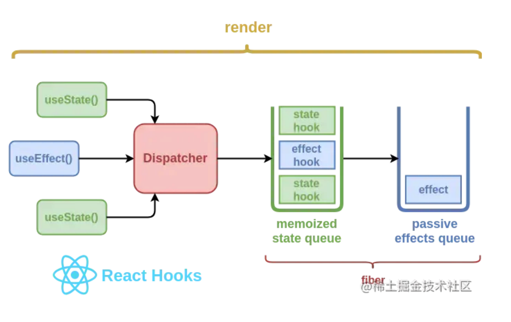

# 不同公司的面试关注点不同

## vue 框架层面的错误捕获

```javascript
Vue.config.errorHandler = (err, vm, info) => {
  console.error("通过vue errorHandler捕获的错误");
  console.error(err);
  console.error(vm);
  console.error(info);
};
```

## 前端信息安全相关的

## 小程序的登录流程

## 前端的登录校验这块

## vue 路由的三种模式

const router = new VueRouter({routes, mode:'hash|history|abstract',})

三、abstract 模式
适用于所有 JavaScript 环境，例如服务器端使用 Node.js。如果没有浏览器 API，路由器将自动被强制进入此模式。

1.
2.
3.

## 错误的监控

## 性能怎么统计的

## webpack 打包的性能优化

[webpack 优化](../../源码/webpack/webpack常用优化.md)

## node 怎么区分不同环境（window，linux）

项目再 windows 和 linux 下部署的差异：

1、大小写敏感度不同：

Linux 下路径和文件名都是区分大小写的。abc/bcd/aa.jpg 和 abc/Bcd/aa.jpg 是两个不同的文件路径，window 访问没问题，Linux 大小写敏感会导致找不到文件。
2、盘符及目录分隔符的区别

父子目录及目录与文件的分隔符，Windows 是，而 Linux 是/，java 编码最好使用 File.separator(能够自动识别 Widow 或者 Linux，使用想用的分隔符)

两个不同路径分隔符，window 下；，Linux 下为：，java 编码最好使用 File.pathSeparator

在的时候魅族用的是 jenkins

## webpack 插件

## node 层面的错误捕获

## CORS 有什么配置

## 看过什么源码

## 最近看过一本 js 有关的书

## 介绍下 vue 中怎么使用 ssr

通过配置 server-entry 和 client-entry，会打包成两份 bundle

Server bundle

vue-ssr-bundle.json

```json
{
  "entry": "static/js/app.80f0e94fe005dfb1b2d7.js",
  "files": {
    "static/js/app.80f0e94fe005dfb1b2d7.js": "module.exports=function(t...",
    "static/js/xxx.29dba471385af57c280c.js": "module.exports=function(t..."
  }
}
```

client bundle

vue-ssr-client-manifest.json

```json
{
  "publicPath": "//cdn.xxx.cn/xxx/",
  "all": [
    "static/js/app.80f0e94fe005dfb1b2d7.js",
    "static/css/app.d3f8a9a55d0c0be68be0.css"
  ],
  "initial": [
    "static/js/app.80f0e94fe005dfb1b2d7.js",
    "static/css/app.d3f8a9a55d0c0be68be0.css"
  ],
  "async": [
    "static/js/xxx.29dba471385af57c280c.js"
  ],
  "modules": {
    "00f0587d": [ 0, 1 ]
    ...
    }
}

```

Server Bundle 中包含了所有要在服务端运行的代码列表，和一个入口文件名。

Client Bundle 包含了所有需要在客户端运行的脚本和静态资源，如：js、css 图片、字体等。还有一份 clientManifest 文件清单，清单中 initial 数组中的 js 将会在 ssr 输出时插入到 html 字符串中作为 preload 和 script 脚本引用。async 和 modules 将配合检索出异步组件和异步依赖库的 js 文件的引入.

在初始化阶段

SSR 应用会在 node 启动时初始化一个 renderer 单例对象，renderer 对象由 vue-server-renderer 库中的 createBundleRenderer 函数创建，函数接受两个参数，ServerBundle 内容和 options 配置

Client Bundle 包含了所有需要在客户端运行的脚本和静态资源，如：js、css 图片、字体等。还有一份 clientManifest 文件清单，清单中 initial 数组中的 js 将会在 ssr 输出时插入到 html 字符串中作为 preload 和 script 脚本引用。async 和 modules 将配合检索出异步组件和异步依赖库的 js 文件的引入，在输出阶段我们会详细解读。

```javascript
bundleRenderer.renderToString(context, (err, html) => {
  //...
});
```

createBundleRenderer 函数在初始化阶段主要做了 3 件事情：

1. 创建将 vue 对象解析为 html 的渲染函数的单例对象

```javascript
var renderer = createRenderer(rendererOptions);
```

## webpack 打包后的输出产物

## webpack 是怎么区分打包环境的 linux 或者 window

确认安装 cross-env 它能跨平台的设置及使用环境变量

他们两者的配置不同

```bash
# BASH
#node中常用的到的环境变量是NODE_ENV，首先查看是否存在
set NODE_ENV

#如果不存在则添加环境变量
set NODE_ENV=production

#环境变量追加值 set 变量名=%变量名%;变量内容
set path=%path%;C:\web;C:\Tools

#某些时候需要删除环境变量
set NODE_ENV=

```

在 linux 中

```BASH
# BASH
#node中常用的到的环境变量是NODE_ENV，首先查看是否存在
echo $NODE_ENV

#如果不存在则添加环境变量
export NODE_ENV=production

#环境变量追加值
export path=$path:/home/download:/usr/local/

#某些时候需要删除环境变量
unset NODE_ENV

#某些时候需要显示所有的环境变量
env

```

```json
"scripts": {
  "dev": "cross-env NODE_ENV=development webpack-dev-server --progress --colors --devtool cheap-module-eval-source-map --hot --inline",
  "build": "cross-env NODE_ENV=production webpack --progress --colors --devtool cheap-module-source-map",
}

```

## 解释下什么是多例什么是单例

## react 组件更新机制是什么

## jquery 链式调用实现原理是？

链式调用是通过 return this 的形式来实现的。通过对象上的方法最后加上 return this，把对象再返回回来，对象就可以继续调用方法，实现链式操作了。
链式调用的问题：所有对象的方法返回的都是对象本身，也就是说没有返回值，所以这种方法不一定在任何环境下都适合。

## webpack loader 原理

[webpack loader 原理](../../源码/webpack/Webpack5%20核心原理与应用实践-loader.md)

## 你遇到的项目挑战及如何解决

## hooks 的原理

实际就是函数组件解决没有 state，生命周期，逻辑不能复用的一种技术方案

React 的真实实现是用的单链表的形式代替数组的，通过 next 串联起所有的 hook



Dispatcher 是一个包含了 hooks 函数的共享对象，它将基于 ReactDom 的渲染阶段被动态地分配或清理，并且它将确保用户无法在 React 组件外访问到 hooks

hooks 在启用时被一个叫做 enableHooks 的标志位变量启用或禁用，在渲染根组件时，判断该标志位并简单的切换到合适的 dispatcher 上

在 Hooks 内部，使用 resolveDispatcher 方法解析当前的 dispatcher 引用，如果当前的 dispatcher 异常，则会报错

真正的 Hooks

可以说 Dispatcher 是 Hooks 机制下的对外统一暴露控制器，渲染过程中，通过 flag 标志控制当前的上下文 dispatcher，核心意义就是严格控制 hooks 的调用渲染，防止 hooks 在异常的地方被调用了

## innerText 和 innerHTML 的区别

innerText 属性将文本内容设置或返回为指定节点及其所有子节点的纯文本，而 innerHTML 属性将获取和设置元素中的纯文本或 HTML 内容。与 InnerText 不同，InnerHTML 允许您使用 HTML 格式的文本，并且不会自动对文本进行编码和解码。

## http 报文头部有哪些字段? 有什么意义?

## debounce 和 throttle 的区别

[节流和防抖.md](../../源码/源码手写系列/节流和防抖.md)

## 微信小程序生命周期

1.onLoad 页面加载时触发。一个页面只会调用一次，可以在 onLoad 的参数中获取打开当前页面路径中的参数
1.onShow() 页面显示/切入前台时触发
1.onReady() 页面初次渲染完成时触发。一个页面只会调用一次，代表页面已经准备妥当，可以和视图层进行交互
1.onHide() 页面隐藏/切入后台时触发。 如 navigateTo 或底部 tab 切换到其他页面，小程序切入后台等
1.onUnload() 页面卸载时触发。如 redirectTo 或 navigateBack 到其他页面时
