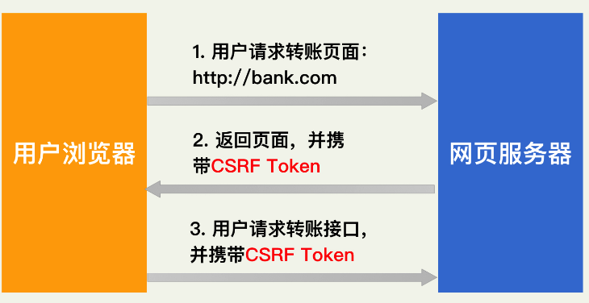

## 讲一讲 react 的 函数组件和 class 组件有什么不一样

## vue 的双向绑定

## 数组常用的方法

1.join

2.reverse

3.sort

4.concat

5.slice

6.splice

7.push pop

8.unshift shift

9.foeEach

10.filter

11.every 和 some

12.indexOf lastIndexOf

## 你主导的项目

项目管理方向：

1. 计划：目标拆解
1. 监控：指定有效的跟进机制，及时发现问题
1. 结果导向：快速响应并有效管理多重需求，敢于带领团队挑战并实现困难目标
1. 复盘能力： 通过团队工作复盘，标杆学习不断沉淀和总结，提供工作的有效性。

## 跨域

## vue 的组件通信

## 讲一讲 css 的性能优化

1、选择器的嵌套的优化

2、CSS 代码模块化

3、抽象 CSS 代码

## 怎么实现 1px

像素可以分为物理像素（CSS 像素）和逻辑像素。

物理像素也叫硬件像素或者设备像素，一个物理像素是显示器（手机屏幕）上最小的物理显示元（像素颗粒）
逻辑像素也叫设备独立像素或者密度无关像素可以认为是计算机坐标系统中得一个点，这个点代表一个可以由程序使用的虚拟像素（比如：css 像素。然后由相关系统转换为物理像素。所以说，物理像素和设备独立像素之间存在着一定的对应关系，这就是接下来要说的设备像素比。

由于现在手机大部分是 Retina 高清屏幕，所以在 PC 端和移动端存在设备像素比的概念。简单说就是你在 pc 端看到的 1px 和在移动端看到的 1px 是不一样的。

在 PC 端上，像素可以称为 CSS 像素，PC 端上 dpr 为 1。也就说你书写 css 样式是是多少在 pc 上就显示多少。而在移动端上，像素通常使用设备像素。往往 PC 端和移动端上在不做处理的情况下 1px 显示是不同的。

我们要先分 dpr=2 还是 dpr=3 的情况，根据 media query 来判断屏幕特性，根据屏幕特性进行适当的设置。
设备像素比(dpr)=物理像素/逻辑像素(px) // 在某一方向上，x 方向或者 y 方向，下图 dpr=2


### 方法一：利用 box-shadow

优点：

缺点： 边框有阴影，颜色变浅

```javascript
    .box {
      width: 100px;
      height: 100px;
      margin: 50px auto;
      background-color: antiquewhite;
      box-shadow: 0px 1px 0px 0px rgba(0, 0, 0, 1);
    }

```

### 方法二：设置 border-image 方案

用 1px 宽度图片做 border 图片
优点：
可以设置单条,多条边框
没有性能瓶颈的问题

缺点：
修改颜色麻烦, 需要替换图片
圆角需要特殊处理，并且边缘会模糊

```javascript
    .box {
      width: 100px;
      height: 100px;
      margin: 50px auto;
      background-color: antiquewhite;
    }
    .border-image-1px {
      border-bottom: 1px solid transparent;
      border-image: url(border.png) 30 stretch;
    }
```

### 方法三： 使用 background-image 实现

background-image 跟 border-image 的方法一样，你要先准备一张符合你要求的图片。然后将边框模拟在背景上。
优点：
可以设置单条,多条边框
没有性能瓶颈的问题
缺点：
修改颜色麻烦, 需要替换图片
圆角需要特殊处理，并且边缘会模糊

```javascript
    .box {
      width: 100px;
      height: 100px;
      margin: 50px auto;
      background-color: antiquewhite;
    }

    .background-image-1px {
      background: url(border.png) repeat-x left bottom;
      -webkit-background-size: 100% 1px;
      background-size: 100% 1px;
      background-color: antiquewhite;
    }

```

### 方法四：多背景渐变实现

与 background-image 方案类似，只是将图片替换为 css3 渐变。设置 1px 的渐变背景，50%有颜色，50%透明。

优点：
可以实现单条、多条边框
边框的颜色随意设置
缺点：
代码量不少
圆角没法实现
多背景图片有兼容性问题

```JS
    .background-gradient-1px {
      background:
        linear-gradient(#000, #000 100%, transparent 100%) left / 1px 100% no-repeat,
        linear-gradient(#000, #000 100%, transparent 100%) right / 1px 100% no-repeat,
        linear-gradient(#000,#000 100%, transparent 100%) top / 100% 1px no-repeat,
        linear-gradient(#000,#000 100%, transparent 100%) bottom / 100% 1px no-repeat
    }

    .box {
      width: 100px;
      height: 100px;
      margin: 50px auto;
      background-color: antiquewhite;
    }

```

### 方法五： 用小数来写 px 值

```javascript
.border { border: 1px solid #999 }
@media all and (-webkit-min-device-pixel-ratio: 2) {
    .scale::after {
        display: block;
        content: '';
        border-bottom: 1px solid #000;
        transform: scaleY(.5);
    }
}
@media all and (-webkit-min-device-pixel-ratio: 3) {
    .scale::after {
        display: block;
        content: '';
        border-bottom: 1px solid #000;
        transform: scaleY(.333);
    }
}
```

## 响应式布局

1.媒体查询
屏幕大小作为分割点：480px,800px,1400px,1400px
移动优先 or pc 优先 2.百分比布局
3.rem 布局

rem 响应式的布局思想：

\*一般不要给元素设置具体的宽度，但是对于一些小图标可以设定具体宽度值

- 高度值可以设置固定值，设计稿有多大，我们就严格有多大
- 所有设置的固定值都用 rem 做单位（首先在 HTML 总设置一个基准值：px 和 rem 的对应比例，然后在效果图上获取 px 值，布局的时候转化为 rem 值)
- js 获取真实屏幕的宽度，让其除以设计稿的宽度，算出比例，把之前的基准值按照比例进行重新的设定，这样项目就可以在移动端自适应了

## Null 和 undefined 有什么不同

1. null 表示无，完全不存在的；undefined 表示东西没有定义
1. undefined 有自己的数据类型（undefined），null 只是一个对象
1. 在基本算术运算中，null 被视为 0，undefined 返回的 NaN.

## hybrid 怎么调用客户端方法

通过 JSBridge 可以实现 web 调用 native 的方法,js Interface 直接注入到 window 对象

## 角色的转变

## 讲讲 watch 和 computed 有什么不同

## vue 的生命周期

不论子组件嵌套多少层，总是最外层（最大组件：APP。vue）的生命周期 created 先执行，mounted 最后执行，接下来便是向内一层（compOne）的 created 执行，接下来就是在向内一层（也就是第三层）的生命周期 created 执行，其次第仨层的 mounted 执行，然后就是第二层的 mounted 了。

当采用懒加载的时候：
App.vue 中生命周期会先执行（created 和 mounted），不论嵌套型还是平级的子组件

## node

## webpack 的配置

## css 怎么实现 x 按钮

方式一：

```css
.close::before {
  　　content: "\2716";
}

::after和
  ::before
  伪元素。
  伪元素：是在内容元素前后插入一个额外的元素。这些元素在文档源中不可见，但是在显示中可见。
  close:before {
  transform: rotate(45deg);
}
close: after {
  transform: rotate(-45deg);
}
```

## 前端安全方面的

讲了 xss， csrf 没讲出来

1. 从代码层面

- 固定字符动态化 --- 加入一些逻辑，让关键字符串只在实际运行的时候，才会被计算出。
- 反调试 --- 无限断点： 开启单独线程循环调用 debugger，进入调试模式后，不断地停滞在无意义的断点处，无法正常调试。

- 混淆代码 --- 将代码无序化和复杂化

2. 从设计层面

XSS 和 SQL 注入。它们分别篡改了原始的 HTML 和 SQL 逻辑

满足 CSRF 攻击的基本条件

1. 使用 Cookie 进行认证 2.参数中不包含任何隐私信息

防范 CSRF 的基本步骤

1. 行业内标准的防护方法是： CSRFToken 的使用



因为 CSRF Token 是每次用户正常访问页面时，服务端随机生成返回给浏览器的。所以，每一次正常的转账接口调用，都会携带不同的 CSRF Token。黑客没有办法进行提前猜测，也就没有办法构造出正确的表单了。

也就是说我们对 CSRF 的理解应为：攻击者借用用户 COOKIE 执行非用户本意的操作。

在此攻击过程中用户 COOKIE 对于攻击者来说是不可见的是未知的、不可见的，攻击者能做到仅仅是借用 COOKIE，而 COOKIE 里面具体写了什么，攻击者是不知道的。又因为 COOKIE 里的信息对于攻击者来说是不可预知的，无法伪造的，所以将 CSRF-TOKEN 写在 COOKIE 中符合就 CSRF 防御思想中的不可预知原则。

将 CSRF-TOKEN 写在 COOKIE 中可抵御 CSRF 攻击，但前提是网站不存在 XSS 漏洞或者 CSRF-Token 具备 httponly 属性。

正常来说，比较容易理解的是，正确的 CSRFtoken 被放在了服务器的 Session 文件中。

当用户执行增删改操作的时候，服务器会从用户对应的 Session 文件中取出这个 Token 值和用户提交到服务器的 Token 值做对比

如果两者数值相同，用户的增删改操作才是被允许执行的，否则用户的请求就是不合法的，即 CSRF。

所以用户 COOKIE 中存在 CSRF-Token 信息，其实是服务器保存正确 CSRF-Token 的一种形式。

它与将 CSRF-Token 存储在 Session 中是一样的，仅仅是 Token 的一种储存形式。

2.加个二次验证来加强防护

XSS 跨站脚本攻击
反射型 XSS、基于 DOM 的 XSS 以及持久型 XSS。

## nginx 反向代理的配置

## 正则匹配数字

数字：^[0-9]\*$
日期：^\d{4}-\d{1,2}-\d{1,2}
字母： ^[A-Za-z]+$
大写：^[A-Z]+$
小写：^[a-z]+$
数字和 26 个英文字母组成的字符串：由数字和 26 个英文字母组成的字符串：^[A-Za-z0-9]+$
n位的数字：^\d{n}$
m-n 位的数字：^\d{m,n}$

正则表达式规则：

| 字符 | 含义                                                   |
| ---- | ------------------------------------------------------ |
| \d   | 数字字符,等价于[0-9] digit                             |
| \D   | 非数字字符,等价于[^0-9]                                |
| \s   | 空白符,等价于[\t\n\x0B\f\r] space                      |
| \S   | 非空白符,等价于[^\t\b\x0b\f\r]                         |
| \w   | 单词字符（字母，数字，下划线）,等价于[a-zA-Z_0-9] word |
| \W   | 非单词字符,等价于[^a-za-z_0-9]                         |

边界：
| 字符 | 含义 |
| ---- | ---- |
| ^ | 以 xxx 开始 |
| $ | 以 xxx 结束 |
| \b | 单词边界 |
| \B | 非单词边界 |

量词

| 字符  | 含义                         |
| ----- | ---------------------------- |
| ？    | 出现零次或一次(最多出现一次) |
| +     | 出现一次或多次(至少出现一次) |
| \*    | 出现零次或多次(任意次)       |
| {n}   | 出现 n 次                    |
| {n,m} | 出现 n 到 m 次               |
| {n,}  | 至少出现 n 次                |

## 正则匹配数字千分位

1. 正则

- (x) 匹配 x 并记住它，后续可通过 $1,$2,... 或者 \1,\2,... 来使用
- x(?=y) 匹配 x 当且仅当 x 后面跟着 y 时，但是 y 不是匹配结果的一部分
- (?:x) 匹配 x, 这里不会被记住, 跟 (x) 做对比记忆 \* + 贪婪匹配，匹配一个或多个
- $ 匹配输入结束。如果多行标示被设置为 true，那么也匹配换行符前的位置。例如，/t$/ 并不会匹配 "eater" 中的 't'，但是会匹配 "eat" 中的 't'。

```JS
  const reg = /(\d)(?=(\d{3})+$)/g;
  const str = '1234567';
  str.replace(reg, '$1,')
```

2. for 循环

```js
function format(num){
  num = String(num); // 将数字转换为字符串
  let str = ''; //字符串累加
  for(let i = num.length){
    if(j%3 ==0 && i != 0){
      str += num[i] + ','; //加千分位逗号;
      continue;
    }
    str += num[i]; //倒着累加数字
  }
}

```

3.for 循环

```JS
function format(num){
  num = String(num);//数字转字符串
  let str = '';//字符串累加
  for (let i = num.length- 1, j = 1; i >= 0; i--, j++){
      if (j%3 == 0 && i != 0){ //每隔三位加逗号，过滤正好在第一个数字的情况
          str = ',' + num[i] + str; //加千分位逗号
		 continue;
      }
      str = num[i] + str; //累加数字
  }
  return str;
}
let num = 1234567890;
format(num); //"1,234,567,890"
```

## 如何使用 service worker 提升首屏？

## 什么是构造函数

在 js 中，用 new 关键字来调用定义的构造函数。默认返回的是一个新对象，这个新对象具有构造函数定义的变量和函数、方法。

构造函数与普通函数相比，有以下 4 个特点： 1.用 new 关键字调用，生成实例对象 2.函数内部使用 this 关键字，来指向即将要生成的实例对象 3.默认不用 return 返回值（构造函数不需要用 return 显示返回值，默认会返回 this，也就是新的实例对象） 4.函数命名建议首字母大写，用来区分普通函数

```JS
function Student(name,age){
  this.name = name;
  this.age = age;
  this.act = function () {
		console.log("我是:" + this.name + ",年龄:" + this.age);
  };
}
var student = new Student("小明",25);
student.act();//我是:小明,年龄:25

```

第一步，创建一个空对象，var student = {}
第二步，将构造函数 Student()中的 this 指向新创建的对象 student
第三步，将 student 的*proto*属性指向 Student 函数的 prototype，创建对象和原型之间的关系
第四步，执行构造函数 Student()内的代码

## promise 的用法

## 前端存储

WebStorage(Local Storage，Session Storage)，IndexedDB，Web SQL，Cookies

sessionStorage 跟 localStorage 差不多，都是用于存储字符型的键值，但存储在 sessionStorage 中的数据将在页面会话结束时被清空，而 localStorage 只能手动删除或者调用 localStorage 的接口进行删除。
sessionStorage 的方法和属性都跟 localStorage 一样的

IndexedDB
IndexedDB 是一个事务型数据库系统，类似于基于 SQL 的 RDBMS。 然而，不像 RDBMS 使用固定列表，IndexedDB 是一个基于 JavaScript 的面向对象的数据库。 IndexedDB 允许您存储和检索用键索引的对象；使用 IndexedDB 执行的操作是异步执行的，以免阻塞应用程序。

web SQL 数据库 API 并不是 HTML5 规范的一部分，但是它是一个独立的规范，引入了一组使用 SQL 操作客户端数据库的 APIs。

cookie 是一种最原始也最简单的客户端存储方式，几乎所有的网站的都有使用 cookie,各有各的用途，cookie 是服务器端保存在浏览器的一小段文本信息，浏览器每次向服务器端发出请求，都会附带上这段信息。可以使用如下的方法设置 cookie。
document.cookie = 'name=value'

## 在 tinyMce 里面比较有挑战性的

## tinyMce 里面的难点

    编辑器是

## 有什么优点

对 chrome performance 等工具进行调试和优化。
  具有很强的业务需求分析能力、问题定位和沟通表达能力；  
  具备较强的学习能力和主动性，有良好的时间和流程意识。
  在职期间多次收到领导对工作的肯定。比较有耐心，对一个问题能够慢慢的分析。学习力强，能够主动去学习一些东西。

个人性格比较负责，用心的，通常很容易融入一个新团体，之前的公司同事和朋友很喜欢跟我搭档做事，通常对我印象都是靠谱……

喜欢跟产品经理交流，喜欢钻研源码，平时会去做项目的优化。

## 有什么不足

对项目有点力求完美，有时候会出现项目投入时长过多，导致项目出现 deadline 风险。

## canvas 的绘制图形

```javascript
ctx.beginPath();
ctx.moveTo(ptA.x, ptA.y);
ctx.lineTo(ptB.x, ptB.y);
ctx.lineTo(ptC.x, ptC.y);
ctx.lineTo(ptD.x, ptD.y);
ctx.lineTo(ptE.x, ptE.y);
ctx.lineTo(ptF.x, ptF.y);
ctx.fill();
ctx.globalAlpha = 1;
```

```JS
export function drawDeletePoint(ctx, point, fillStyle) {
  ctx.fillStyle = fillStyle;
  ctx.arc(point.x, point.y, DELETE_POINT_R, 0, Math.PI * 2);
  ctx.fill();
  ctx.beginPath();
  const t = DELETE_POINT_R * 0.5;
  ctx.strokeStyle = WHITE_COLOR;
  ctx.lineWidth = 1;
  ctx.moveTo(point.x - t, point.y - t);
  ctx.lineTo(point.x + t, point.y + t);
  ctx.stroke();
  ctx.moveTo(point.x - t, point.y + t);
  ctx.lineTo(point.x + t, point.y - t);
  ctx.stroke();
}

```

```JS
export function drawRoundedRect(ctx, rect, r, fillStyle, globalAlpha) {
  ctx.fillStyle = fillStyle;
  ctx.globalAlpha = globalAlpha;
  if (
    isNaN(rect.x)
    || isNaN(rect.y)
    || isNaN(rect.width)
    || isNaN(rect.height)
  ) {
    return;
  }
  if (rect.width == 0) return;
  if (rect.width < 2 * r) {
    r = rect.width / 2;
    // ctx.fillRect(rect.x, rect.y, rect.width, rect.height);
    // return;
  }

  const ptA = getPoint(rect.x + r, rect.y);
  const ptB = getPoint(rect.x + rect.width, rect.y);
  const ptC = getPoint(rect.x + rect.width, rect.y + rect.height);
  const ptD = getPoint(rect.x, rect.y + rect.height);
  const ptE = getPoint(rect.x, rect.y);

  ctx.beginPath();
  ctx.moveTo(ptA.x, ptA.y);
  ctx.arcTo(ptB.x, ptB.y, ptC.x, ptC.y, r);
  ctx.arcTo(ptC.x, ptC.y, ptD.x, ptD.y, r);
  ctx.arcTo(ptD.x, ptD.y, ptE.x, ptE.y, r);
  ctx.arcTo(ptE.x, ptE.y, ptA.x, ptA.y, r);

  ctx.fill();

  ctx.globalAlpha = 1;
}
```

```JS
export function drawPointCircle(ctx, point, r = DEPENDENCY_POINT_R) {
  ctx.arc(point.x, point.y, r, 0, 2 * Math.PI);
}
```

```javascript
function drawLine(ctx, { x, y }, endPoint) {
  ctx.moveTo(x, y);
  ctx.lineTo(endPoint.x, endPoint.y);
  return endPoint;
}
```

```JS
function drawQuarterRound(
  ctx,
  { x, y },
  endPoint,
  { quadrant } = { quadrant: 0 }
) {
  ctx.moveTo(x, y);
  let cpx;
  let cpy;

  switch (quadrant) {
    case 1:
      cpx = Math.max(x, endPoint.x);
      cpy = Math.min(y, endPoint.y);
      break;
    case 2:
      cpx = Math.max(x, endPoint.x);
      cpy = Math.max(y, endPoint.y);
      break;
    case 3:
      cpx = Math.min(x, endPoint.x);
      cpy = Math.max(y, endPoint.y);
      break;
    case 4:
      cpx = Math.min(x, endPoint.x);
      cpy = Math.min(y, endPoint.y);
      break;
  }
  ctx.quadraticCurveTo(cpx, cpy, endPoint.x, endPoint.y);

  return endPoint;
}
```

## sass 和 less 有什么不同

Less 是基于 JavaScript，是在客户端处理的。

Sass 是基于 Ruby 的，是在服务器端处理的。

关于变量在 Less 和 Sass 中的唯一区别就是 Less 用@，Sass 用$。

scss 和 sass 关系
是延伸关系，scss 是 sass 的更新版本，scss 就是 sass3.0 以后的版本

为什么要改？
sass 语法与 css 的语法相差甚大，学习成本增加。scss 的语法更加接近 css 语法，可以说基本一样。

申明变量

```scss
$theme-color: #fff;
```

在 scss 语法里面
在 Scss 语法里面，变量分为全局变量与局部变量，变量加上!default 以后就是默认变量
1.1 子级选择器中的> ~与+

1. '>'代表是的子级选择器
2. 空格代码的是后代选择器
3. '+'代表的是相邻兄弟选择器
4. ‘～’代表兄弟选择器

1.2 父选择器的标识符&

1.3 选择器继承

```scss
//通过选择器继承继承样式
.error {
  border: 1px solid red;
  background-color: #fdd;
}
.loading-error {
  @extend .error;
  border-width: 3px;
}
```

1.4 @mixin

```scss
@mixin btn {
  width: 120px;
  height: 35px;
  border: 1px solid lightgray;
  border-radius: 15px;
}
.btn-success {
  @include btn;
  background-color: green;
}
```

1.5 混合器的中参数

```scss
@mixin flex-box($direction) {
  display: flex;
  flex-direction: $direction;
}
.item1 {
  @include flex-box(row);
  justify-content: center;
  align-items: center;
}
```

1.6 混合器参数的默认值

```scss
@mixin flex-box($direction) {
  display: flex;
  flex-direction: $direction;
}
.item1 {
  @include flex-box(row);
  justify-content: center;
  align-items: center;
}
```
