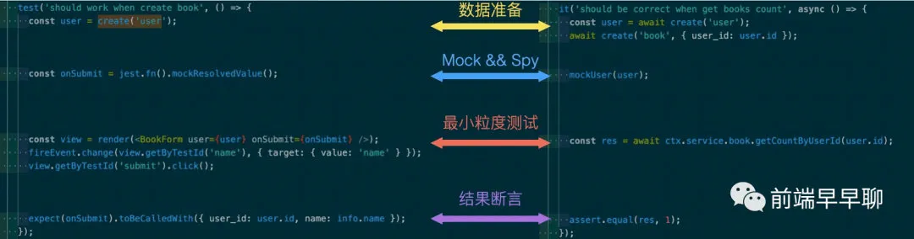

# 面试

## LCP 是怎么统计的

主要内容加载完成的时候，它会记录下这个时间点.一个快速的 LCP，可以让用户感受到这个页面的可用性。

旧指标，像 load 和 DOMContentLoaded 并不是很好，因为它不一定跟用户屏幕上看到的内容相对应。然而新的以用户为中心的指标，比如 FCP (First Contentful Paint) 只是记录了加载体验的最开始。如果页面显示的是启动图片或者 loading 动画，这个时刻对用户而言没有意义。

在过去，我们也有推荐的性能指标，如：FMP (First Meaningful Paint) 和 SI (Speed Index) 可以帮我们捕获更多的首次渲染之后的加载性能，但这些过于复杂，而且很难解释，也经常出错，没办法确定主要内容什么时候加载完。

## 如何确定元素类型？

- img 元素
- svg 中的 img 元素
- vide 元素的
- 带 url 的背景图的元素
- 块级元素带有文本节点或者内联文本子元素

## 性能优化 lcp

LCP 中元素尺寸的定义就是用户视窗所见到的尺寸。如果元素在视窗外面，或者如果元素被 overflow 裁剪了，这些部分不计算入 LCP 的元素尺寸。

LCP 什么时候上报？
由于 Web 页面都是分阶段加载的，所以最大元素可能随时会发生变化。

为了捕获这种变化，浏览器会派发一个类型是 largest-contentful-paint 的 PerformanceEntry 对象，表示浏览器绘制第一帧的时候最大的元素。在后来的渲染帧中，如果最大元素发生变化，会再次派发一个 PerformanceEntry 对象。

## 如何改善 LCP？

LCP 主要受以下四方面影响:

较慢的服务器响应时间
阻塞渲染的 js 或者 css
资源加载时间
客户端渲染性能

## 页面的性能统计指标

- 首先是 First Contentful Paint，通常简写为 FCP，它表示的是页面上呈现第一个 DOM 元素的时间。在此之前，页面都是白屏的状态；

- 然后是 Time to interactive，通常简写为 TTI，也就是页面可以开始交互的时间；

- 还有和用户体验相关的 Largest Contentful Paint，通常简写为 LCP，这是页面视口上最大的图片或者文本块渲染的时间，在这个时间，用户能看到渲染基本完成后的首页，这也是用户体验里非常重要的一个指标。

```js
let timing = window.performance && window.performance.timing;
let navigation = window.performance && window.performance.navigation;

// DNS 解析：
let dns = timing.domainLookupEnd - timing.domainLookupStart;

// 总体网络交互耗时：
let network = timing.responseEnd - timing.navigationStart;

// 渲染处理：
let processing = (timing.domComplete || timing.domLoading) - timing.domLoading;

// 可交互：
let active = timing.domInteractive - timing.navigationStart;
```

## 为什么 vue 不用做渲染优化

在 Vue 应用中，组件的依赖是在渲染过程中自动追踪的，所以系统能精确知晓哪个组件确实需要被重渲染。你可以理解为每一个组件都已经自动获得了 **shouldComponentUpdate**，并且没有上述的子树问题限制。

## 进行单元测试

1. 创建一些初始数据；
2. 对外部依赖进行 mock；
3. 最小粒度的执行要测试的测试方法；
4. 对结果做断言；



## JavaScript 为什么不做多线程处理呢， 还能更加充分利用 cpu

我们设想一下： 如果一个线程去更新某个 DOM 元素，而另一个线程去删除这个 DOM 元素，那么浏览器该执行哪个操作呢？

为了避免复杂的多线程机制， JavaScript 从设计之处就选择了单线程标准， 而且未来也不会发生变化。

Web Worker 不是允许 JavaScript 来创建多线程吗？

这个是没错的，但是要注意的是，Web Worker 创建的子线程是不能操作 DOM 的，操作 DOM 的任务需要交给主线程来执行，而且子线程完全受到主线程的控制，因此 Web Worker 的提出也并没有改变 JavaScript 单线程的本质。

## 新的微前端方式

模块联邦背后的原理非常简单：宿主系统通过配置名称来引用远程模块，同时在编译阶段宿主系统是不需要了解远程模块的，仅仅在运行时通过加载远程模块的入口文件来实现。

模块联邦的使用方式

```js
const HtmlWebpackPlugin = require("html-webpack-plugin");
const ModuleFederationPlugin = require("webpack/lib/container/ModuleFederationPlugin");

module.exports = {
  // other webpack configs...
  plugins: [
    new ModuleFederationPlugin({
      name: "app_one_remote",
      remotes: {
        app_two: "app_two_remote",
        app_three: "app_three_remote",
      },
      exposes: {
        AppContainer: "./src/App",
      },
      shared: ["react", "react-dom", "react-router-dom"],
    }),
    new HtmlWebpackPlugin({
      template: "./public/index.html",
      chunks: ["main"],
    }),
  ],
};
```

## vue 与 react 有什么不同 (react 和 vue 有什么区别)

[react 和 vue 区别](../针对字节/React%20面试准备.md)

问过我有没有自己手写过 loader ， 讲出在 mpvue 里面 添加过 filter

首先正则匹配 | ， 然后全前面的值 作为 后面方法的参数， 在返回回去给模板，

数据状态管理
Vuex 改变 store 的方式支持提交一个 mutation， 而 redux 并不支持，mutation 类似于事件发布、订阅系统： 每个 mutation 都通过一个字符串来表示时间类型（type）， 并通过一个回调函数 handler 来进行对应的数据修改。 另一个中，store 是直接注入组件实例中的， 因此用起来更加方便； 而 redux 需要通过 connect 方法把 prop 和 dispatch 注入组件。

## vuex 的数据持久化

vuex 里，某个状态的变化可以在组件内实时监测、并进行处理。localstorage 不行，它只是存，没有“变化”的概念。

刷新丢失数据，其实和 vuex 本身无关。因为刷新了 JS 就会重新加载，之前的就会丢失，无非是看你使用哪种方式去缓存.

vuex-persistedstate

```js
const store = new Vuex.Store({
  modules: {
    user,
    groupBuying,
    clearance,
  },
  getters,
  plugins: [createPersistedState()],
});
```

一些比较常见的

1. nextTick

[vue 源码分析之 nextTick.md](../../源码/vue/vue2/vue%20源码分析之%20nextTick.md)

2. fiber

[react 源码分析之 Fiber](../../源码/React/react源码分析之Fiber.md)

3. hooks 原理

4. 通信机制

5. keep-alive

   [keep-alive](../../源码/vue/vue2/vue%20源码分析之%20keep-alive.md)

6. https 这个我还是说不顺

7. 架构
   总结过完的亮点：

8. 渲染层面的
9. 虚拟列表按需加载----可视区域的按需加载

异步组件的优点：

1. 用不到的组件不会加载，当用到这个组件的时候，才会通过异步组件请求进行加载； 2.缓存组件，通过异步加载的组件会缓存起来，当下一次在用到这个组件时，丝毫不会有任何的疑迟，组件会很快加载
