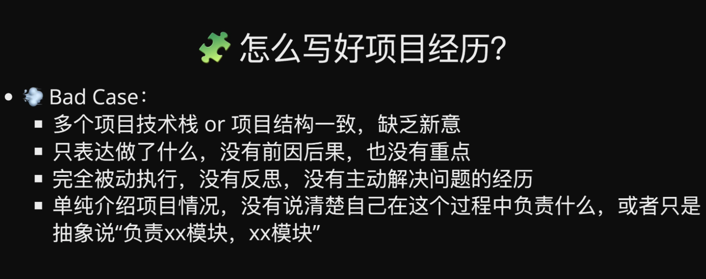
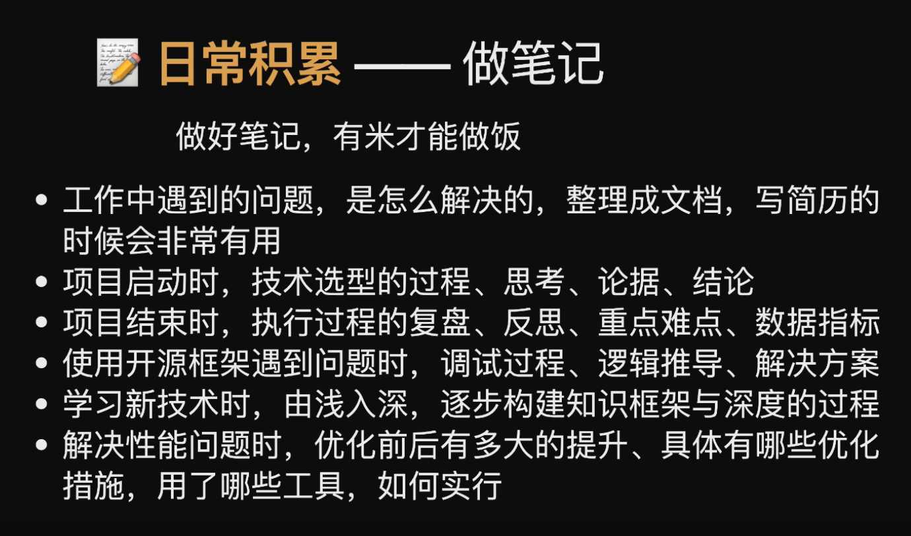

# 面试的基本原则

面试从本质上来说，是劳资双方相互选择的一个过程，双方是处于一个平等的关系。你不能因为自己是求职者，就把自己置于一种有求于人，弱势的地位。

## 自我介绍

  我叫沈君鸿,目前在魅族科技深圳分公司就任前端工程师岗位,主要负责的项目是游戏管理后台(这个项目:技术栈是在原有采用 原生 js 和 jquery 的基础上,采用了微前端架构 qiankun,接入了 React 和 vue )和活动模板(Vue + Electron)还有游戏会员俱乐部，公司主要的技术栈是 vue 为主， 部分项目中使用 react, 拥有自己的博客和掘金账号,同时也积极关注行业动态.喜欢看一些业界的最佳实践, 并看能否着手在自己工作上使用,积极推动部门效率方面的提升.

## 对未来有什么规划吗

未来的3-5年, 希望能带团队.
未来2-3年，在公司的平台上面继续深入学习，提升自己的专业技能，持续成长。同时也能不断地接受新的挑战。在做好现在这个工作的基础上，我当然希望未来有能机会进一步承担更多的管理任务，并且可以参与公司的策略.

## 你为什么从上家公司离职

  从这家公司离职主要有两方面的原因， 一方面公司深圳这边准备搬回珠海了，而我觉得待在深圳更有发展的空间。另一方面， 公司层面来说的话，就是因为公司还是一家传统的硬件手机厂商，想去纯互联网的。我个人的还是想去互联网类型的公司。

## 你做过的项目内容对你来说有难度

## 项目排期

* 制定项目计划
  
* 跟进项目进度

* 把控项目质量

1. 对需求进行尽量细的功能点拆分, 有助于准确评估排期(精确到2天)
2. 根据实际项目情况,预留适当的 buffer 时间(大约为项目总时长的5% ~ 10%)
3. 排期一旦确定, 视为对所有成员的承诺,非极端情况不可更改

## 目前遇到最困难的事或是挫折是什么

## 在原来的单位主要做什么工作的

  主要负责游戏管理后台和活动模板与游戏活动开发.

## 在原来工作上有哪些创新

  推动了团队微前端的架构,在自身进度正常的情况下 help 别的组,并成功上线.

## 原来工作上遭遇了哪些挫折

  在原来工作上遇到项目排期问题,产品需求提的太多频繁并且需求不明确的问题,导致开发无法正常理解需求,没有对功能点进行严格评审,没有真正产于需求评审并对产品进行相应的建议和看法

## 在这个新平台上你如何面对新的挑战

  我首先会了解我的工作职责，看我的职责范围内我需要承担什么样的责任或者KPI，明确职责范围之后制定相应的实施计划来逐步完成工作目标。

## 你原来的单位有没有相应的奖惩

  有，如果项目延期会对相应负责人进行处罚，比如扣相应的金额作为活动基金，如果项目完成效果好，则会进行绩效评优，工资会有相应的奖金。

## 你对这个行业未来的发展持什么态度

## 贵公司与xxx竞争对手在未来的发展策略上会有什么不同

## 终面的 boss,究竟关注什么

一般地，经理级别的面试官关注候选人的工作技能有多强，总监及以上的面试官则更关注候选人的战略思维与个人潜力是否深厚。
误区一：急于表现自我  

能走到终面的候选人，在前期面试一般都得到了不同面试官的赞许，这很容易使得一些候选人滋长自满情绪，在终面中给人以过于表现自我的印象，从而导致面试失败。

误区二：忽略面试官问题背后的真实意图

由于终面一般由具有多年管理经验的用人经理或高级管理者进行，候选人应尤其关注面试官每一个问题背后的意图：一方面提供给面试官他们最想知道的信息，一方面抓住每一个机会展现更全面的自己。

误区三：回答不当造成自身缺点被放大

每个人在工作中都有自己的优缺点，我们建议候选人在面试中合理有度地展示它们。不过，有的候选人在进行终面时，面对面试官提出的复杂问题，在回答中大量展示了自己的缺点，造成了不足之处被放大的假象，这是应当避免的。

如果你对自己的面试技能非常自信却频频在终面时出现问题，不妨先从工作胜任力的角度想想，自己的关键技能是否有待提升。

问你该问什么的时候：

不要跟HR讨论薪水
直接跟面试官要feedback

我会在进行电话面试的同一天进行follow up，让招聘官知道面试过程很愉快，感谢他们抽出时间和我交流，并且再次强调我对公司和职位的关注

简单来说：在同一天或一天后跟进。
在个人面试之后跟进的时间表与电话面试非常相似。你知道你应该结合follow up的信息发送一个真诚的“感谢信”感谢招聘官为你付出的时间。

您对我的面试或者职场发展有什么建议。

当你面试到后面，企业优中选优的时候，如果你没有特别闪光的经历，你的优秀和别人拉不开极大的差异的时候，学历必然会成为继续往下走的一道阻碍。学历无法改变，只能努力制造闪光点。

专业能力面（技术面）环节，一般会按照 基本功考核、业务经验考核、综合深度考核 的递进法。业务阶段的不同、团队规模由小到大，岗位的定级不同，一般的选人差别，是 “能独立做完” - “能独立干好” - “能主导某个专项” - “能引领某个体系”；要求上也会是从做完做好，到追求卓越，乃至极致。

面试的本质: 亮点展示
WHYYOU  WHYME  围绕兴趣, 能力, 未来
心态要好: 面试官--普通人, 未必有相关的培训
要保持一致性 要真诚

金字塔原理:
结论先行, 自下而上.
职业规划--从远到近,从虚到实.
自我介绍-简单明了, 买下伏笔.

1. 自我认知,你对自己是否了解
2. 组织承诺, 你到底能在我们这儿踏实淦几年

优缺点：
经常遇到，这是一个很难回答的题目，重点是，缺点不能是真正的缺点，如果说缺点是不喜欢加班，ok，完蛋。本人经历后总结出以下几点
1.实践能力不足，解决问题能力有待提高，随着自己的实践和努力，怎么怎么样
2.职场专业性不足，学校学生的思维更多， 然后自己会尽快转变从学校到职场多过度
3.心理抗压能力不足
4.任务时间规划和细分。

## 薪资

先反问对方，公司的薪资结构是怎样的？

1.五险一金
2.每个月的工资构成（底薪+绩效+餐补+交通补等等）
3.12个月的基本薪资+季度奖金+年终奖等等
4.涨薪机制（一年有多少次考核晋升调薪机会、KPI考核）、期权等等。

休假、加班制度

我希望的薪资是税前xx-xx(一个区间）来进行回答（这个范围比自己预估的高一些，避免HR有意压价而吃亏）

我叫沈君鸿，现在在腾讯TAPD就任前端岗位，主要负责的业务有，富文本编辑器部分，甘特图还有缺陷，需求的性能优化。

首先就是需求和缺陷列表的性能优化部分

首先就是提升lighthouse的分数

1. 大计算量的逻辑走webworker 将需求树的一些属性、权限计算的部分放到 webwork 里面
2. 精简api请求，将api都收敛起来
3. 组件进行按需加载，复用组件，资源大小的优化

旧版的需求 缺陷列表 只能支持到需求树200，而我们现在做的事情就是双向懒加载的方式实现需求树突破200的性能，

针对底层的 table 组件进行改造，原本是用element的table组件声成， 而现在

甘特图 部分就是 canvas是 重点对表格的维护和右侧的甘特图回显

富文本编辑器  主要有两种方案：提供挂载点和自定义组件：

1. 自定义组件 （插入思维导图、腾讯文档、插入自定义对象、插入代码块）
    在编辑器里面将自定义的按钮绑定好通信逻辑，在业务层面去监听调用的部分。这一部分主要是依托于编辑器的能力

2.挂载点 作为亮点 把这个能力交出去  封装一个可复用的组件，并提供便捷的接入方式

故事墙拖拽

// 只加载可是区域

// 滚动的时候 进行数据的请求和绘制

// 一直滚的话 dom会越来越多

如果如果前面1w的dom结构拖动的时候

虚拟dom的时候。

前端组件化的构建

今年行情不好 内部不稳定

追求稳定发展 想多学点技术

## 事件归因

当下真实发生的，具体、紧急且重要的；

适合向过来人 / 同道中人请教的；

你困扰已久，百思不得其解的；

事件归因

我的能力在哪里

未来我要做什么

不用着急回答，先花点时间想想怎么回答的更好
由浅入深，说出深度---日常多做积累，多思考api 背后的技术逻辑
例如： 介绍一下vue computed 属性
表象是什么
深度：底层逻辑是怎样的，跟响应式系统有什么关系
广度：v3与v2有什么区别，react有没有类似的实践，有什么优缺点

遇到卡点：
    坦诚表达没接触，没遇到，求换题目
    不太了解，但可以展开聊聊自己的猜想和想法
    问问面试官的理解，思考面试官给出的答案

可以主动了解下对方的技术栈、业务
可以要求加问你擅长的问题
可以问对方对候选人的预期，然后着重强调

定目标 做笔记 个人作品

