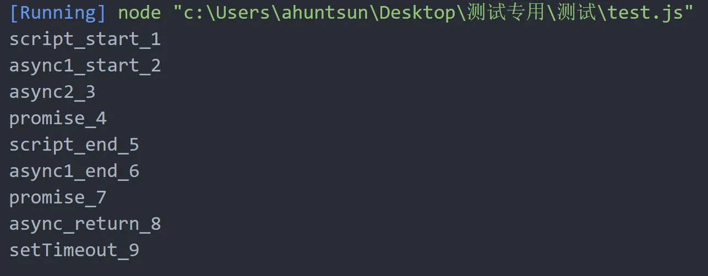

```js
async function async1() {
  console.log("async1 start");
  await async2();
  console.log("async1 end");
}
async function async2() {
  console.log("async2");
}
console.log("script start");
setTimeout(function () {
  console.log("setTimeout");
}, 0);
async1();
new Promise(function (resolve) {
  console.log("promise1");
  resolve();
  console.log("promise2");
}).then(function () {
  console.log("promise3");
});
console.log("script end");

// --- script start
// --- script end
// --- async1 start
// --- Promise1
// --- Promise2
// --- async2
// --- async1 end
// --- promise3
// --- setTimeout
```

--不对

```js
async function async1() {
  console.log("async1_start_2");
  await async2();
  console.log("async1_end_6");
  return "async_return_8";
}

async function async2() {
  console.log("async2_3");
}

console.log("script_start_1");

setTimeout(function () {
  console.log("setTimeout_9");
}, 0);

async1().then(function (message) {
  console.log(message);
});

new Promise(function (resolve) {
  console.log("promise_4");
  resolve();
}).then(function () {
  console.log("promise_7");
});

console.log("script_end_5");
```



我们在做的时候 写出我们的任务队列

宏任务队列： setTimeout
微任务队列：none

async1 开始执行，当函数里遇到 await 时，暂停执行（await 所在行放在本次执行完），而 async1 函数 未完成部分被添加到宏任务队列

宏任务队列：async1 setTimeout
微任务队列：none

new Promise() 实例对象被 new 出来后，它里面的 promise1 会立刻打印，然后又遇到 then, 此时 promise 实例 被添加到微任务队列；

宏任务队列：async1 setTimeout
微任务队列：promise 实例

由于异步代码第一次执行时，async1 函数 要早于 promise 对象，所以紧接着 async1 函数继续执行没有执行完成的部分（例三中 promise.then 先于 await，所以 then 先执行），执行完毕后，退出任务队列，打印：async1 end。然后把它的 then 逻辑添加到任务微任务队列中;

​ 此时的任务队列：

宏任务队列：setTimeout

微任务队列：promise 实例 ，async1 的 then 逻辑部分

先清空微任务队列，promise 实例 继续执行它的 then 的逻辑，打印：promise2。执行完毕后，退出微任务队列；

​ 此时的任务队列：

宏任务队列：setTimeout

微任务队列：async1 的 then 逻辑部分

async 函数执行 then 逻辑；

此时的任务队列：

宏任务队列：setTimeout

微任务队列：none

setTimeout 是宏任务会在最后执行。

await 后面的代码虽然算作宏任务，但是和普通的微任务不在一个维度，位于更上一层的任务队列，所以优先度要比其他（下层）微任务要高；

定时器为什么是不精确的
因为定时器是异步的，要等到同步任务执行完之后，才会去执行异步的任务，即使 setTimeout(0)中时间为 0 也不是立马执行。再者 w3c 在 HTML 标准中规定，要求 setTimeout 时间低于 4ms 的都按 4ms 来算。

解决方法： 使用 web Worker 将定时函数作为独立线程执行

```js
new Promise((resolve, reject) => {
  resolve("success");
  console.log("new Promise");
});
console.log("finished");
```

构造函数内部的代码是立即执行的,then 是异步的

```js
Promise.resolve(1)
  .then((res) => {
    console.log(res); // => 1
    return 2; // 包装成 Promise.resolve(2)
  })
  .then((res) => {
    console.log(res); // => 2
  });
```

Promise 实现了链式调用，也就是说每次调用 then 之后返回的都是一个 Promise，并且是一个全新的 Promise，原因也是因为状态不可变。如果你在 then 中 使用了 return，那么 return 的值会被 Promise.resolve()包装

Promise 构造函数是同步，then 是异步

Promise 构造函数中是立即执行（同步任务），then 函数分发到微任务 Event Queue（异步任务），setTimeout 是分发到宏任务中

实现 promise

```js
class MyPromise {
  constructor(executor) {
    this.state = "pending"; // pending  fulfilled rejected
    this.value = undefined; //成功结果
    this.reason = undefined; // 失败原因
    this.onFulfilledCallbacks = []; // 保存 fulfilled 回调
    this.onRejectedCallbacks = []; // 保存 rejected 回调
    executor(this.resolve.bind(this), this.reject.bind(this));
  }
  resolve(value) {
    if (this.state === "pending") {
      this.state = "fulfilled";
      this.value = value;
      setTimeout(() => {
        this.onFulfilledCallbacks.forEach((callback) => callback(value));
      }, 0);
    }
  }
  reject(reason) {
    if (this.state === "pending") {
      this.state = "rejected";
      this.reason = reason;
      setTimeout(() => {
        this.onRejectedCallbacks.forEach((callback) => callback(reason));
      }, 0);
    }
  }
  then(onFulfilled, onRejected) {
    // 创建一个新的 Promise 用于链式调用
    return new MyPromise((resolve, reject) => {
      const fulfilledHandler = () => {
        try {
          if (typeof onFulfilled !== "function") {
            resolve(this.value);
          } else {
            const result = onFulfilled(this.value);
            // 如果 result 是 Promise，则等待其结果
            if (result instanceof MyPromise) {
              result.then(resolve, reject);
            } else {
              resolve(result);
            }
          }
        } catch (err) {
          reject(err); // 处理回调中的错误
        }
      };
      const rejectHandler = () => {
        try {
          // 如果 onRejected 不是函数，直接透传 reason
          if (typeof onRejected !== "function") {
            reject(this.reason);
          } else {
            // 执行 onRejected 并处理返回值
            const result = onRejected(this.reason);
            if (result instanceof MyPromise) {
              result.then(resolve, reject);
            } else {
              resolve(result); // 注意：错误处理后默认转为 fulfilled
            }
          }
        } catch (err) {
          reject(err);
        }
      };
      if (this.state === "fulfilled") {
        setTimeout(fulfilledHandler, 0);
      }
      if (this.state === "rejected") {
        setTimeout(rejectHandler, 0);
      }
      if (this.state === "pending") {
        this.onFulfilledCallbacks.push(fulfilledHandler);
        this.onRejectedCallbacks.push(rejectHandler);
      }
    });
  }
}
```
