## 1. 技术硬|三观正

写代码有热情 做项目有章法 搞业务有洞察

## 凭什么说写代码有热情

HTML、css、js 基础知识
对编程语言语法特性都不了解，查来就用？

vue/react/angular 框架原理
对常用框架原理一知半解，跑通就行？

计算机世界软硬件知识：
算法、网络、存储、系统、编译，样样不懂？

玩转技术栈玩出新花样
再烂的业务也能搞创新

动手造轮子 YY 新作品
浑身编程技能，竟然不会手痒痒？

记笔记做分享 开源提 PR
业界动态不关心不参与，不输出只索取

**你并不热爱这个编程事业，只是认可和接受这个前端职业**

## 凭什么说做项目有章法

项目流程与规范
做过项目无记录，哪怕一个上线文档都不写？

仓库流程与规范
没分支管理、代码 RV，都怪环境不是你偷懒？

项目交付与问题复盘
发生各种风险，哪怕仅给自己来个复盘？

目标对焦与线上跟踪
项目上线后数据怎样是死是或，从此与你无关？

项目沟通推进有始有终

PDCA、5W 的做事方法，即没听过也没用过？

社区同类方案整理分析
业界类似项目方案不管不问，只管闷头猛干？

**你并不珍惜这个项目机会，只是草草完成这些项目任务**

## 3.凭什么说搞业务有洞察

公司的盈利模式
公司是怎么靠业务赚钱的，不关心也不观察？

业务的运行流程
业务链路怎么串起来的，说不清楚关键点？

业务的价值判断
怎么才算是业务有做得好，对此没有概念？

业务与用户的痛点
有哪些痛点技术能解决，脑海中没有草案？

业务与产品中的机会
有哪些机会技术能切入，对此毫无钻研？

行业竞品业务分析
行业类似业务的玩法与技术方案，极少思考？

**你并不重视业务内外的机会，只是被动式跟进分配好的项目**

在不影响渲染的情况下，异步的加载执行脚本，带来良好的用户体验。

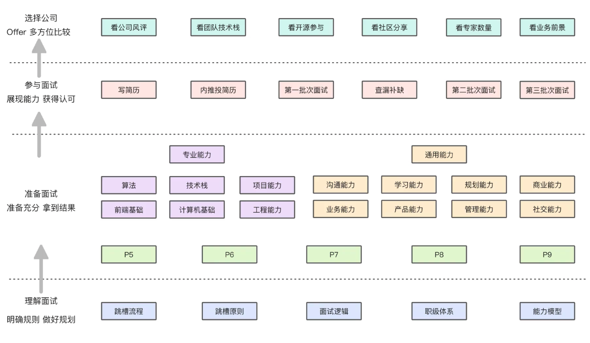

1.写简历、打磨简历

要体现出 对技术是有热情的 是有追求的 是有好奇心的 是有兴趣的
对项目是有独特的理解 可复用的能力 任何项目交给你 老板都很放心 业务上的观察和洞察

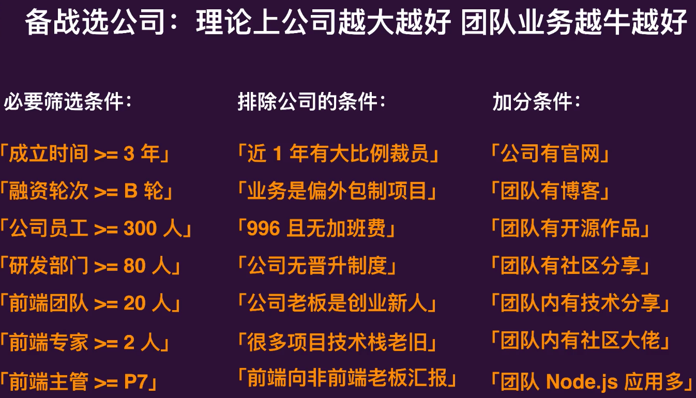

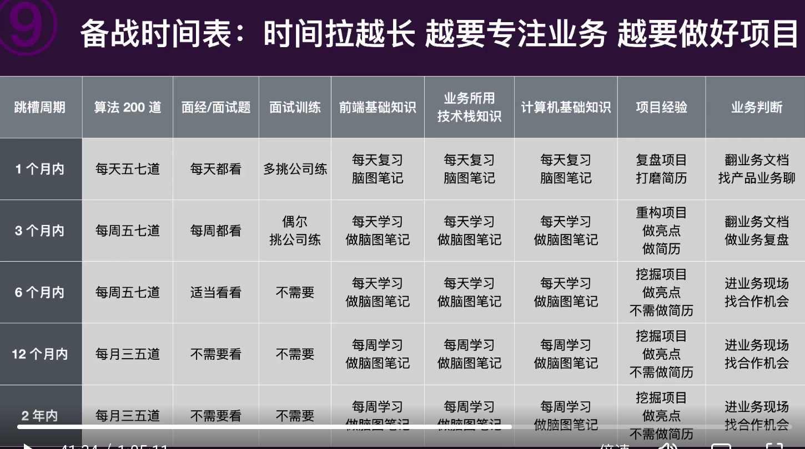

算法： 每天 5 、7 道
面试、面试题： 每天都看
面试训练； 多挑公司练
前端基础知识： 每天复习 脑图笔记
业务所用技术栈知识：每天复习 脑图笔记
计算机基础知识： 每天复习 脑图笔记
项目经验： 复盘项目 打磨简历
业务判断： 找产品业务聊

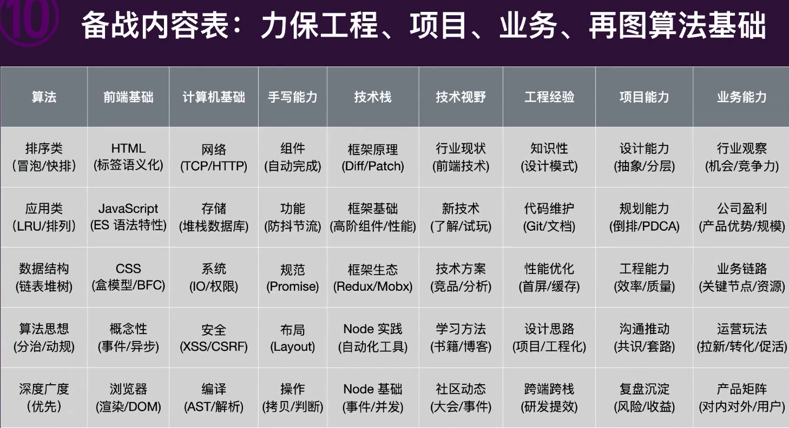

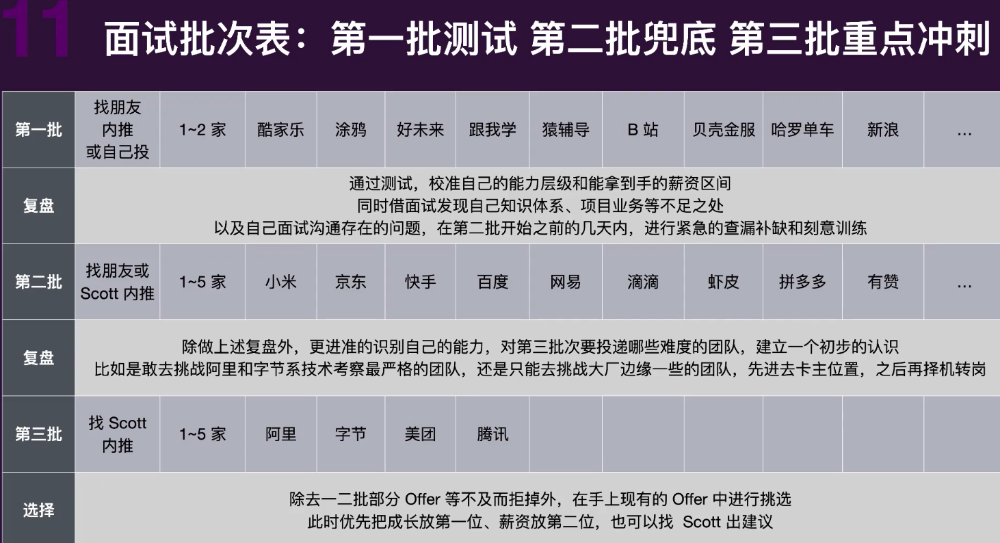

// 1.广州 上海的包括珠海的大厂（确定不会去的）

对自己的定位应该是 P6
能独挡一面，能负责多个业务模块
能团队协同做项目，担人项目 PM

面试技巧：

面试前:
⾯试模拟
⾃我模拟 讲给⾃⼰听、讲给朋友听
实战模拟 收集反馈 -> 分析问题 -> ⾃我调整 -> 反复实践

形象建设
声⾳形象 语速、语⽓、语调
外在形象 简单、⼲练、不邋遢
内在形象 ⾃信、踏实、⽪实、乐观……

1. 专业技能按掌握、熟悉、了解程度依次罗列
2. 亮点项⽬详细写，附带数据描述成果更具说服⼒
   简历准备 PDF 格式
   书写原则 适度包装、不能造假
   职位 JD 岗位职责、硬技能、找差距、补⻬差距
   内容排版 基本信息 -> 专业技能 -> 项⽬经历 -> 教育背景
   简历模板 WonderCV、五百丁

简历⼈设
证明
实际案例

面试中： 1.技术一面： 重点考察基础和知识广度
计算机基础： 算法、数据结构
前端基础： JS/CSS, 前端框架、Node、浏览器原理、网络、安全、跨端能力（后端或客户端）
编码能力：逻辑是否清晰、边界是否考虑到、思维是否活跃
技术视野： 行业技术现状、新技术的了解和实践

2.技术二面：工程能力、设计能力、规划能力
功能能力：效率、质量、性能、定义标准、产出规范
设计能力：抽象能力、拆解能力、健壮性、扩展性、可维护性
规划能力： 做事的思路是什么
沟通和推动能力： 是否有一套自己的项目推动方法和成功的 case
产品意识： 事情的目标是什么？ 存在哪些问题？如何解决？价值体现在哪里？规范？共建
其他软实力： 聪明程度、学习能力、责任心、价值观
3，技术三面： 技术格局&视野、人生规划、软技能考察

描述项⽬
STAR 法则
情境(situation)、⽬标（target）、⾏动(action)、结果(result)
·
背景：项⽬背景，是在什么情况下发⽣的
·
⻆⾊：我当时承担了什么⻆⾊
·
职责：负责⼯作的哪⼀⽅⾯，协调/开发/…
·
难题：遇到了什么难题，怎么解决的，为什么这么解决
·
结果：项⽬结果如何，有数据⽀撑更有说服⼒
·
沉淀：做完这个项⽬沉淀了什么，给别⼈带来什么
·
复盘：如果 新让你做这件事，你会怎么做，有什么更好的⽅案
·
评价：项⽬中的表现，你周围的⼩伙伴怎么评价的，上级怎么评价的

面试后：
添加微信
夸赞对⽅
夸赞对⽅在技术领域的专业性
承认不⾜
勇敢承认⾃⼰当前的不⾜
询问建议
询问从⾯试官视⻆给予你未来的建议
建⽴⼈脉
弱关系，未来关键时刻能帮上你

复盘结果： 梳理答的好的、不好的知识点。记录，找差距，反复实践
复盘情绪： 回忆面试的哪种情绪占比多，紧张、开心、严肃、调整心态。

## 前端工程师的面试 究竟准备什么

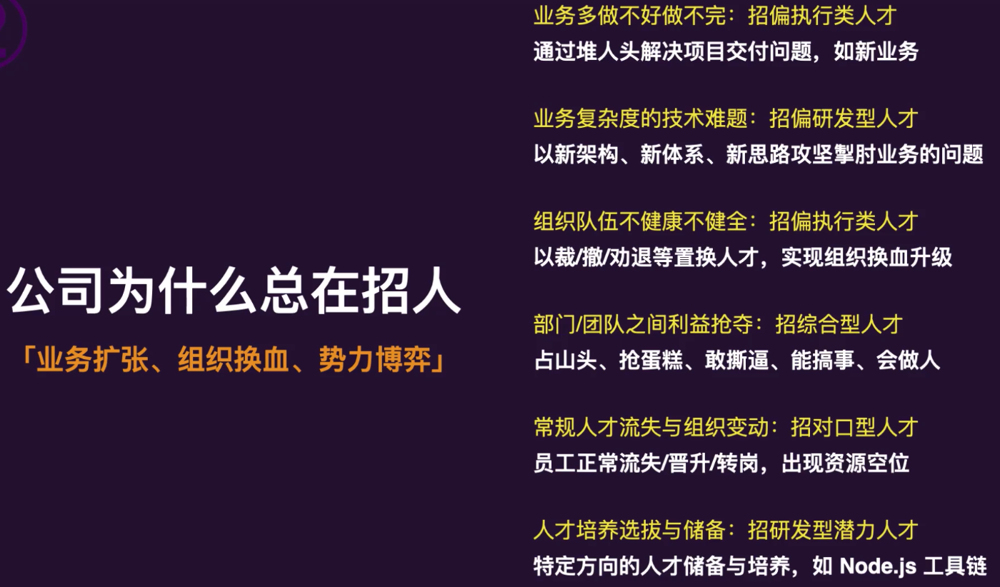

公司为什么总在招人：
业务多做不好做不完： 招偏执行类人才

业务复杂度的技术难题： 招偏研发型人才

组织队伍不健康不健全： 招偏执行类人才

部门、团队之间利益抢夺：招综合型人才

常规人才流失与组织变动： 招对口型人才

人才培养选拔与储备： 招研发型潜力人才

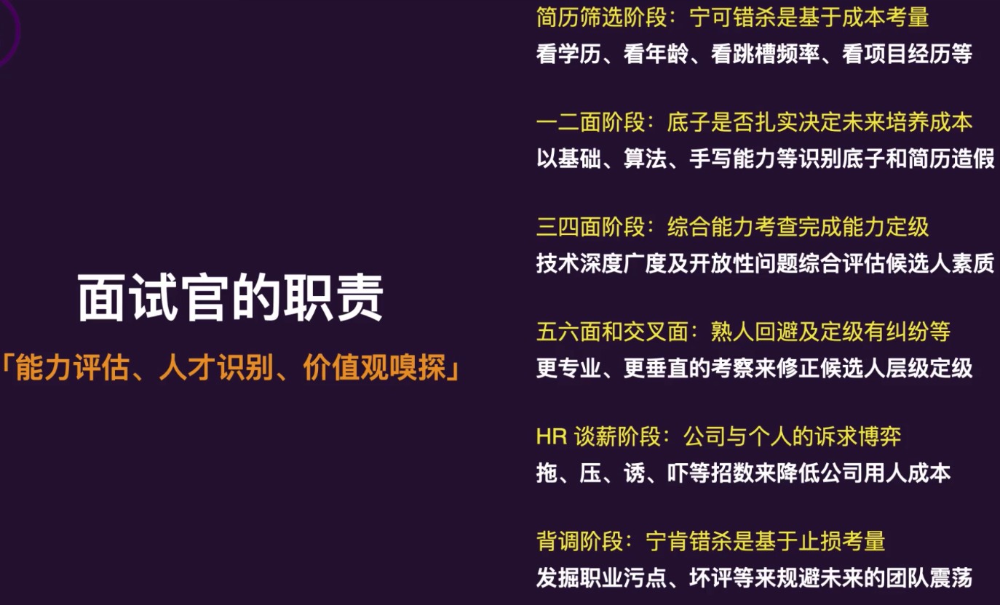

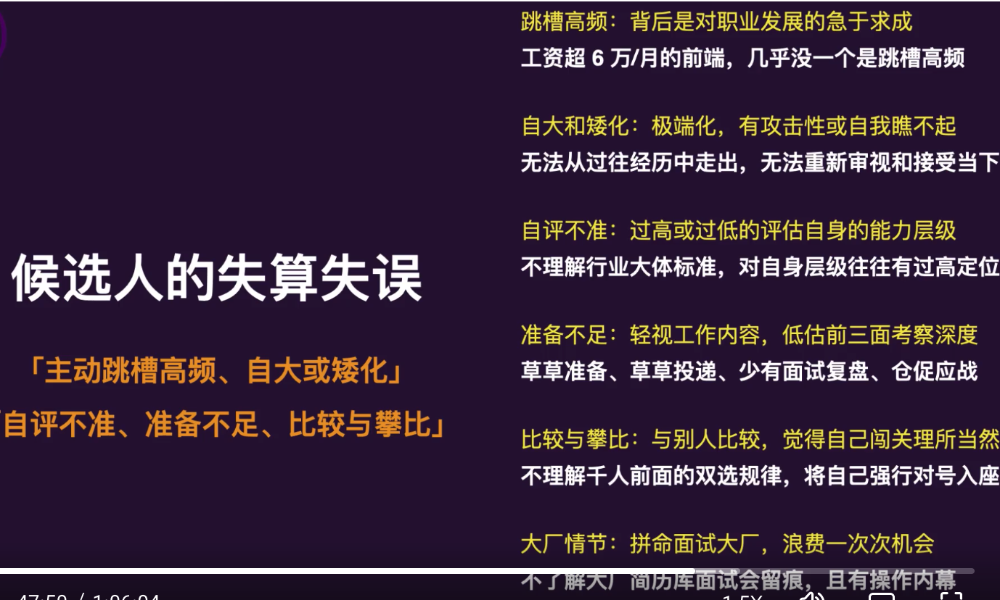

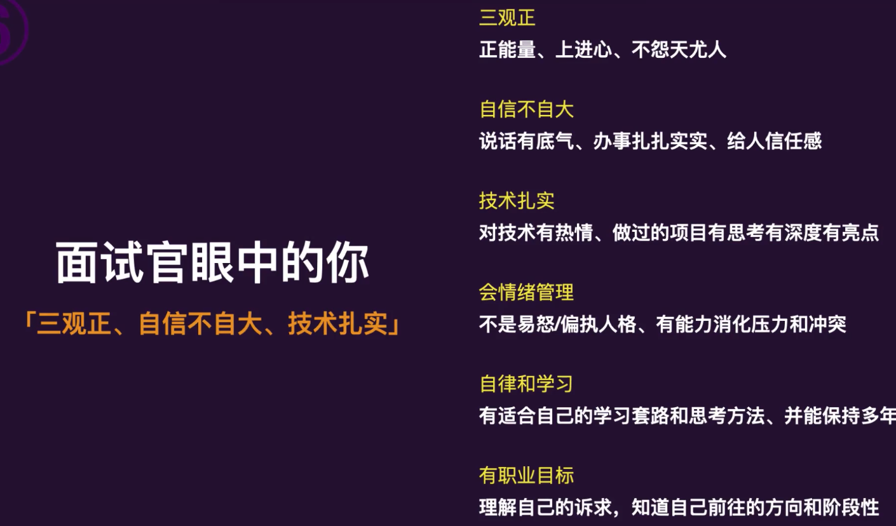

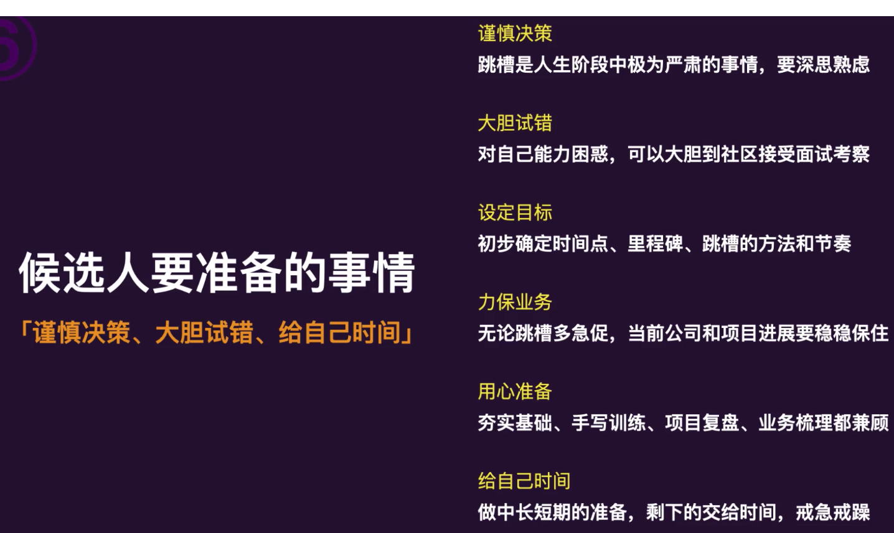

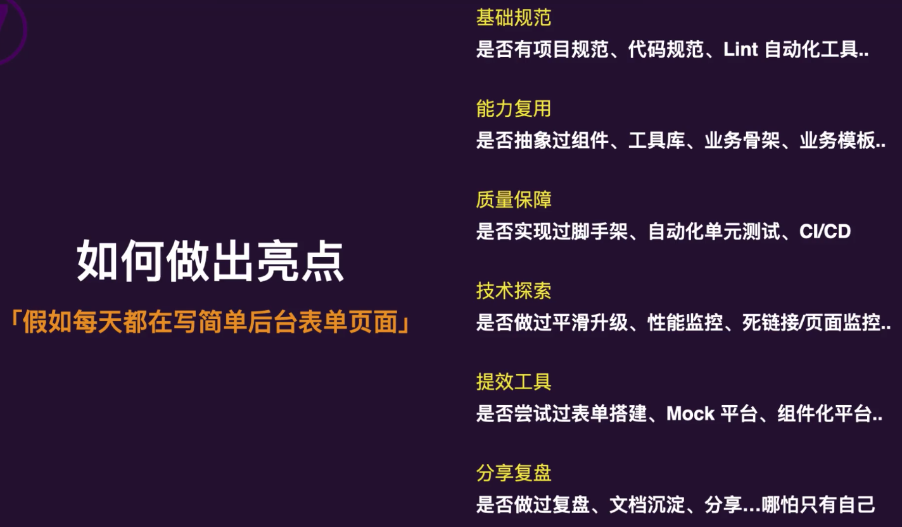
