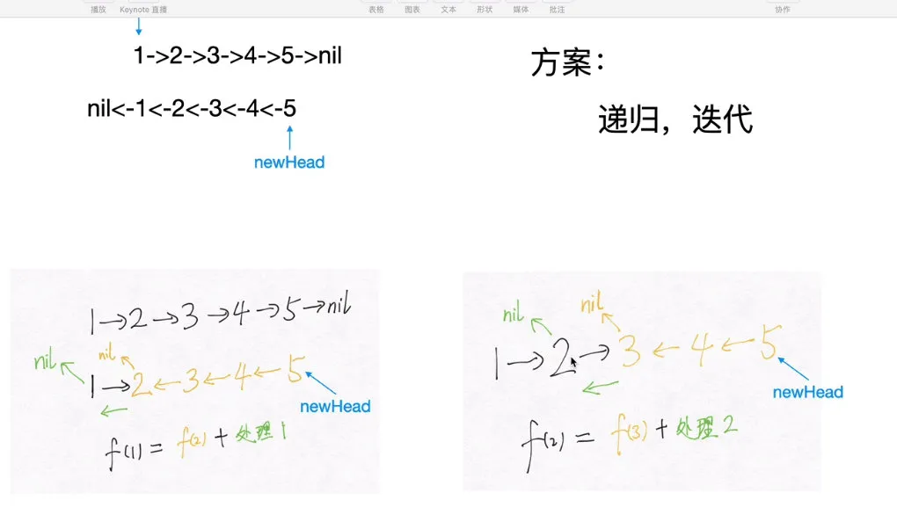

401 403 各代表什么

服务端 和 客户端差异 cookie

node 怎么判断有没有溢出

浏览器 怎么看 内存溢出

linx 查看本地路径 777 sudo chmod +r

http2.0 和 http1.1
[http 详解](../../html&css/HTTP详解.md)

## 手写翻转链表

```JS
//节点构造函数
function Node(val){
    this.val = val
    this.next = null
}

var reverseList = function (head) {
    let pre = null
    while (head) {
        next = head.next
        head.next = pre
        pre = head
        head = next
    }
    return pre
};

```



## 手写单例

```js
function Single(fn) {
  var result;
  return function () {
    return result || (result = fn.apply(this, arguments));
  };
}
```

## 平衡二叉树

```JS
//重复遍历了
function IsBalanced_Solution(pRoot) {
  if (pRoot == null) return true;
  let leftLen = TreeDepth(pRoot.left);
  let rightLen = TreeDepth(pRoot.right);
  return Math.abs(rightLen - leftLen) <= 1 && IsBalanced_Solution(pRoot.left) && IsBalanced_Solution(pRoot.right);
}
function TreeDepth(pRoot) {
  if (pRoot == null) return 0;
  let leftLen = TreeDepth(pRoot.left);
  let rightLen = TreeDepth(pRoot.right);
  return Math.max(leftLen, rightLen) + 1;
}
/* function TreeNode(x) {
    this.val = x;
    this.left = null;
    this.right = null;
} */

//同时判断
function IsBalanced_Solution(pRoot)
{
    // write code here
    return TreeDepth(pRoot) !==-1;
}
function TreeDepth(pRoot){
    if(pRoot === null) return 0;
    var left = TreeDepth(pRoot.left);
    if(left === -1)return -1;
    var right = TreeDepth(pRoot.right);
    if(right === -1)return -1;
    return Math.abs(left - right) > 1 ? -1: Math.max(left,right) + 1;
}

```

## 寻找链表第 k 个节点

## 二维数组找出元素

```js
var findNumberIn2DArray = function (matrix, target) {
  const rowNum = matrix.length;
  if (!rowNum) {
    return false;
  }
  const colNum = matrix[0].length;
  if (!colNum) {
    return false;
  }

  let row = 0,
    col = colNum - 1;
  while (row < rowNum && col >= 0) {
    if (matrix[row][col] === target) {
      return true;
    } else if (matrix[row][col] > target) {
      --col;
    } else {
      ++row;
    }
  }

  return false;
};
```

解法 2：观察数组规律
按照题目要求，数组的特点是：每一行都按照从左到右递增的顺序排序，每一列都按照从上到下递增的顺序排序。考虑以下数组：

1 2 3
4 5 6
7 8 9
在其中寻找 5 是否存在。过程如下：

从右上角开始遍历
当前元素小于目标元素(3 < 5)，根据数组特点，当前行中最大元素也小于目标元素，因此进入下一行
当前元素大于目标元素(6 > 5)，根据数组特点，行数不变，尝试向前一列查找
找到 5

// ac 地址：https://leetcode-cn.com/problems/er-wei-shu-zu-zhong-de-cha-zhao-lcof/submissions/
// 原文地址：https://xxoo521.com/2019-12-19-er-wei-shu-zu-cha-zhao/

```js
/**
 * @param {number[][]} matrix
 * @param {number} target
 * @return {boolean}
 */
var findNumberIn2DArray = function (matrix, target) {
  const rowNum = matrix.length;
  if (!rowNum) {
    return false;
  }
  const colNum = matrix[0].length;
  for (let i = 0; i < rowNum; i++) {
    for (let j = 0; j < colNum; j++) {
      if (matrix[i][j] === target) return true;
    }
  }

  return false;
};
```
