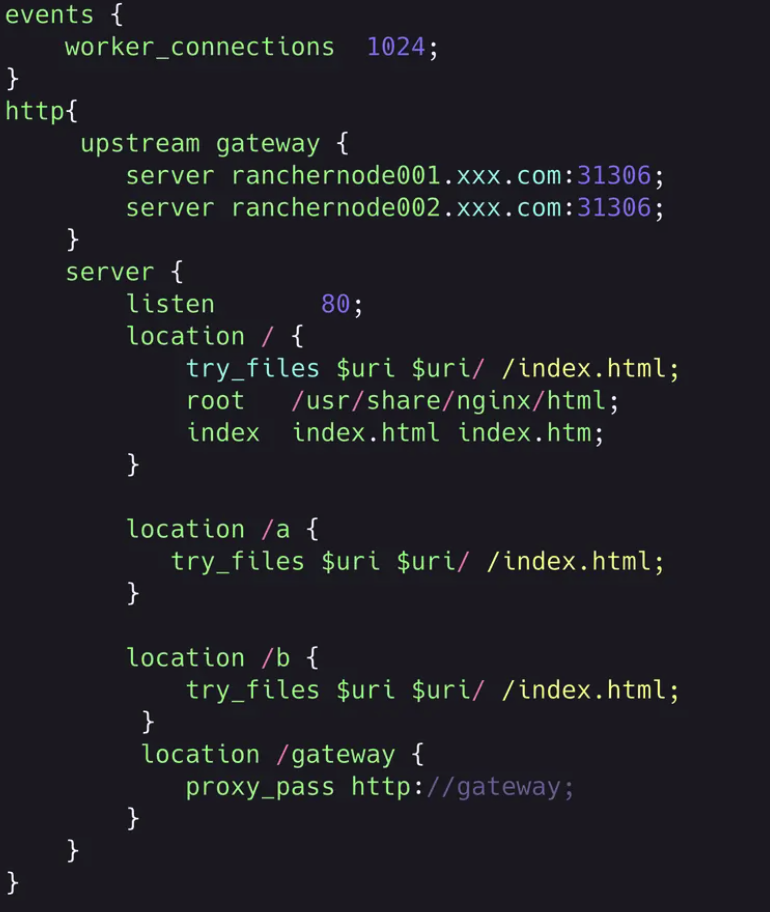

## 技术细节

  好处：
    1.应用自治 只需要遵循统一的接口规范或者框架，以便系统集成到一起。
    2.单一职责 每个前端应用可以只关注于自己所需要完成的功能
    3.技术栈无关
  缺点：
    1. 应用的拆分基础依赖于基础设施的构建，一旦大量应用依赖于同一基础设施，那么维护变成了一个挑战。
    2. 拆分的粒度越小，意味着架构变得复杂、维护成本变高

## 遇到最难的问题

qiankun 是通过fetch去获取子应用注册时配置的静态资源url，所有静态资源必须是支持跨域的，那就得设置运行源

```js
http {
  server {
    listen 80;
    add_header Access-Control-Allow-Origin *;
    add_header Access-Control-Allow-Headers DNT,X-Mx-ReqToken,Keep-Alive,User-Agent,X-Requested-With,If-Modified-Since,Cache-Control,Content-Type,Authorization;
    add_header Access-Control-Allow-Methods GET,POST,OPTIONS;
    if ($request_method = 'OPTIONS') {
      return 204;
    }
    location / {
      root /data/www/html;
      index index.html index.htm;
    }
  }
}

```

* Access-Control-Allow-Origin：跨域在服务端是不允许的。只能通过给Nginx配置
* Access-Control-Allow-Origin *后，才能使服务器能接受所有的请求源（Origin）
* Access-Control-Allow-Headers: 设置支持的Content-Type

## 样式隔离

  start方法有个属性sandbox。该值默认为true

为true，可以隔离子页面的样式，但是*、html、body等公共的样式还是会影响到主应用

可以配置为 { strictStyleIsolation: true } 表示开启严格的样式隔离模式。 这种模式下 qiankun 会为每个微应用的容器包裹上一个 shadow dom 节点，从而确保微应用的样式不会对全局造成影响。

```js
function render(props = {}) {
  const { container } = props
  new Vue({
    router,
    render: h => h(App)
  }).$mount(container ? container.querySelector('#app') : '#app')
}
// ...
// 生命周期 - 挂载后
export async function mount(props) {
  // ...
  // 渲染
  render(props)
}
// ...
// 本地调试
if (!window.__POWERED_BY_QIANKUN__) {
  render()
}

```

## 保障原来的应用运行正常，但能集成到基座portal中

使用这个全局变量来区分当前是否运行在 qiankun 的主应用中

**window.__POWERED_BY_QIANKUN_**

独立运行：window.__POWERED_BY_QIANKUN__为false，执行mount创建vue对象
运行在qiankun: window.__POWERED_BY_QIANKUN__为true，则不执行mount

## history路由模式，需要如何配置nginx，才能正常访问

通过nginx配置加入try_files，history 模式同样会有一个问题，就是当页面刷新时，如果没有合适的配置，会出现404错误，针对这种请看，需要额外在nginx配置，对于找不到url的，将首页html返回



* try_files：用来解决nginx找不到client客户端所需要的资源时访问404的问题

* proxy_pass：主要是用来配置接口网关反向代理，可以使得父子应用下访问的api是一致的，防止接口跨域问题

## 微前端方案种类

基座模式：通过搭建基座、配置中心来管理子应用。如基于SIngle Spa的偏通用的乾坤方案，也有基于本身团队业务量身定制的方案。
自组织模式： 通过约定进行互调，但会遇到处理第三方依赖等问题。
去中心模式： 脱离基座模式，每个应用之间都可以彼此分享资源。如基于Webpack 5 Module Federation实现的EMP微前端方案，可以实现多个应用彼此共享资源分享。

## 微前端按技术来拆分

按技术拆分

路由分发式。通过 HTTP 服务器的反向代理功能，来将请求路由到对应的应用上。
前端微服务化。在不同的框架之上设计通讯、加载机制，以在一个页面内加载对应的应用。
微应用。通过软件工程的方式，在部署构建环境中，组合多个独立应用成一个单体应用。
微件化。开发一个新的构建系统，将部分业务功能构建成一个独立的 chunk 代码，使用时只需要远程加载即可。
前端容器化。通过将 iFrame 作为容器，来容纳其它前端应用。
应用组件化。借助于 Web Components 技术，来构建跨框架的前端应用。
